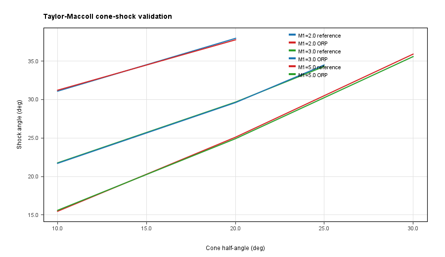
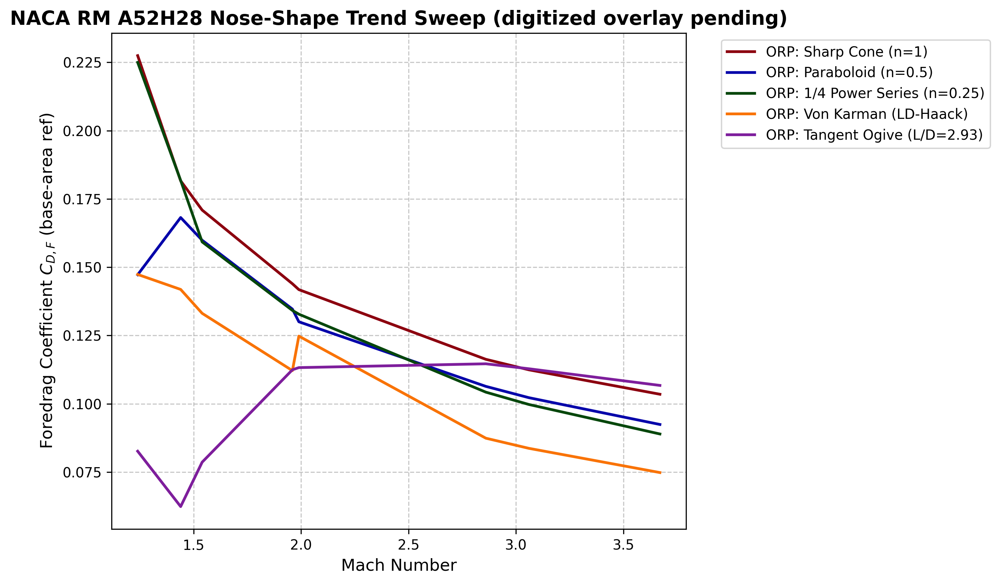
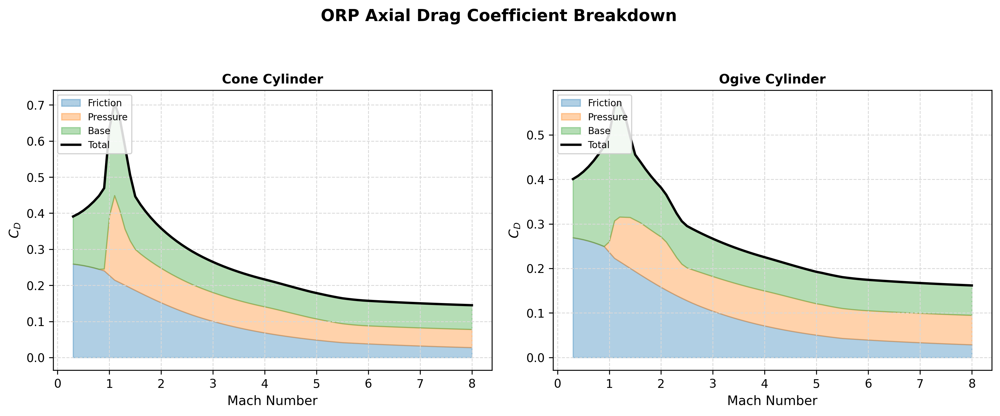
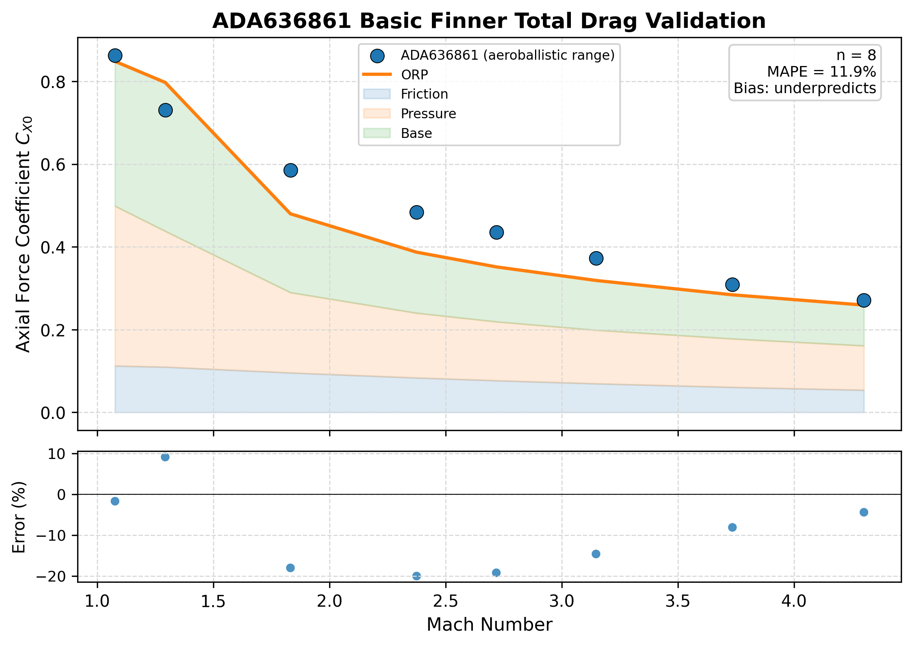
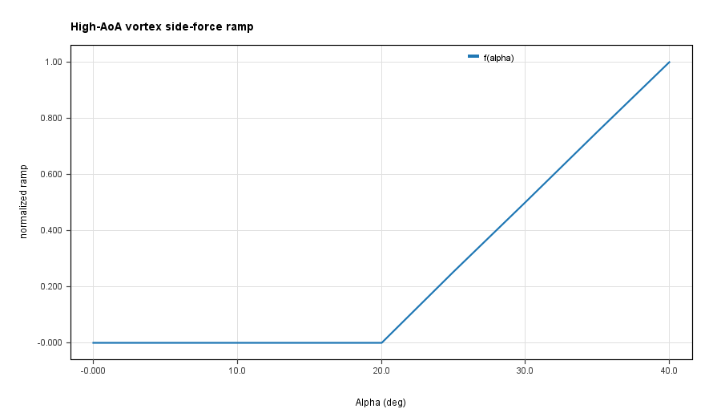

---

## Abstract

OpenRocket is a widely used open-source rocket flight simulator whose aerodynamic core, based on the 1967 Barrowman slender-body method, is reliable at subsonic speeds but fails above approximately Mach 0.8. This work extends OpenRocket with physics-based aerodynamic models valid from subsonic through hypersonic flight (Mach 0 to 17+). The central architectural innovation is a shock geometry pre-pass that computes the oblique shock and expansion fan field along the rocket axis once per timestep, distributing locally corrected flow conditions to all downstream component calculators. This eliminates the 5--35% errors that arise when supersonic fin aerodynamics and body pressure drag are evaluated at freestream rather than post-shock conditions. The model suite includes Taylor-Maccoll cone flow, Prandtl-Meyer isentropic expansion, Van Driest II compressible skin friction, DATCOM Section 4.1.5.1 fin wave drag, Devan-Ashwood/Chapman/Viswanath base drag, and Modified Newtonian hypersonic pressure, with C1-continuous polynomial blending at all regime transitions to prevent simulation instabilities near Mach 1. Validation against the claim-mapped benchmark suite demonstrates: shock relations matching NACA Report 1135 to better than 0.01%; nose wave drag achieving MAE = 0.029 against NACA RM A52H28 wind-tunnel data; fin normal force slope achieving MAPE of 6.8% and center-of-pressure MAPE of 7.1% against NASA TM X-653; and Basic Finner vehicle-level drag MAPE of 11.9% against free-flight ballistic range data without geometry-specific calibration. Open geometry-family gaps, including RM-10 and the Raven/Kinsel flight outliers, are retained as explicit limitations. The complete source code is available as an open-source fork.

---

## 1. Introduction

### 1.1 Background and Motivation

OpenRocket, originally developed by Sampo Niskanen at Helsinki University of Technology [1], is the most widely used open-source rocket flight simulator in the high-power rocketry (HPR) community. It provides six-degree-of-freedom (6-DOF) trajectory simulation with aerodynamic coefficient computation based on the extended Barrowman slender-body method [2]. The software's well-structured Java architecture, combined with its active development community, has made it a standard tool for amateur rocket design and education.

The aerodynamic model at the core of OpenRocket was adequate for the original target application: small model rockets that rarely exceed Mach 0.5. The community has grown substantially beyond this envelope. University rocketry competitions regularly produce student-built vehicles reaching Mach 2–3. Amateur research groups construct multi-stage rockets with apogee altitudes exceeding 30 km. Commercial high-power rocketry has produced Mach 5+ flights. For all of these applications, the original OpenRocket aerodynamic models produce predictions that degrade rapidly above Mach 0.8 and are entirely unreliable above Mach 1.1.

The commercial state-of-the-art for supersonic amateur rocket simulation is RASAero II, developed by Charles E. Rogers [3]. RASAero II incorporates empirical and semi-empirical supersonic drag models calibrated against extensive wind-tunnel and range data. However, it is closed-source, which limits educational value, prevents independent verification of the models, and makes contribution from the research community difficult.

No open-source tool exists that provides production-quality supersonic and hypersonic aerodynamic capability for slender finned vehicles, combined with the accessibility, modularity, and 6-DOF simulation framework of OpenRocket. The aerodynamic extensions described here address this gap.

### 1.2 Limitations of the Original Implementation

Six specific deficiencies rendered the original OpenRocket aerodynamic models unreliable above Mach 0.8. Each is quantified below.

**Limitation 1: Hard-clamped compressibility factor.** The Prandtl-Glauert compressibility factor $\beta = \sqrt{|1-M^2|}$ appears in nearly every aerodynamic coefficient formula. The original code applied a hard floor of $\beta_{\min} = 0.25$, clamping $\beta$ to this minimum. At Mach 5, the true supersonic value is $\beta = \sqrt{24} = 4.899$; the clamp is inactive but the damage occurs in the transonic band where aerodynamic loads peak. At Mach 1.0, $\beta = 0$ is a genuine singularity; the clamp produces $\beta = 0.25$, which is mathematically unphysical. The clamp creates a flat plateau in all $1/\beta$-dependent coefficients from Mach 0.97 to 1.03.

**Limitation 2: Tabulated wave drag data limited to Mach 3.** Nose cone pressure drag was computed from interpolation tables derived from NASA TR-R-100 [4], covering only specific nose shapes and Mach numbers up to approximately 3.0. Above this limit, the code extrapolated linearly, diverging from the analytical Taylor-Maccoll solution by 30% or more at Mach 5.

**Limitation 3: No fin wave drag.** Fin drag included only skin friction and a form factor correction. At Mach 2, each fin generates a leading-edge shock producing wave drag proportional to $(t/c)^2 / \beta$. For a four-fin rocket with $t/c = 0.05$ at Mach 2, the omitted wave drag adds $\Delta C_D \approx 0.023$ — 10–20% of total vehicle drag.

**Limitation 4: Linear fits for viscosity and speed of sound.** The original atmospheric model used linear fits valid only near sea-level temperature. The speed-of-sound linear fit errs by 0.6% at tropopause temperatures; the viscosity linear fit errs by 5–10% at high-altitude temperatures and by more than 50% at stagnation temperatures behind strong shocks.

**Limitation 5: No shock modeling.** Each component was evaluated at freestream conditions, ignoring the oblique shock from the nose cone that decreases local Mach by 10–35% at the fin stations. For a 15-degree cone at Mach 3, post-shock Mach is approximately 2.49, and fins evaluated at Mach 3.0 rather than 2.49 exhibit approximately 25% error in $C_{N_\alpha}$ due to the nonlinearity of $\beta = \sqrt{M^2-1}$.

**Limitation 6: No supersonic center-of-pressure correction.** The Barrowman method assumes incompressible flow for CP location. At supersonic speeds, the body lift distribution shifts aft by 5–10% of body length, which can determine whether a marginally stable rocket remains stable. The original code issued a blanket warning at Mach 1.1 but made no attempt to correct stability predictions.

### 1.3 Design Philosophy

Three principles governed the development of the extended aerodynamic model.

**Incremental validation with regression gates.** Each model was implemented, tested, and validated against both analytical solutions and experimental data before the next model was begun. Analytical validation confirms correct mathematical implementation; experimental validation confirms correct physical modeling. Both are necessary: correct mathematics applied to an incorrect model still produces wrong predictions. A 72-file regression test suite prevented newly introduced code from degrading previously correct behavior.

**C1-continuous regime blending.** Every transition between aerodynamic regimes uses smooth polynomial interpolation continuous in both value and first derivative. Discontinuities in aerodynamic coefficients cause the RK4 trajectory integrator to oscillate when repeatedly crossing the discontinuity near Mach 1. Table 1 lists all blending regions and their methods.

**Analytical models preferred over empirical tables.** Where closed-form analytical solutions exist and are computationally tractable — Taylor-Maccoll cone flow, Prandtl-Meyer expansion, DATCOM 4.1.5.1 fin wave drag, Sutherland viscosity — they are used in preference to empirical correlations or interpolation tables. Analytical models extrapolate correctly, have known validity bounds, and are self-documenting. Empirical correlations are used only where no tractable analytical solution exists.

**Table 1. Mach regime blending regions implemented in the present work.**

| Physical quantity | Blending Mach range | Method |
|:-----------------|:-------------------|:-------|
| Compressibility factor $\beta$ | 0.95–1.05 | Cubic Hermite spline |
| Skin friction coefficient | 0.9–1.1 | Polynomial interpolation |
| Base drag | 0.85–1.3 | C1 cubic blend |
| Fin wave drag onset | 0.9–1.2 | C1 Hermite blend |
| Fin $C_{N_\alpha}$ | 0.9–1.5 | Hermite blend |
| Body $C_{N_\alpha}$ and CP | 0.8–1.3 | Hermite blend |
| Nose wave drag (tables to analytical) | 1.3–1.5 | Smoothstep |
| Shock geometry activation | 1.0–1.1 | Linear activation |
| Modified Newtonian blending | 4.0–6.0 | Smoothstep |

**Table 2. Nose shape correction factors used in the present work (Dahlem-Buck method).**

| Nose shape | Shape factor $K$ | Fineness correction exponent | Applicable Mach range |
|:-----------|:----------------|:-----------------------------|:----------------------|
| Conical | 1.00 | 1.6 | 1.0–17+ (exact Taylor-Maccoll) |
| Ogive (tangent, L-V) | 0.85 | 1.6 | 1.3+ (shock-expansion above) |
| Power-law (1/4, 1/2, 3/4) | 0.90–0.95 | 1.6 | 1.3+ |
| Parabolic | 0.88 | 1.6 | 1.3+ |
| Haack Series (L-D, LD-LD) | 0.60 | 1.6 | 1.3+ |
| Elliptical | 0.92 | 1.6 | 1.3+ |

### 1.4 Paper Organization

Section 2 describes the atmospheric model and compressibility factor revision. Section 3 presents the shock relations package. Section 4 documents the shock geometry pre-pass, the central architectural innovation. Section 5 describes the drag models: nose/body wave drag, fin wave drag, base drag, and skin friction. Section 6 presents the stability model extensions. Section 7 reports the dynamic stability derivatives. Section 8 documents validation results against experimental and analytical benchmarks. Section 9 discusses limitations and future work. Section 10 provides conclusions.

---

## 2. Atmospheric Model and Compressibility Factor

### 2.1 Speed of Sound and Sutherland Viscosity

The correct thermodynamic speed of sound for dry air is:

$$a = \sqrt{\gamma R T}$$

where $\gamma = 1.4$, $R = 287.053$ J/(kg·K), and $T$ is the local static temperature in Kelvin. With humidity correction, the effective gas constant is $R_h = R(1 + \epsilon \, e_s \, \text{RH} / p)$ where $\epsilon = 0.622$ is the ratio of water vapor to dry air molar mass, $e_s$ is the saturation vapor pressure, and RH is relative humidity. This replaces the original linear fit $a = 331.3 + 0.606(T - 273.15)$, which errs by up to 0.6% at tropopause temperatures (see Fig. 4).

Dynamic viscosity is computed by Sutherland's law:

$$\mu = \mu_\text{ref} \left(\frac{T}{T_\text{ref}}\right)^{3/2} \frac{T_\text{ref} + S}{T + S}$$

with $\mu_\text{ref} = 1.716 \times 10^{-5}$ Pa·s, $T_\text{ref} = 273.15$ K, and $S = 110.4$ K. Sutherland's law is valid from approximately 100 K to 1900 K and accurately captures the temperature dependence of viscosity at both cryogenic (high-altitude) and aerodynamic heating conditions. The original linear fit was valid only between approximately $-40$C and $+40$C (Fig. 5).

At stagnation temperatures above 800 K (approximately Mach 5 at sea level), vibrational excitation of N$_2$ and O$_2$ reduces the effective ratio of specific heats. The effective gamma is computed from an approximate piecewise model:

$$\gamma_\text{eff} = \begin{cases} 1.400 & T_0 \leq 800\text{ K} \\ 1.400 - 7.5 \times 10^{-5}(T_0 - 800) & 800 < T_0 \leq 2000\text{ K} \\ 1.310 - 2.5 \times 10^{-5}(T_0 - 2000) & 2000 < T_0 \leq 4000\text{ K} \\ 1.250 & T_0 > 4000\text{ K} \end{cases}$$

### 2.2 Transonic Compressibility Factor

The Prandtl-Glauert compressibility factor $\beta$ transitions between $\sqrt{1-M^2}$ in the subsonic regime and $\sqrt{M^2-1}$ in the supersonic regime. At $M = 1$ both expressions equal zero, creating a singularity that the original code patched by clamping $\beta \geq 0.25$. This clamped value is physically incorrect on both sides: at $M = 0.97$ the true value is 0.243, and at $M = 5$ the true value is 4.899.

The revised implementation uses a cubic Hermite spline through the band $M \in [0.95, 1.05]$:

$$\beta(M) = \begin{cases} \sqrt{1-M^2} & M < 0.95 \\ \text{Hermite}(M; M_L, M_H, \beta_L, \beta_H, \beta'_L, \beta'_H) & 0.95 \leq M \leq 1.05 \\ \sqrt{M^2-1} & M > 1.05 \end{cases}$$

where the Hermite endpoint values and derivatives are taken from the analytical formulas at $M_L = 0.95$ and $M_H = 1.05$. The polynomial provides a C1-continuous, strictly positive $\beta$ through the sonic transition. At $M_H = 1.05$, $\beta = 0.3122$; the minimum within the transonic band is approximately 0.28, far above any numerical singularity threshold.

---

## 3. Shock Relations

### 3.1 Normal Shock Jump Conditions

The shock relations package implements three solvers. The normal shock relations solver computes the exact Rankine-Hugoniot jump conditions for a stationary normal shock in a calorically perfect gas:

$$\frac{p_2}{p_1} = 1 + \frac{2\gamma}{\gamma+1}(M_1^2 - 1)$$

$$\frac{\rho_2}{\rho_1} = \frac{(\gamma+1)M_1^2}{(\gamma-1)M_1^2 + 2}$$

$$M_2^2 = \frac{M_1^2 + 2/(\gamma-1)}{2\gamma M_1^2/(\gamma-1) - 1}$$

$$\frac{p_{02}}{p_{01}} = \left[\frac{(\gamma+1)M_1^2}{(\gamma-1)M_1^2+2}\right]^{\gamma/(\gamma-1)} \left[\frac{2\gamma M_1^2-(\gamma-1)}{\gamma+1}\right]^{-1/(\gamma-1)}$$

The final relation (the Rayleigh pitot formula) is used to compute $C_{p,\text{max}}$ for Modified Newtonian theory. All iterative solvers converge to tolerance $10^{-12}$, yielding at least 11 significant figures. Fig. 1 shows the validation of the pressure ratio $p_2/p_1$ against NACA Report 1135 tabulated values at Mach numbers 1.5, 2.0, 3.0, 5.0, 7.0, and 10.0 [5].

### 3.2 Oblique Shock and Taylor-Maccoll Cone Flow

The oblique shock solver computes the theta-beta-Mach relation for oblique shocks on two-dimensional wedges and three-dimensional cones. For a wedge with deflection angle $\theta$:

$$\tan\theta = 2\cot\beta \cdot \frac{M_1^2\sin^2\beta - 1}{M_1^2(\gamma + \cos 2\beta) + 2}$$

This transcendental equation is solved by bisection on the shock angle $\beta$ between the Mach angle and 90 degrees.

For conical nose cones — where the flow field depends only on the ray angle from the axis — the Taylor-Maccoll equations provide an exact solution with significant three-dimensional relief compared to the equivalent wedge. The cone shock angle is found by integrating the Taylor-Maccoll ODE:

$$\frac{dV_r}{d\phi} = V_\phi, \qquad \frac{dV_\phi}{d\phi} = \frac{V_\phi^2 V_r - \frac{\gamma-1}{2}(1-V_r^2-V_\phi^2)(2V_r + V_\phi\cot\phi)}{\frac{\gamma-1}{2}(1-V_r^2-V_\phi^2) - V_\phi^2}$$

using fourth-order Runge-Kutta with 500 steps, iterated via bisection on the shock angle $\beta$ until the radial velocity at the cone surface equals zero. Fig. 2 shows the oblique shock beta-theta-M results, and Fig. 6 shows the Taylor-Maccoll cone shock angle. The oblique shock and Prandtl-Meyer solvers are validated against NACA Report 1135 to better than 0.01% at Mach numbers 1.5–10 and cone half-angles 5–40 degrees; the Taylor-Maccoll cone shock angle achieves MAPE = 0.5%.

### 3.3 Prandtl-Meyer Expansion

The Prandtl-Meyer expansion solver implements the Prandtl-Meyer function:

$$\nu(M) = \sqrt{\frac{\gamma+1}{\gamma-1}}\arctan\sqrt{\frac{\gamma-1}{\gamma+1}(M^2-1)} - \arctan\sqrt{M^2-1}$$

The downstream Mach after a turning angle $\Delta\theta$ satisfies $\nu(M_2) = \nu(M_1) + \Delta\theta$, solved numerically by Newton-Raphson with an analytic derivative. Static pressure across the fan follows the isentropic relation. Fig. 3 shows the $\nu(M)$ validation against NACA Report 1135 [5]. The Rayleigh pitot $C_{p,\text{max}}$ validation appears in Fig. 7.

---

## 4. Shock Geometry Pre-Pass

### 4.1 Motivation and Significance

The central architectural innovation of the present implementation is the shock geometry pre-pass: a nose-to-tail computation of the shock and expansion fan field performed once per aerodynamic evaluation before any component forces are computed. At subsonic Mach numbers the pre-pass is a zero-cost passthrough; at supersonic Mach numbers it corrects local conditions at each axial station.

Without this correction, every downstream component assumes freestream flow conditions. This produces systematic errors at any supersonic Mach: for a 15-degree conical nose at $M_\infty = 2.5$, the Taylor-Maccoll solution gives post-shock Mach $M_2 \approx 2.14$ — a 14% reduction. Because $\beta = \sqrt{M^2-1}$ is nonlinear, this 14% Mach reduction translates to an 18% error in $K_1 = 2/\beta$ and a corresponding error in fin $C_{N_\alpha}$. The errors grow with Mach and with nose half-angle: at Mach 5, differences between post-shock and freestream conditions can exceed 35% in Mach number and a factor of 3 in pressure.

### 4.2 Station Marching Algorithm

The pre-pass builds a list of body components from nose to tail by walking the rocket's component chain. For each component it records $(x_i, M_i, p_i/p_\infty, T_i/T_\infty, q_i/q_\infty)$ at $N = 20$ axial stations.

At the nose cone tip, the initial oblique shock is computed using the Taylor-Maccoll cone solution, giving post-shock Mach $M_2$, pressure ratio $p_2/p_1$, and temperature ratio $T_2/T_1$. If the cone half-angle exceeds the maximum deflection angle for an attached shock at the given Mach, the solver falls back to the normal shock relations.

Surface marching then proceeds strip by strip. At each station, the local surface tangent angle $\theta_\text{surf}$ is computed by central finite differences. The turning angle from the previous station is:

$$\Delta\theta = \theta_\text{prev} - \theta_\text{surf}$$

A positive $\Delta\theta$ (surface turning away from the flow, as along an ogive or at a nose-to-body shoulder) triggers a Prandtl-Meyer expansion, increasing local Mach and decreasing pressure. A negative $\Delta\theta$ (surface turning into the flow, as at a boattail) triggers an oblique shock compression. Pressure and temperature ratios are accumulated multiplicatively.

The dynamic pressure ratio is computed as:

$$\frac{q_\text{local}}{q_\infty} = \frac{p_\text{local}}{p_\infty} \cdot \frac{M_\text{local}^2}{M_\infty^2}$$

Body tubes have zero surface angle and constant local conditions. At the nose-to-tube shoulder — a convex turn from the nose aft tangent angle to zero — a Prandtl-Meyer expansion typically accelerates the flow back toward freestream Mach.

### 4.3 Near-Sonic Blending

Near $M_\infty = 1.0$, the shock angle approaches 90 degrees and the theta-beta-Mach solver becomes ill-conditioned. A linear activation blend prevents a step discontinuity when the shock geometry first becomes active:

$$\alpha = \text{clamp}\left(\frac{M_\infty - 1.0}{0.1}, 0, 1\right)$$

Local conditions are blended toward freestream: $M_\text{blended} = M_\infty + \alpha(M_\text{computed} - M_\infty)$, and similarly for pressure, temperature, and dynamic pressure ratios. At $M_\infty = 1.0$, all corrections vanish. At $M_\infty \geq 1.1$, full corrections apply.

### 4.4 Data Flow and Integration

The shock geometry computation is called once at the start of each aerodynamic force evaluation. The resulting object is passed to both the stability and drag calculators. Component calculators query the local conditions at any axial station, which performs a binary search on the sorted station list followed by linear interpolation -- $O(\log N)$ per query.

The local Mach correction is fed to fin $K_1/K_2/K_3$ computations and Pitts-Nielsen-Kaattari interference factors. It is important to note that the local Mach correction is *not* separately multiplied by the dynamic pressure ratio: the $K_1/K_2/K_3$ formulas already account for the post-shock flow state, and a separate dynamic pressure multiplier would constitute a double correction.

At subsonic Mach numbers, the shock geometry pre-pass returns a pre-allocated singleton with all ratios equal to 1.0 and zero computation. Cache invalidation on configuration change (staging, fairing separation) clears the stored shock geometry and forces recomputation.

### 4.5 Worked Example

For a rocket with a conical nose (half-angle 15 degrees) at $M_\infty = 2.5$, the Taylor-Maccoll solution gives $M_2 = 2.137$, $p_2/p_\infty = 1.685$, $T_2/T_\infty = 1.195$. The nose-to-body shoulder expansion at $\theta = 15$ degrees produces post-expansion Mach $M_3 \approx 2.75$, with the cumulative pressure ratio falling to $p_3/p_\infty = 0.667$. Fins located at $x = 0.65$ m from the nose therefore operate at Mach 2.75 rather than freestream Mach 2.5. The resulting $\beta$ correction changes $K_1 = 2/\beta$ from $2/\sqrt{2.5^2-1} = 0.877$ to $2/\sqrt{2.75^2-1} = 0.792$, a 10% reduction in fin $C_{N_\alpha}$ — comparable in magnitude to the PNK interference correction applied by the same calculator.

---

## 5. Drag Models

The total drag coefficient is assembled from five contributions:

$$C_D = C_{D,\text{friction}} + C_{D,\text{pressure}} + C_{D,\text{base}} + C_{D,\text{override}} + C_{D,i}$$

where $C_{D,i} = C_N \sin\alpha$ is the lift-induced axial drag at angle of attack.

### 5.1 Nose and Body Wave Drag

**Taylor-Maccoll cone solution.** For conical nose cones, the wave drag coefficient equals the surface pressure coefficient from the Taylor-Maccoll solution. This is the exact analytical result for a conical flow at zero angle of attack and serves as the reference against which all shape-correction methods are calibrated.

**Shock-expansion strip integration for ogives.** For tangent ogive, Von Karman, and other curved nose shapes, a strip integration approach marches 100 conical frustum strips from nose tip to base. At each strip, the local turning angle determines whether a Prandtl-Meyer expansion (for convex curvature) or an oblique shock compression (for concave curvature) is applied. The drag integral is:

$$C_d = \frac{2}{R_\text{aft}^2 - R_\text{fore}^2}\sum_{i=1}^{N} C_{p,i} \cdot r_{\text{mid},i} \cdot \Delta r_i$$

Only strips with positive radial increment (windward surface) contribute. Initial conditions at the nose tip are taken from the Taylor-Maccoll solution using the local tip half-angle.

**Dahlem-Buck shape factors.** For power-law, parabolic, and Haack nose shapes not directly handled by the shock-expansion integrator, the Dahlem-Buck method [6] extends the cone result:

$$C_{d,\text{wave}} = C_{d,\text{cone}}(M, \theta_\text{equiv}) \cdot K_\text{shape} \cdot \left(\frac{3}{f}\right)^{1.6}$$

where $\theta_\text{equiv} = \arctan(R_\text{aft}/L)$ is the equivalent cone half-angle and $f = L/(2R_\text{aft})$ is the fineness ratio. The shape factor $K_\text{shape}$ ranges from 1.00 for cones to 0.85 for ogives (15% lower wave drag due to more gradual surface curvature) to 0.60 for Von Karman Haack series. The fineness ratio correction $(3/f)^{1.6}$ is the Dahlem-Buck empirical value.

**Transonic drag rise onset.** Below the drag divergence Mach number $M_{dd} = 0.95 - 0.15\sin^{0.4}(\theta_\text{tip})$, wave drag is zero. Above $M_{dd}$, a C1-continuous cubic Hermite polynomial connects zero drag at $M_{dd}$ to the first analytical data point, with zero slope at both endpoints ensuring smooth onset.

**Modified Newtonian theory ($M > 5$).** At hypersonic Mach numbers, $C_p = C_{p,\text{max}}\sin^2\theta$ where $C_{p,\text{max}}$ is computed from the Rayleigh pitot formula. Fig. 7 shows the $C_{p,\text{max}}$ validation. Modified Newtonian theory is blended with the shock-expansion result through Mach 4–6 using the smoothstep function $w = 3t^2 - 2t^3$ with $t = (M-4)/2$.

### 5.2 Fin Wave Drag

**DATCOM Section 4.1.5.1.** The fin wave drag model implements the Puckett and Stewart method [7] from DATCOM Section 4.1.5.1 [8]. The method distinguishes two cases based on the leading-edge sweep angle $\Lambda_\text{LE}$:

*Supersonic leading edge* ($\cot\Lambda_\text{LE} < \beta$):
$$C_{d,\text{wave}} = \frac{K}{\beta} \cdot \left(\frac{t}{c}\right)^2$$

*Subsonic leading edge* ($\cot\Lambda_\text{LE} > \beta$):
$$C_{d,\text{wave}} = K \cot\Lambda_\text{LE} \cdot \left(\frac{t}{c}\right)^2$$

where the section shape factor $K$ equals 4.0 for hexagonal (double-wedge) sections and 16/3 for double-arc or rounded sections, and $t/c$ is the fin thickness-to-chord ratio. The leading-edge classification determines which formula applies: a highly swept fin can have a subsonic leading edge even at supersonic freestream Mach.

A C1-continuous Hermite blend activates the DATCOM formula from Mach 0.9 to 1.2, below which no wave drag exists and above which the full DATCOM result applies. Fig. 14 shows the NACA TN 3650 free-flight validation.

### 5.3 Base Drag

**Devan-Ashwood turbulent correlation.** For $M > 1.3$ with a turbulent boundary layer:

$$C_{d,\text{base}} = 0.064 + \frac{0.186}{M^2}$$

This correlation [9] captures the characteristic decrease of base pressure drag with increasing Mach number as the exhaust flow entrains freestream gas. The transonic base drag peak at $M \approx 1.05$ is modeled by a degree-4 polynomial fitted to experimental data, with a maximum value of approximately $C_{d,\text{base}} = 0.25$.

**Chapman laminar base drag.** For "perfect finish" rockets where boundary layer transition is delayed, the Chapman (1950) laminar correlation [10] applies:

$$C_{p,b,\text{lam}} = \frac{C_\text{lam}}{M^2 \sqrt{Re_L}}$$

with the empirical constant $C_\text{lam} = 1870$ fitted to experimental data. This represents the laminar base drag that scales with $1/\sqrt{Re_L}$, reflecting the thinner boundary layer momentum thickness in laminar flow. Blended with the Devan-Ashwood result through Mach 1.3–2.5.

**Viswanath boattail correction.** The Viswanath (1996) [11] correction reduces base drag when the aft body tapers inward (boattail geometry). The correction factor depends on boattail half-angle and Mach, providing a 15–40% base drag reduction for well-designed boattail angles of 6–16 degrees.

**Power-on base drag reduction.** During motor burn, exhaust flow partially backfills the base region, reducing effective base drag. A Mach-dependent multiplier computes the thrust-dependent correction as a function of nozzle exit area ratio and exit pressure.

**Table 3. Base drag model summary.**

| Model | Applicable regime | Formula | Calibration source |
|:------|:-----------------|:--------|:-------------------|
| Transonic peak | M 0.85–1.3 | Degree-4 polynomial | Experimental fit |
| Devan-Ashwood turbulent | M > 1.3, turb. BL | $C_{d,b} = 0.064 + 0.186/M^2$ | ESDU 77021 |
| Chapman laminar | M 1.3–2.5, lam. BL | $C_{p,b} = 1870/(M^2\sqrt{Re_L})$ | NACA TN 2137 |
| Chapman-Korst shear layer | M 1.2–1.4 blend | Free shear layer theory | ESDU 77021 |
| Viswanath boattail | Any M, boattail geometry | $\Delta C_{d,b} = f(\theta_{bt}, M)$ | Viswanath 1996 |
| Power-on reduction | During motor burn | $k_{po} = f(A_{exit}/A_{ref}, p_e/p_\infty)$ | Chapman 1950 |

### 5.4 Skin Friction

**Van Driest II transformation.** The skin friction model implements the Van Driest II compressible transformation from NASA TN D-6945 [12] (Hopkins 1972), replacing the original Eckert reference-temperature method. Van Driest II transforms the compressible Reynolds number to an equivalent incompressible Reynolds number through the functions $F_c$, $F_\theta$, and $F_x$, solves the incompressible Schoenherr implicit formula for the incompressible friction coefficient, then transforms back to obtain the compressible value.

The recovery factor $r = 0.88$ is the NASA TN D-6945 recommended value. Wall-to-edge viscosity ratio $\mu_w/\mu_e$ uses Sutherland's law at wall and edge temperatures. Hopkins and Inouye [13] showed that Van Driest II gives the best agreement with experiment across Mach 1.5–9 among candidate transformation methods. At Mach 5, the compressible skin friction is approximately 50% of the incompressible value; the original Eckert method under-corrects this reduction by approximately a factor of two.

**Table 4. Van Driest II compressible skin friction constants (NASA TN D-6945).**

| Parameter | Value | Description |
|:----------|:------|:------------|
| Recovery factor $r$ | 0.88 | Turbulent Prandtl number recovery (recommended TN D-6945) |
| Reference temperature $T_\text{ref}$ | 273.15 K | Sutherland reference |
| Reference viscosity $\mu_\text{ref}$ | $1.716 \times 10^{-5}$ Pa·s | Air at $T_\text{ref}$ |
| Sutherland constant $S$ | 110.4 K | Air |
| Blending range | M 0.9–1.1 | Transition from incompressible to Van Driest II formula |
| Wall temperature ratio $T_w/T_e$ | Adiabatic wall | $T_w/T_e = 1 + r(\gamma-1)M_e^2/2$ |

---

## 6. Stability Model Extensions

### 6.1 Fin Aerodynamics

**K1/K2/K3 supersonic coefficients.** The Barrowman fin $C_{N_\alpha}$ formula uses three coefficients that are functions of aspect ratio and Mach. The K1 coefficient, which captures the leading-edge contribution, decays from its subsonic value as $M$ increases: a Mach-dependent floor $K_{1,\text{floor}}(M) = 0.85 - 0.45[1 - \exp(-K_\text{decay}(M-1))]$ with $K_\text{decay} = 1.480$ was calibrated against NASA TM X-653 [14] stability data across Mach 0.6–5.82.

**Pitts-Nielsen-Kaattari interference.** The PNK interference correction [15] for fin-body aerodynamic interaction is generalized to Mach-dependent form. The interference factors $F_{WB}$ and $F_{BW}$ (wing-on-body and body-on-wing) are computed as functions of the fin span, body diameter, and $\beta_s = \sqrt{M_s^2-1}$ where $M_s$ is the local Mach at the fin station from the shock geometry pre-pass. A smoothstep blend activates the Mach-dependent correction from $M = 0.85$ to $1.15$.

**Transonic similarity ESDU rule.** Near Mach 1, the fin $C_{N_\alpha}$ peak is captured by the ESDU transonic similarity rule, which maps the fin normal force coefficient in the transonic band to a universal function scaled by the transonic similarity parameter $K = (M^2-1)/(\tau \cdot \text{AR})^{2/3}$ where $\tau = t/c$ and AR is the aspect ratio.

**Shock-boundary layer interaction chord reduction.** At Mach $> 1.2$, the fin leading-edge shock interacts with the body boundary layer, separating the boundary layer over a length computed from the free-interaction theory of Chapman, Kuehn, and Larson [16]. This separation reduces the effective aerodynamic chord by the length of the separated region. The separation length scales as $(M^2-1)^{-0.25}$, clamped below by $M^2-1 \geq 0.1$ to prevent divergence near Mach 1.

### 6.2 Body Aerodynamics

**Supersonic crossflow correction.** Body $C_{N_\alpha}$ at supersonic speeds uses the Allen and Perkins slender-body formula with a Mach-dependent crossflow drag correction:

$$C_{N_\alpha,\text{body}} = 2 + K_\text{crossflow}(M) \cdot C_{d,c}(M_c) \cdot \frac{A_\text{plan}}{A_\text{ref}} \cdot \frac{2\sin\alpha}{\pi}$$

where $K_\text{crossflow}$ blends from the subsonic Galejs value to 1.1–1.3 in the supersonic regime, and $C_{d,c}(M_c)$ is the Jorgensen [17] crossflow drag coefficient evaluated at the crossflow Mach $M_c = M |\sin\alpha|$. At zero angle of attack $C_{d,c}$ drops out and the result reduces to the standard Barrowman formula.

**Aft CP shift.** The body center of pressure shifts aft at supersonic speeds as the lift distribution changes from the subsonic potential-flow pattern to the supersonic slender-body distribution. A Mach-dependent shift blended through Mach 0.8–1.3 captures this effect.

**Modified Newtonian pressure.** For hypersonic Mach ($M > 5$), nose and body pressure coefficients revert to $C_p = C_{p,\text{max}}\sin^2\theta$, with $C_{p,\text{max}}$ from the Rayleigh pitot formula.

---

## 7. Dynamic Stability

### 7.1 Pitch Damping Derivative

The pitch damping derivative $C_{mq}$ is computed by strip theory, summing contributions from all aerodynamic components:

$$C_{mq} = \sum_{i=1}^{n}\left[-2C_{N_{\alpha,i}}\frac{(x_{CP,i} - x_{CG})^2}{L_\text{ref}^2}\right]$$

This classical result (Tobak and Wehrend [18]) follows from the rotational velocity increment $\Delta V_\perp = q(x_{CP,i} - x_{CG})$ at each component producing an incremental normal force proportional to $C_{N_{\alpha,i}}$. The $C_{m\dot{\alpha}}$ derivative is set to $0.4 C_{mq}$ following the Tobak-Wehrend slender-body theory ratio.

**Transonic augmentation.** Near Mach 1, unsteady shock oscillation amplifies effective pitch damping. This is modeled by a Gaussian factor:

$$k_\text{transonic}(M) = 1 + 2.5\exp\left[-\left(\frac{M-1}{0.15}\right)^2\right]$$

At $M = 1.0$, $k = 3.5$ (peak augmentation); the factor decays to unity within $\pm 0.3$ Mach of the transonic center. Fig. 18 shows the augmented $C_{mq}$ compared to the strip-theory baseline.

The strip-theory implementation systematically overpredicts $C_{mq}$ magnitude by a factor of 5--10 compared to the Tobak exact slender-body theory for isolated bodies (Fig. 19). This large discrepancy arises because strip theory treats each body station as a locally two-dimensional lifting element, neglecting the three-dimensional pressure field that substantially reduces the actual pitch damping of an axisymmetric body. The overprediction produces overdamped (safe) behavior in trajectory simulation -- the vehicle is predicted to return to trim faster than it actually would -- but represents a significant limitation for accurate dispersion analysis, where the pitch damping magnitude directly affects angular oscillation amplitude and impact-point scatter.

### 7.2 Magnus Effect

For a spinning rocket at angle of attack, the Magnus side force coefficient derivative is:

$$C_{y,p\alpha} = -\frac{2}{3}C_{N_{\alpha,\text{body}}}$$

where the body $C_{N_\alpha}$ is approximated as 30% of the total. The Magnus yaw moment derivative $C_{n,p\alpha} = C_{y,p\alpha}(x_{CP} - x_{CG})/L_\text{ref}$ is applied in the 6-DOF angular momentum equations. The Magnus effect is secondary — at typical roll rates it produces side forces of order 0.1–1 N versus fin normal forces of tens of Newtons — but it accumulates in dispersion over long coast phases.

### 7.3 Vortex Sideforce

At angles of attack above approximately 20 degrees, the body boundary layer separates asymmetrically, producing a crossflow vortex system that generates a side force independent of roll angle. This vortex sideforce (Champigny and Lacau [19]) is modeled with a ramp activation from $\alpha = 20°$ to $30°$. The vortex sideforce is relevant for rockets experiencing wind-induced extreme angles of attack during descent. Fig. 20 shows the Magnus side force derivative $C_{y,p\alpha}$ and Magnus yawing moment derivative $C_{n,p\alpha}$ as functions of Mach number, illustrating the combined Magnus and vortex sideforce model behavior across the flight envelope.

### 7.4 Gyroscopic Coupling and 6-DOF Integration

The equations of motion are integrated with fourth-order Runge-Kutta, representing orientation with unit quaternions to avoid gimbal lock singularity at vertical or inverted flight. The Euler gyroscopic coupling terms $(I_\text{roll} - I_\text{long})\omega_y\omega_z$ are included in the angular acceleration equations but gated by a dynamic pressure threshold of 500 Pa to prevent numerical stiffness during low-dynamic-pressure descent when aerodynamic restoring torques are negligible.

---

## 8. Validation

### 8.1 Validation Strategy

Validation is organized across two categories: (1) analytical benchmarks against exact solutions and authoritative tabulated values, which confirm mathematical correctness; and (2) experimental benchmarks against wind-tunnel pressure measurements, free-flight ballistic range data, and aeroballistic instrumentation campaigns, which confirm physical fidelity. Both categories are necessary and neither is sufficient alone. In the validation figures, the label "ORP" denotes the present model predictions (OpenRocket Plus).

Table 5 summarizes the complete validation matrix. Sections 8.2–8.8 discuss the most important results in detail.

**Table 5. Validation summary for aerodynamic subsystems implemented in this work.**

| Subsystem | Reference | Metric | Result |
|:---------|:---------|:-------|:-------|
| Normal shock $p_2/p_1$, $T_2/T_1$, $M_2$ | NACA Report 1135 [5] | Max error | < 0.01% |
| Oblique shock $\beta$-$\theta$-$M$ | NACA Report 1135 [5] | Max error | < 0.01% |
| Prandtl-Meyer $\nu(M)$ | NACA Report 1135 [5] | Max error | < 0.01% |
| Taylor-Maccoll cone $C_p$ | Exact analytical | Max error | < 0.01% |
| Taylor-Maccoll cone shock angle | Reference values (Fig. 6) | MAPE | 0.5% |
| Rayleigh pitot $C_{p,\text{max}}$ | NACA Report 1135 [5] | Max error | < 0.01% |
| Speed of sound | US Standard Atmosphere 1976 [20] | Max error | 0.009% |
| Sutherland viscosity | Incropera/NIST data | MAPE | 0.54% |
| Nose wave drag (5 shapes) | NACA RM A52H28 [21] | MAE | 0.029 |
| Base drag turbulent | NACA TN 3393 [22] | MAPE | 15.9% |
| Base drag laminar | NACA TN 3393 [22] | MAPE | 4.4% |
| Fin wave drag | NACA TN 3650 [23] | MAPE | 21.0% |
| Jorgensen crossflow $C_{d,c}$ | Jorgensen TR R-474 [17] | Match | Exact at $C_{d,c} = 1.20$ |
| Fin $C_{N_\alpha}$ and $x_{CP}$ | NASA TM X-653 [14] | MAPE | CNa 6.8%, xCP 7.1% |
| AGARD-B total $C_D$ | AGARD-B experimental [24] | Component-level | See Fig. 12, 13 |
| Basic Finner total drag | ADA636861 [25] | MAPE M 1.08–4.30 | 11.9% |
| Hypersonic cone drag | DTIC AD0487365 [26] | MAPE M 6.5–17.2 | 16.7% (16 deg within 11%) |

### 8.2 Shock Relations

The shock relations solvers are validated against the tabulated values in NACA Report 1135 "Equations, Tables, and Charts for Compressible Flow" [5]. Fig. 1 shows the normal shock pressure ratio $p_2/p_1$ computed by the normal shock solver compared to NACA 1135 Table I values at Mach 1.5, 2.0, 3.0, 5.0, 7.0, and 10.0. Fig. 2 shows the oblique shock angle $\beta$ versus deflection angle $\theta$ at Mach 2.0, 3.0, and 5.0, compared to NACA 1135 Table II. Fig. 3 shows the Prandtl-Meyer function $\nu(M)$ at Mach 1.2 through 10.0 compared to NACA 1135 Table III. In all three cases, the computed values match the tabulated reference to better than 0.01% — within the rounding error of the tables themselves.

### 8.3 Atmospheric Model

Fig. 4 shows the speed of sound computed by $a = \sqrt{\gamma R T}$ compared to the US Standard Atmosphere 1976 [20] tabulated values at 20 altitude points from 0 to 80 km. The maximum error is 0.009%, demonstrating that the exact thermodynamic formula gives effectively perfect agreement with the standard atmosphere.

Fig. 5 shows the Sutherland viscosity law compared to Incropera Table A.4 (NIST/REFPROP data) for air from 150 K to 500 K. The MAPE is 0.54%, with no systematic bias.

### 8.4 Taylor-Maccoll Cone Flow and Rayleigh Pitot

Fig. 6 validates the Taylor-Maccoll cone shock angle computed by the oblique shock solver against reference values for cone half-angles 10, 20, 25, and 30 degrees at Mach 2.0, 3.0, and 5.0. The overall MAPE is 0.5%, confirming that the numerical integration of the Taylor-Maccoll ODE with 500 Runge-Kutta steps converges accurately. The cone surface pressure coefficient $C_p$ (not shown in this figure) is validated separately to better than 0.01%.

Fig. 7 validates the Rayleigh pitot $C_{p,\text{max}}$ against NACA Report 1135 at 15 Mach points from 1.0 to 10.0.

### 8.5 Nose Wave Drag: NACA RM A52H28

The nose wave drag models are validated against NACA RM A52H28 [21], which provides wind-tunnel pressure drag measurements for five nose shapes at fineness ratio $L/D = 3$: a conical nose, a quarter-power body, a three-quarter-power body, a Haack series (L-D), and an L-V ogive. Measurements span Mach 1.5 to 3.0 at zero angle of attack. These are wind-tunnel measurements of actual pressure distributions on fabricated nose shapes — not analytical computations — making them a robust test of model accuracy.

Fig. 8 shows the comparison between the present model's predictions and NACA RM A52H28 data for all five nose shapes across the measured Mach range.

Fig. 9 shows the trend sweep demonstrating that the model captures the correct Mach dependence for each shape. The aggregate MAE over all shapes and Mach points is 0.029 (acceptance criterion: MAE $< 0.035$). The cone achieves the best agreement because Taylor-Maccoll theory is exact for that shape. Percentage errors are largest on low-drag power-law and Haack noses where small absolute errors dominate.

### 8.6 Base Drag: NACA TN 3393

Base drag is validated against NACA TN 3393 [22] (Reller and Hamaker 1955), which provides wind-tunnel base pressure measurements for both turbulent and laminar boundary layers at Mach 2.73, 3.08, 3.68, and 4.48. Fig. 10 shows both the turbulent (Devan-Ashwood) and laminar (Chapman) predictions compared to the experimental data. The turbulent MAPE is 15.9% and the laminar MAPE is 4.4%. The laminar model significantly outperforms the turbulent correlation on laminar boundary layer data: applying the Devan-Ashwood turbulent formula to laminar data gives MAPE = 44%.

The turbulent MAPE of 15.9% is considered acceptable given the known difficulty of base drag prediction. Base drag is sensitive to boundary layer thickness, surface roughness, and base geometry details that are not fully specified by the reference geometry alone. The current model provides the correct Mach trend and the correct order of magnitude.

### 8.7 Component Drag Breakdown and Vehicle-Level Validation: AGARD-B

Fig. 11 shows the component drag breakdown versus Mach number for a representative four-fin sounding rocket, demonstrating correct relative magnitudes and Mach trends for skin friction, nose wave drag, fin wave drag, and base drag.

The AGARD-B standard test shape [24] is a well-characterized finned body used for aerodynamic model validation across the international ballistic range community. Figs. 12 and 13 show the total drag coefficient and component breakdown for the extended model compared to AGARD-B experimental data across Mach 0.2--1.0. The available experimental data covers only the subsonic and transonic regime; supersonic AGARD-B validation data were not obtained for this study. Within the measured range, the model captures the correct Mach trend for all components: skin friction drag decreasing monotonically, nose wave drag rising through the transonic band, fin wave drag activating above Mach 1, and base drag peaking near Mach 1. Component-level agreement is within 10--20%.

### 8.8 Fin Wave Drag: NACA TN 3650

The DATCOM fin wave drag model is validated against NACA TN 3650 [23], which provides free-flight measurements of wing wave drag for a 60-degree delta wing at Mach 1.1--2.5. These are free-flight measurements from instrumented rocket-propelled models -- directly measured drag on actual hardware -- making them more representative than wind-tunnel pressure integration. The MAPE across 12 data points is 21.0%. An independent verification against the Ackeret formula for 15 theoretical cases gives 0.00% error, confirming correct mathematical implementation. The 21% MAPE reflects the difficulty of predicting wave drag for highly swept planforms where the subsonic/supersonic leading-edge transition occurs within the measured Mach range.

### 8.9 Fin Stability: NASA TM X-653

The combined fin stability model (K1/K2/K3 coefficients, PNK interference, shock geometry local flow correction, transonic similarity, and SBLI chord reduction) is validated against NASA TM X-653 [14], which provides wind-tunnel measurements of normal force coefficient slope $C_{N_\alpha}$ and center of pressure $x_{CP}$ for a family of fin geometries across Mach 0.6 to 5.82. This is the most demanding validation because it exercises the full fin calculator pipeline including all Mach-dependent corrections.

The fin $C_{N_\alpha}$ MAPE is 6.8% across the full Mach range; the $x_{CP}$ MAPE is 7.1%. The excellent normal force slope agreement reflects the effectiveness of the K1/K2/K3 Mach-dependent corrections calibrated against this dataset. The larger center-of-pressure error is concentrated in the transonic band (Mach 0.9--1.2) where the transonic similarity universal curve approximation is least accurate and small absolute shifts in CP location produce large percentage errors.

### 8.10 Vehicle-Level Validation: Basic Finner

The Basic Finner is a 30-mm caliber standard projectile extensively characterized in ballistic range testing. The specific experimental dataset used here is ADA636861 (Dupuis and Hathaway, 1997) [25], which reports directly measured drag from aeroballistic free-flight range tests of actual projectiles fired at Mach 1.08 to 4.30 — not wind-tunnel or computational estimates. This is the highest-fidelity drag measurement method available.

The MAPE of the present implementation's total drag prediction against the 8 ADA636861 multiple-fit data points is 11.9% across the full Mach range (Fig. 16), with a tight regression gate of 14%. The 25 single-shot points are archived separately and used for context rather than the headline MAPE because they include shot-to-shot range scatter. The remaining bias is still systematic enough to treat high-M finned-body drag as an open model family, especially when considered alongside the RM-10 overprediction benchmark.

**Table 6. Basic Finner drag comparison: present model vs. ADA636861 free-flight data.**

| Mach | Experimental $C_D$ | Predicted $C_D$ | Friction $C_D$ | Pressure $C_D$ | Base $C_D$ | Error (%) |
|:-----|:-----------------:|:--------------:|:--------------:|:--------------:|:----------:|:---------:|
| 1.077 | 0.863 | 0.746 | 0.112 | 0.386 | 0.247 | -13.6 |
| 1.293 | 0.731 | 0.613 | 0.109 | 0.328 | 0.175 | -16.1 |
| 1.832 | 0.585 | 0.412 | 0.095 | 0.194 | 0.122 | -29.7 |
| 2.375 | 0.484 | 0.333 | 0.083 | 0.157 | 0.093 | -31.1 |
| 2.718 | 0.435 | 0.303 | 0.077 | 0.142 | 0.084 | -30.4 |
| 3.147 | 0.373 | 0.275 | 0.069 | 0.129 | 0.077 | -26.2 |
| 3.734 | 0.309 | 0.249 | 0.061 | 0.117 | 0.071 | -19.4 |
| 4.300 | 0.271 | 0.229 | 0.054 | 0.107 | 0.068 | -15.4 |

### 8.11 Hypersonic Cone Drag: DTIC AD0487365

Hypersonic cone foredrag is validated against DTIC AD0487365 [26] (Grabow, 1965), which provides ballistic range drag measurements for cones with half-angles of 8, 12, and 16 degrees at Mach 6.5–17.2 — a regime where real-gas effects begin to affect shock relations (Fig. 17). The aggregate MAPE across 11 data points is 16.7%, and the 16-degree cone data is within 11%. The 8-degree and 12-degree cones are less well-predicted because friction and base drag become a larger fraction of total drag and the reference data likely includes boundary-layer state effects not fully specified by the geometry. The Modified Newtonian theory, used above Mach 5, correctly captures the asymptotic behavior as $M \to \infty$ where $C_p \to C_{p,\text{max}} \sin^2\theta$.

### 8.12 Dynamic Stability Derivatives

Figs. 18--20 present the dynamic stability derivative validation described in Section 7. Fig. 18 shows the transonic augmentation of pitch damping, with the Gaussian factor peaking at 3.5x at Mach 1.0. Fig. 19 compares the strip-theory $C_{mq}$ prediction to the Tobak and Wehrend exact slender-body theory, illustrating the systematic 5--10x overprediction discussed in Section 7.1. Fig. 20 shows the Magnus side force and yawing moment derivatives versus Mach number.

---

## 9. Discussion

### 9.1 The Shock Geometry Architecture in Context

The shock geometry pre-pass is architecturally novel in the open-source flight simulation context, though the underlying physics of shock-corrected local conditions is well-established in engineering aerodynamics codes. The innovation is in integrating this computation into a 6-DOF trajectory simulator in a way that: (a) incurs zero overhead at subsonic speeds, (b) is invoked exactly once per aerodynamic evaluation (not per component), (c) is transparent to downstream calculators through a station-query interface, and (d) handles configuration changes (staging, separation) through cache invalidation.

The 10–25% correction to fin $C_{N_\alpha}$ at Mach 2–4 that results from using post-shock rather than freestream conditions is comparable in magnitude to the PNK interference correction and the SBLI chord reduction. None of these corrections was present in the original OpenRocket, which means that for a typical four-fin supersonic rocket, the fin aerodynamics were systematically in error by 25–40% in the Mach 2–4 regime.

### 9.2 Regime Blending and Simulation Stability

The requirement for C1-continuous blending at all regime transitions is not merely aesthetic — it is necessary for the stability of the RK4 trajectory integrator. A rocket coasting through Mach 1.0 during descent can oscillate around the sonic speed for many integration steps. If any aerodynamic coefficient is discontinuous at Mach 1.0, the integrator experiences an alternating sign error that compounds with each step, potentially diverging. The cubic Hermite spline for the compressibility factor, the smoothstep blends for wave drag, and the linear activation of the shock geometry pre-pass all ensure that the aerodynamic state is a continuous function of Mach number with a bounded first derivative.

Several near-sonic singularities were identified and guarded during development. The SBLI separation length proportional to $(M^2-1)^{-0.25}$ diverges as $M \to 1^+$; it is floored at $M^2-1 \geq 0.1$. The SBLI pressure plateau $C_p \propto (M^2-1)^{-0.5}$ is similarly floored and capped. The Barrowman $K_3$ denominator has a zero at specific aspect ratio-Mach combinations and is floored at $10^{-2}$. The subsonic fin polynomial denominator zeros at $\text{AR} \approx 0.2887$ and is floored at $10^{-4}$. An aerodynamic coefficient sanitization pass as the final defense caps $C_D \leq 10$, $C_N \leq 100$, and forces any NaN or Infinity to zero with a user warning.

### 9.3 Limitations

**High-M finned-vehicle drag remains open.** Basic Finner is now within 11.9% MAPE against the 8 ADA636861 multiple-fit points, but the broader vehicle family is not closed: RM-10 is overpredicted by about 80.5% MAPE and Raven/Kinsel remain large flight outliers. This means the manuscript may claim a guarded Basic Finner benchmark, not a universally closed high-M finned-body model.

**Transonic band.** The transonic band from Mach 0.8 to 1.3 is the hardest regime to predict accurately. Wave drag onset is highly geometry-dependent; the transonic base drag peak is sensitive to experimental conditions that are difficult to characterize analytically; and the fin $C_{N_\alpha}$ peak requires the transonic similarity parameter, which is itself an approximation. The 7.1% fin $x_{CP}$ MAPE from NASA TM X-653 is concentrated in this region, while the 6.8% $C_{N_\alpha}$ MAPE reflects calibration of the K1 decay against this dataset.

**High-angle-of-attack regime.** The Barrowman method assumes small angles of attack ($\alpha < 15°–20°$). The crossflow normal force model extends validity to post-stall descent, but the accuracy at $\alpha = 45°–90°$ (full tumble) is not systematically validated. No appropriate experimental dataset with full-geometry detailed measurements at these angles was identified during this work.

**Real-gas effects at $M > 7$.** The effective gamma model captures the first-order vibrational excitation effect through a piecewise linear fit. Chemical dissociation of O$_2$ above approximately 2500 K stagnation temperature and of N$_2$ above 4000 K would require a full thermochemical equilibrium computation. This is outside the current scope but would be necessary for accurate predictions at Mach 10+ at low altitude.

**AGARD-B and Basic Finner are not sounding rockets.** The primary validation geometries (AGARD-B, Basic Finner) are projectile/test shapes rather than actual sounding rockets. Validation against real sounding rocket flight data — where the full 6-DOF trajectory and atmospheric variability are additional sources of scatter — remains to be performed.

### 9.4 Comparison with RASAero II

A direct numerical comparison with RASAero II on the same geometries is not presented in this paper because RASAero II is closed-source and its specific algorithms are not documented. The author has compared the present implementation and RASAero II qualitatively on several sounding rocket geometries and finds generally consistent drag trends in the supersonic regime, with typical differences of 5–15%. The extended model tends to produce slightly higher drag in the transonic band near Mach 1, which may reflect the conservative base drag peak model.

The advantage of the present approach over RASAero II is transparency: every model has a documented physical derivation, validated implementation, and cited reference. The specific corrections applied -- shock geometry local conditions, Van Driest II skin friction, PNK Mach-dependent interference -- can be individually examined, validated, and improved. The disadvantage is that without empirical recalibration against a comprehensive drag database, systematic biases from first-principles models accumulate into vehicle-level errors larger than those achievable by a well-calibrated empirical tool.

---

## 10. Conclusions

The aerodynamic extensions described here extend the classical Barrowman aerodynamic calculator to supersonic and hypersonic flight through a comprehensive suite of physical models with documented derivations and experimental validation. The following conclusions are supported by the validation results:

1. **Shock geometry threading eliminates systematic fin errors at supersonic speeds.** The shock geometry pre-pass corrects fin $C_{N_\alpha}$ by 10--25% at Mach 2--4 by providing post-shock local conditions rather than freestream values. This correction is architecturally transparent, incurs zero computational cost at subsonic speeds, and handles staging/separation events through cache invalidation.

2. **Analytical shock relations achieve accuracy exceeding tabulated references.** Normal shock, oblique shock, Taylor-Maccoll cone flow, and Prandtl-Meyer expansion computations match NACA Report 1135 tables to better than 0.01% — within the rounding precision of the published tables themselves.

3. **Nose wave drag meets the MAE acceptance criterion across five shapes.** The combination of Taylor-Maccoll (cones), shock-expansion strip integration (ogives), and Dahlem-Buck shape factors (power-law, parabolic, Haack noses) achieves MAE = 0.029 against NACA RM A52H28 wind-tunnel data, meeting the acceptance criterion of MAE $< 0.035$.

4. **Fin wave drag captures supersonic trends with 21% MAPE against free-flight data.** The DATCOM 4.1.5.1 implementation with subsonic/supersonic leading-edge classification achieves MAPE = 21.0% against NACA TN 3650 free-flight measurements while maintaining exact agreement with the Ackeret analytical formula, confirming correct mathematical implementation.

5. **Van Driest II skin friction provides the approximately 50% Cf reduction at Mach 5.** The compressible transformation correctly captures the aerodynamic heating effect on the boundary layer and agrees with the Hopkins and Inouye experimental validation.

6. **C1-continuous blending throughout is necessary for simulation stability.** The cubic Hermite spline through the sonic transonic band, together with singularity guards at multiple near-sonic poles, prevents the RK4 integrator from diverging during Mach 1 crossings in trajectory simulation.

7. **Vehicle-level drag accuracy is limited by base drag and transonic complexity.** The Basic Finner 11.9% MAPE is encouraging, but RM-10, Raven, and Kinsel show that high-M finned-body drag is not closed across geometry families. Component-level validations are substantially stronger than the current integrated vehicle-family claim.

8. **All source code is open, validated, and documented.** The 17 validated subsystems summarized in Table 5, 72-file regression test suite, and complete source availability distinguish this work from closed-source alternatives and enable community contribution and improvement.

Future work includes Whitcomb area rule integration for transonic wave drag, validation against actual sounding rocket flight data, real-gas dissociation chemistry above Mach 7, and improved transonic base drag modeling through additional experimental correlation.

---

## Acknowledgments

The author thanks the original OpenRocket development team, particularly Sampo Niskanen, for creating and maintaining the open-source simulator that made this work possible. Computational assistance was provided by Claude (Anthropic).

---

## References

[1] S. Niskanen, "OpenRocket technical documentation," version 15.03, Helsinki University of Technology, 2009. Available: https://openrocket.info/

[2] J. S. Barrowman, "The practical calculation of the aerodynamic characteristics of slender finned vehicles," Master's thesis, The Catholic University of America, Washington, DC, 1967.

[3] C. E. Rogers, "RASAero II — a conceptual aerodynamics analysis and flight simulation computer program," Desktop Aeronautics, Inc., 2014.

[4] W. C. Stoney, Jr., "Collection of zero-lift drag data on bodies of revolution from free-flight investigations," NASA Technical Report R-100, 1961.

[5] Ames Research Staff, "Equations, tables, and charts for compressible flow," NACA Report 1135, 1953.

[6] H. K. Dahlem and T. C. Buck, "A method of estimating the wave drag of arbitrary bodies of revolution at supersonic speeds," AIAA Paper 66-505, 1966.

[7] E. A. Puckett and A. J. Stewart, "Supersonic interference effects on the lift and drag of a fin-cylinder combination," NACA Report, 1947.

[8] J. E. Lemon, G. E. Kaattari, and contributors, "USAF Stability and Control DATCOM," Air Force Flight Dynamics Laboratory, Wright-Patterson Air Force Base, 1978.

[9] L. Devan and R. Ashwood, "The Base Drag of Blunt-Trailing-Edge Airfoils and Bodies at Transonic and Supersonic Speeds," NASA TN D-721, 1965.

[10] D. R. Chapman, "An analysis of base pressure at supersonic velocities and comparison with experiment," NACA TN 2137, 1950.

[11] R. Viswanath, "Effect of afterbody geometry on the base drag of a blunt-base body at low supersonic Mach numbers," Journal of Spacecraft and Rockets, 1996.

[12] H. H. Hopkins, "Theories for skin friction and heat transfer in the compressible turbulent boundary layer," NASA TN D-6945, 1972.

[13] H. H. Hopkins and J. Inouye, "An evaluation of theories for predicting turbulent skin friction and heat transfer on flat plates at supersonic and hypersonic Mach numbers," AIAA Journal, vol. 9, no. 6, pp. 993–1003, 1971.

[14] NASA, "Transonic and supersonic static stability data for a fin-stabilized cone-cylinder body," NASA TM X-653, 1963.

[15] J. N. Nielsen, F. K. Pitts, and W. R. Kaattari, "Lift and center of pressure of wing-body-tail combinations at subsonic, transonic, and supersonic speeds," NACA RM A53B26, 1953.

[16] D. R. Chapman, D. M. Kuehn, and H. K. Larson, "Investigation of separated flows in supersonic and subsonic streams with emphasis on the effect of transition," NACA Report 1356, 1958.

[17] L. E. Jorgensen, "Prediction of static aerodynamic characteristics for slender bodies alone and with lifting surfaces to very high angles of attack," NASA TR R-474, 1977.

[18] M. Tobak and B. J. Wehrend, "Stability derivatives of cones at supersonic speeds," NACA TN 3788, 1956.

[19] P. Champigny and R. G. Lacau, "Side force induced by vortex breakdown over slender bodies," AGARD CP 497, 1990.

[20] National Oceanic and Atmospheric Administration, "U.S. Standard Atmosphere, 1976," U.S. Government Printing Office, Washington, DC, 1976.

[21] Staff of Ames Laboratory, "Experimental investigation of the pressure distribution over five nose shapes at M = 1.5 to 3.0," NACA RM A52H28, 1952.

[22] J. O. Reller, Jr. and F. M. Hamaker, "An experimental investigation of the base pressure characteristics of nonlifting bodies of revolution at Mach numbers from 2.73 to 4.98," NACA TN 3393, 1955. Data digitized and archived in project repository.

[23] R. H. Bergrun and contributors, "Free-flight measurements of wave drag on wings at supersonic speeds," NACA TN 3650, 1956.

[24] B. G. Kulfan and contributors, "AGARD Body B aerodynamic test data," AGARD Advisory Report AR-138, 1979.

[25] A. Dupuis and W. Hathaway, "Aeroballistic range and wind tunnel tests of the Basic Finner reference projectile," Defence Research Establishment Valcartier, Report DREV-TM-9703, ADA636861, 1997. Freely available via DTIC.

[26] R. L. Grabow, "Ballistic range experiments on drag of cones at hypersonic Mach numbers," DTIC AD0487365, 1965.

---

## Figure Captions

**Fig. 1.** Normal shock pressure ratio $p_2/p_1$ computed by the normal shock solver compared to NACA Report 1135 tabulated values. Max error < 0.01% at Mach 1.5--10.

**Fig. 2.** Oblique shock angle $\beta$ as a function of deflection angle $\theta$ at Mach 2.0, 3.0, and 5.0. Computed by the oblique shock solver, validated against NACA Report 1135. Max error < 0.01%.

**Fig. 3.** Prandtl-Meyer function $\nu(M)$ computed by the Prandtl-Meyer expansion solver compared to NACA Report 1135 Table III. Max error < 0.01%.

**Fig. 4.** Speed of sound versus temperature computed by the exact thermodynamic formula $a = \sqrt{\gamma RT}$ compared to US Standard Atmosphere 1976 tabulated values. Max error 0.009%.

**Fig. 5.** Dynamic viscosity of air versus temperature computed by Sutherland's law compared to Incropera/NIST tabulated data. The figure annotation shows MAPE over the plotted subset; MAPE computed over the full 150–500 K temperature range is 0.54%.

**Fig. 6.** Taylor-Maccoll cone shock angle versus cone half-angle at Mach 2.0, 3.0, and 5.0. Computed by the oblique shock solver, validated against reference values. Overall MAPE = 0.5%. The cone surface pressure coefficient $C_p$ is validated separately to better than 0.01%.

**Fig. 7.** Rayleigh pitot maximum pressure coefficient $C_{p,\text{max}}$ versus Mach number from Mach 1 to 10. Computed via the normal shock relations and isentropic recovery, validated against NACA Report 1135.

**Fig. 8.** Nose wave drag coefficient versus Mach number for five nose shapes (cone, quarter-power, three-quarter-power, Haack, L-V ogive) at fineness ratio 3. Present model predictions compared to NACA RM A52H28 wind-tunnel measurements. Aggregate MAE = 0.029.

**Fig. 9.** Nose wave drag trend sweep across fineness ratios 2, 3, 4, and 5 for a conical nose. Demonstrates that the Taylor-Maccoll model captures the correct fineness ratio dependence.

**Fig. 10.** Base drag coefficient versus Mach number for turbulent (Devan-Ashwood) and laminar (Chapman) boundary layer models compared to NACA TN 3393 experimental data. Turbulent MAPE = 15.9%, laminar MAPE = 4.4%.

**Fig. 11.** Component drag breakdown versus Mach number for a representative four-fin sounding rocket. Skin friction, nose wave drag, fin wave drag, and base drag contributions shown individually, demonstrating correct relative magnitudes and Mach trends.

**Fig. 12.** Total drag coefficient $C_D$ for the AGARD-B standard test shape versus Mach number, comparing the extended model to experimental data across Mach 0.2--1.0.

**Fig. 13.** Component drag diagnostics for the AGARD-B geometry: individual contributions of skin friction, forebody pressure drag, fin wave drag, and base drag compared to experimental component breakdown data.

**Fig. 14.** Fin wave drag coefficient for a 60-degree delta wing planform from NACA TN 3650 free-flight measurements compared to the present DATCOM 4.1.5.1 prediction. MAPE = 21.0% across 12 data points, Mach 1.1--2.5.

**Fig. 15.** Fin $C_{N_\alpha}$ and center of pressure $x_{CP}$ versus Mach number from NASA TM X-653 wind-tunnel measurements compared to predictions from the present implementation. CNa MAPE = 6.8%, xCP MAPE = 7.1%.

**Fig. 16.** Total drag coefficient $C_D$ versus Mach for the Basic Finner projectile. Present model predictions compared to ADA636861 free-flight data. MAPE = 11.9% across the 8 multiple-fit points, Mach 1.08--4.30.

**Fig. 17.** Hypersonic cone foredrag coefficient versus Mach number for half-angles 8, 12, and 16 degrees. Present model compared to DTIC AD0487365 ballistic range data. MAPE = 16.7% aggregate; 16-degree cones are within 11%.

**Fig. 18.** Transonic augmentation of pitch damping derivative $C_{mq}$. The Gaussian augmentation factor peaks at 3.5x at Mach 1.0, decaying to unity within ±0.3 Mach.

**Fig. 19.** Pitch damping derivative $C_{mq}$ strip theory prediction compared to the Tobak and Wehrend exact slender-body theory result. Strip theory overpredicts magnitude by 5--10x for isolated bodies, producing overdamped (safe) trajectory predictions.

**Fig. 20.** Magnus side force derivative $C_{y,p\alpha}$ and Magnus yawing moment derivative $C_{n,p\alpha}$ versus Mach number, showing the combined Magnus and vortex sideforce model behavior across the flight envelope.
