# A Shock-Geometry Pre-Pass Architecture for Supersonic and Hypersonic Sounding-Rocket Aerodynamic Prediction

**Aidan Yu**
Independent Researcher
aidansyu@gmail.com

---

## Abstract

Open-source rocket flight simulators are reliable subsonically but lose fidelity above approximately Mach one, leaving a gap for university, sounding-rocket, and supersonic missile applications where altitudes, recovery loads, and stability margins must be predicted to engineering accuracy. This paper presents a shock-geometry pre-pass architecture that walks the vehicle nose-to-tail once per timestep and distributes locally corrected post-shock Mach, pressure, and temperature to every downstream component calculator, together with a twenty-two-subsystem replacement of the underlying engineering models — including Taylor-Maccoll cone flow, shock-expansion nose drag, Van Driest II compressible skin friction, Datcom four point one point five point one fin wave drag, Devan-Ashwood and Chapman base drag, and Modified Newtonian hypersonic pressure — blended at regime transitions by C-one-continuous Hermite and rational functions. Each subsystem is benchmarked against published wind-tunnel, range, or computational fluid-dynamics data. Integrated trajectory validation across a twenty-eight-flight ground-truth corpus spanning Mach zero point five four to seven point two two and apogee one point one to two hundred seventy-four kilometers yields mean signed apogee error minus zero point four four percent, standard deviation five point one three percent, and twenty-eight of twenty-eight flights within ten percent of measured altitude.

---

## Nomenclature

| Symbol | Meaning | Units |
|---|---|---|
| $a$ | Speed of sound | m/s |
| $A_b, A_e$ | Base area, nozzle exit area | m² |
| $C_D$ | Drag coefficient | — |
| $C_{D_b}$ | Base drag coefficient | — |
| $C_{D_w}$ | Wave drag coefficient | — |
| $C_f$ | Skin friction coefficient | — |
| $C_{N_\alpha}$ | Normal-force-curve slope | rad⁻¹ |
| $C_p, C_{p,\max}$ | Pressure coefficient, max (Rayleigh pitot) | — |
| $C_{m_q}, C_{m_{\dot\alpha}}$ | Pitch damping derivatives | rad⁻¹ |
| $d_\mathrm{ref}$ | Reference body diameter | m |
| $K_1, K_2, K_3$ | Datcom fin lift coefficients | — |
| $K_{WB}, K_{BW}$ | Fin-body, body-fin interference factors | — |
| $L/D$ | Body fineness ratio | — |
| $M, M_1, M_2$ | Mach (freestream, pre/post shock) | — |
| $p, p_0$ | Static, stagnation pressure | Pa |
| $q_\infty$ | Freestream dynamic pressure | Pa |
| $r$ | Recovery factor | — |
| $\mathrm{Re}_L$ | Length-based Reynolds number | — |
| $T, T_0, T_w$ | Static, stagnation, wall temperature | K |
| $t/c$ | Fin thickness-to-chord ratio | — |
| $x_{CP}, x_{CG}$ | Center of pressure, center of gravity | m |
| $\alpha$ | Angle of attack | rad |
| $\beta$ | Prandtl-Glauert / Ackeret compressibility factor | — |
| $\gamma, \gamma_\mathrm{eff}$ | Ratio of specific heats, effective (vibrationally relaxed) | — |
| $\delta$ | Flow deflection angle | rad |
| $\theta, \theta_c$ | Shock angle, cone half-angle | rad |
| $\Lambda_{LE}$ | Fin leading-edge sweep angle | rad |
| $\mu$ | Dynamic viscosity | Pa·s |
| $\nu(M)$ | Prandtl-Meyer function | rad |
| $\tau$ | Fin half-thickness ratio (= 0.5 $t/c$) | — |

---

## §1 Introduction

### §1.1 Background and motivation

Sounding rockets, supersonic missile testbeds, and student-built research vehicles routinely traverse Mach 1 to Mach 5 during boost and coast. Mission designers in this class need open-source trajectory tools that predict apogee, peak dynamic pressure, peak Mach, and static and dynamic stability across the full ascent profile with engineering accuracy. The two most widely used open-source rocket trajectory simulators — OpenRocket [CITE:niskanen2009] and RocketPy [CITE:rocketpy2021] — descend from the Barrowman engineering aerodynamic method [CITE:barrowman1967] and are reliable below approximately Mach 1.1. Above the sonic line the underlying constant-coefficient lookup tables, the incompressible skin-friction transformation, and the absence of post-shock local-flow corrections cause the predicted drag and stability derivatives to diverge from measured behavior, frequently producing apogee errors in excess of twenty percent on hypersonic sounding-rocket missions.

Commercial software fills part of the gap. RASAero II [CITE:rogers2015] couples a six-degree-of-freedom integrator to a Missile DATCOM-style coefficient generator and is widely used in the high-power and university-class rocketry communities. Its source code is closed and its underlying coefficient model is not externally auditable. The semi-empirical lineage typified by Missile DATCOM and the Aeroprediction code family [CITE:moore2002] supports missile design at industrial scale but is similarly closed. No open-source rocket trajectory simulator presently offers externally benchmarked Mach 5 aerodynamic prediction with end-to-end flight-corpus validation.

The objective of the present work is to close that gap inside the OpenRocket fork OpenRocket Plus: a single open-source, six-degree-of-freedom trajectory simulator that predicts apogee, peak Mach, and dynamic stability across the full sounding-rocket envelope to within ten percent of instrumented flight measurements, with every aerodynamic subsystem traceable to a published wind-tunnel, range, or computational fluid-dynamics benchmark.

### §1.2 Prior work

Barrowman's master's thesis [CITE:barrowman1967] established the lift-and-center-of-pressure framework that anchors essentially every open-source rocket simulator written since 1967. Niskanen [CITE:niskanen2009] implemented and extended that framework in OpenRocket, adding component-level drag bookkeeping and a Mach-dependent base-drag table valid through the transonic peak. Rogers' RASAero II [CITE:rogers2015] coupled a Missile DATCOM-style coefficient generator to a six-degree-of-freedom trajectory integrator and remains the most widely used non-OpenRocket prediction tool in high-power and university rocketry. Moore's Aeroprediction series [CITE:moore2002, CITE:moore2001] and the Sooy and Schmidt 2005 cross-comparison of Missile DATCOM 97 against Aeroprediction 98 [CITE:sooy2005] document the closed-source semi-empirical lineage against which the present work positions itself. RocketPy [CITE:rocketpy2021] provides a Python-language alternative to OpenRocket, also rooted in the Barrowman engineering pipeline, with comparable subsonic fidelity and a similar transonic ceiling. On the open-source-software side, the recent JSR paper on arcjetCV [CITE:quintart2025] established the precedent that open-source aerospace software with a documented validation campaign and a permanent code archive is publishable in JSR, and the 2025 low-cost roll-control paper [CITE:lowcostroll2025] established that supersonic amateur-rocket hardware studies anchored on OpenRocket simulations fit within JSR's scope.

### §1.3 Gap statement

The combined prior literature leaves three concrete gaps. First, no open-source rocket trajectory simulator distributes post-shock local flow conditions to its component-level aerodynamic calculators; freestream Mach is applied uniformly along the body, which is incorrect above approximately Mach 1.5. Second, the engineering submodels underlying OpenRocket and RocketPy — incompressible skin friction, $\cos^2\Lambda_{LE}$ Ackeret fin wave drag, constant-coefficient base drag, no hypersonic blending — are unchanged from their 1960s and 1970s antecedents and lack independent benchmarks above the transonic peak. Third, no open-source aerodynamic code has been subjected to end-to-end integrated flight-corpus validation against instrumented sounding-rocket data above Mach 5, with the residual decomposed into bias and variance terms and compared against a commercial baseline.

### §1.4 Contributions

The present work addresses each gap with one corresponding contribution:

1. **A shock-geometry pre-pass architecture** distributing post-shock local conditions — Mach, static pressure, and static temperature — to all component calculators downstream of a single nose-to-tail surface march, inert at subsonic Mach and verified bit-for-bit against the Taylor-Maccoll cone solution and the Prandtl-Meyer function at shoulder expansions.
2. **A twenty-two-subsystem replacement of the underlying Barrowman engineering models**, each externally benchmarked against published wind-tunnel, ballistic-range, free-flight, or computational fluid-dynamics data, with explicit Mach ranges and mean absolute percent error reported per subsystem.
3. **A twenty-eight-flight ground-truth corpus spanning Mach 0.54 to 7.22 and apogee 1.1 to 273.6 km**, released under Creative Commons Attribution 4.0 International with permanent Zenodo digital object identifier, enabling end-to-end integrated validation of the present method (mean signed apogee error minus 0.44 percent, twenty-eight of twenty-eight flights within ten percent of measured altitude) and direct paired comparison against RASAero II on twenty-five common flights.

### §1.5 Paper organization

Section 2 presents the shock-geometry pre-pass architecture in detail and establishes the analytical-reference verification that anchors the novelty claim. Section 3 documents the underlying compressible-flow infrastructure: atmosphere, viscosity, effective ratio of specific heats, the smoothed compressibility factor through Mach 1, and the closed-form shock and expansion relations. Sections 4 and 5 catalog the drag and stability submodels respectively, each with its governing equation, regime of applicability, and published benchmark. Section 6 rolls up the twenty-two A-level externally benchmarked subsystems with explicit verification-and-validation methodology, and discloses the two B-level model decisions. Section 7 validates against four independent published computational fluid-dynamics studies. Section 8 reports the headline result: end-to-end integrated validation against the twenty-eight-flight ground-truth corpus, with bias-variance decomposition, per-regime breakdown, paired RASAero II comparison, distribution-normality characterization, and sensitivity analysis. Section 9 discloses known limitations with quantitative magnitude, root cause where identified, and proposed fix. Section 10 concludes and lists prioritized future work.


---

## §2 ShockGeometry Pre-Pass Architecture

This section presents the architectural contribution that distinguishes the present work from the prior Barrowman-pipeline open-source simulators. The shock-geometry pre-pass is a once-per-timestep nose-to-tail surface march that publishes post-shock local Mach, static pressure, and static temperature at every component station before any downstream drag or stability calculator runs. Subsequent sections consume those local conditions through a stable query interface.

### §2.1 Motivation

The freestream Mach number governs aerodynamic coefficient behavior only when the flow over each component is unprocessed by upstream shocks and expansions. On a slender finned rocket at moderate supersonic Mach this assumption breaks at the first body shoulder: the conical or ogival nose shock processes the flow before it reaches the cylindrical afterbody, the fins, and the base. A 15 deg cone at freestream Mach 2.5, for instance, leaves the post-shock surface Mach near 2.16 — a fourteen percent reduction. Because the Prandtl-Glauert compressibility factor $\beta = \sqrt{|M^2 - 1|}$ is nonlinear, that fourteen percent Mach reduction translates to roughly eighteen percent change in the fin lift-curve-slope coefficient $K_1 = 2/\beta$. Similar effects propagate through fin wave drag, fin-body interference, and base-region inflow conditions. Freestream-Mach evaluation systematically biases every downstream coefficient.

Closed-source missile aerodynamic codes (Missile DATCOM, Aeroprediction) handle post-shock local conditions internally as part of their coefficient generator but do not expose them as a shared architectural seam. Open-source rocket simulators do not address the local-flow question at all: OpenRocket and RocketPy evaluate every component at freestream Mach.

### §2.2 Data flow

The pre-pass executes once per call to the top-level aerodynamic-forces routine, immediately after `FlightConditions` is populated and before any per-component calculator runs. The pre-pass produces a `ShockGeometry` object indexed by axial station. Each downstream calculator queries the object for its local post-shock state. The pseudocode below summarizes the data path.

```
function getAerodynamicForces(rocket, FlightConditions fc):
    shock_geom = ShockGeometry.compute(rocket, fc)        # §2.3
    forces = {}
    for component in rocket.components():
        local = shock_geom.queryAt(component.axialStation()) # §2.4
        forces[component] = componentCalculator(component,
                                                fc,
                                                local)     # §3-§5
    return aggregate(forces)
```

The pre-pass is configuration-aware: it invalidates and recomputes on geometric changes (staging, fairing separation, side-booster jettison) but is otherwise pure with respect to `FlightConditions`. At subsonic Mach the surface march short-circuits to a pass-through that returns freestream conditions at every station; measured subsonic overhead is below ten microseconds per call on the reference hardware (Intel Core i7, single-threaded), which is below the measurement floor of the simulator's per-timestep budget.

**Table 1. ShockGeometry calculator input/output contract.**

| Field | Direction | Description | Subsonic |
|---|---|---|---|
| `Rocket` configuration | in | Component tree, axial stations, half-angles, shoulder/boat-tail flags | passed through |
| `FlightConditions.machNumber` | in | Freestream Mach number $M_\infty$ | passed through |
| `FlightConditions.aoa` | in | Vehicle angle of attack (used for windward-side bias when present) | unused |
| `localMach[station]` | out | Post-shock local Mach at each axial station | returns $M_\infty$ |
| `localPressure[station]` | out | Post-shock static pressure ratio $p/p_\infty$ | returns 1.0 |
| `localTemperature[station]` | out | Post-shock static temperature ratio $T/T_\infty$ | returns 1.0 |
| `shockStandoff` | out | Detached-shock standoff distance for blunt noses | returns infinity (no shock) |
| `activationBlend` | out | C¹ blend weight $w \in [0,1]$ through M = 1.0–1.1 | returns 0.0 |

### §2.3 Surface marching

The march initializes at the nose tip. For sharp conical noses the inflow is processed through a Taylor-Maccoll cone solution [CITE:taylormaccoll1933] evaluated at the local tip half-angle, returning the cone-surface Mach and pressure as the seed state. For ogival noses the tip slope is read as an instantaneous cone half-angle and the Taylor-Maccoll seed is followed by a Prandtl-Meyer expansion at each subsequent strip increment. For blunt noses a detached normal-shock solution seeds the post-shock state and the surface march resumes around the shoulder.

Body-station traversal walks downstream along the axisymmetric body, applying at each surface element either a Prandtl-Meyer expansion (for a contracting turning angle, where the surface inclination decreases relative to the freestream) or an oblique-shock turn (for an expanding turning angle, where the surface inclination increases). The expansion versus compression branch is selected by the sign of the turning angle relative to the prior surface tangent; turning angles below a numerical threshold ($10^{-9}$ rad) are skipped to preserve isentropic state. Boat-tails and aft-body contractions are handled by the expansion branch; shoulders, fin-leading-edge regions, and forward conical transitions invoke the oblique-shock branch.

Pressure and temperature ratios accumulate multiplicatively along the march; Mach is updated through Prandtl-Meyer for expansions and through the post-shock Mach-from-$\theta$-$\beta$-$M$ relation for compressions. All iterative solvers (Taylor-Maccoll Runge-Kutta-4 with 500 angular steps; oblique-shock bisection on $\beta$; Prandtl-Meyer Newton-Raphson) converge to $10^{-12}$ relative tolerance.

### §2.4 Local-condition query interface

Downstream calculators receive the pre-pass output through a stable query interface keyed on axial station. `SymmetricComponentCalc` reads `localMach` and `localPressure` at the body element centroid for use in the shock-expansion strip integral (§4.1) and the Jorgensen crossflow body lift (§5.1). `FinSetCalc` reads `localMach` at the fin axial station and uses the local Mach in the Datcom $K_1/K_2/K_3$ fin normal-force computation (§5.2) and in the Datcom 4.1.5.1 wave-drag computation (§4.2). The Pitts-Nielsen-Kaattari fin-body interference factors (§5.3) and the free-interaction SBLI chord-reduction model (§5.7) also draw from the same query interface. `BarrowmanDragCalculator` reads the post-shock local pressure for the base-drag dynamic-pressure rescaling.

### §2.5 Numerical guards and C¹ activation

The pre-pass is gated by a continuous activation weight $w(M_\infty)$ that ramps from zero at $M_\infty = 1.0$ to one at $M_\infty = 1.1$ via a smoothstep $w = 3t^2 - 2t^3$ with $t = (M_\infty - 1.0)/0.1$. Below $M_\infty = 1.0$ the pre-pass returns freestream conditions everywhere; above $M_\infty = 1.1$ it returns the full post-shock state; through the activation band each component's local state is the smoothstep blend of the two. The activation band is C¹-continuous in $M_\infty$, which is necessary to preserve the smoothness of the assembled drag and stability coefficients required by the fixed-step Runge-Kutta-4 trajectory integrator.

Additional guards include: a minimum surface-element length below which the Prandtl-Meyer / oblique-shock branch is suppressed (avoids accumulated round-off on geometries with very fine longitudinal discretization); a hard fallback to freestream conditions when the local computed Mach descends below 1.0 due to repeated expansion (preserves physical consistency); and bounds-checking on the Mach-from-$\theta$-$\beta$-$M$ post-shock Mach to ensure $M_2 > 0$ in all admissible inputs.

### §2.6 Verification

The pre-pass was verified against analytical references at six combinations of freestream Mach and cone half-angle spanning $M_\infty = 1.5$, 2.5, and 5.0 at $\theta_c = 10$ deg and 20 deg. Cone-surface Mach reproduced the Taylor-Maccoll exact solution to 0.00 percent in all six cases (the residual was below the eight-digit print precision of the diagnostic). Shoulder-expansion turning produced post-shock Mach reproducing the Prandtl-Meyer relation [CITE:naca1135] to better than $4 \times 10^{-11}$ percent at all tested turning angles between 1 deg and 25 deg. Figure 3 plots the surface-Mach march for the six reference cases against the analytical envelope.

The verification level is consistent with the AIAA Editorial Policy on Numerical and Experimental Accuracy [CITE:aiaa_numerical_policy] requirement that engineering codes anchor against analytical or tabulated solutions where available. The pre-pass is reported as an A-level externally benchmarked subsystem in the Section 6 roll-up.

The novelty of the present pre-pass relative to prior semi-empirical aerodynamic codes is fourfold. First, the pre-pass is an *architectural seam* shared by all downstream calculators — stability and drag, body and fin, static and dynamic — rather than an internal subroutine of a single coefficient generator. Second, the pre-pass is *inert below the sonic line* with measured overhead below ten microseconds per call, preserving the original OpenRocket subsonic timestep budget. Third, the pre-pass is *C¹-continuously activated* through Mach 1, avoiding the trajectory-integration discontinuities that plague hand-coded supersonic switches. Fourth, the pre-pass is *bit-for-bit verified* against the analytical references in NACA Report 1135 [CITE:naca1135] and the Taylor-Maccoll cone solution. Fifth, the pre-pass lives inside an open-source six-degree-of-freedom trajectory simulator rather than a closed-source coefficient table generator, making the architecture and its verification publicly auditable.


---

## §3 Atmosphere, Compressibility, and Shock Relations

The models in §4 and §5 inherit a common thermodynamic and compressible-flow infrastructure: the atmospheric profile, the temperature dependence of viscosity and the ratio of specific heats, the compressibility factor through the sonic line, and the closed-form shock and expansion relations. Every quantity in §3 was verified against an analytical or authoritative tabulated reference before any downstream model was activated.

### §3.1 Speed of Sound and US Standard Atmosphere 1976

The thermodynamic speed of sound for dry air is

$$a = \sqrt{\gamma R T}, \qquad R = 287.053~\mathrm{J/(kg\cdot K)} \tag{1}$$

evaluated at the local static temperature. The original OpenRocket linear fit $a = 331.3 + 0.606(T - 273.15)$ errs by approximately 0.6 percent at tropopause temperatures. The revised implementation evaluates Eq. (1) directly with $\gamma = 1.4$ in the freestream and an effective $\gamma$ (§3.3) above the vibrational threshold. Verification against the US Standard Atmosphere 1976 [CITE:nasa1976ussa] over 20 altitudes from sea level to 80 km gave a maximum error of 0.009 percent (Fig. 4).

### §3.2 Sutherland Viscosity

Dynamic viscosity follows Sutherland's law

$$\mu(T) = \mu_{\mathrm{ref}}\left(\frac{T}{T_{\mathrm{ref}}}\right)^{3/2}
   \frac{T_{\mathrm{ref}} + S}{T + S} \tag{2}$$

with $\mu_{\mathrm{ref}} = 1.716\times10^{-5}$ Pa·s, $T_{\mathrm{ref}} = 273.15$ K, $S = 110.4$ K. The legacy linear fit produced viscosity errors over 50 percent at post-shock wall temperatures, contaminating the skin-friction model. Eq. (2) was verified against Incropera Table A.4 (NIST/REFPROP) [CITE:incropera2007] for air over 150–500 K with mean absolute percent error (MAPE) 0.54 percent and no systematic bias (Fig. 5).

### §3.3 Effective Ratio of Specific Heats

Above stagnation temperatures of approximately 800 K, vibrational excitation of N$_2$ and O$_2$ depresses the effective ratio of specific heats. A piecewise model interpolates between thermally perfect, vibrationally relaxed, and partially dissociated regimes:

$$\gamma_{\mathrm{eff}}(T_0) = \begin{cases}
1.400, & T_0 \leq 800~\mathrm{K}\\
1.400 - 7.5\times10^{-5}\,(T_0 - 800), & 800 < T_0 \leq 2000~\mathrm{K}\\
1.310 - 2.5\times10^{-5}\,(T_0 - 2000), & 2000 < T_0 \leq 4000~\mathrm{K}\\
1.250, & T_0 > 4000~\mathrm{K}.
\end{cases} \tag{3}$$

The break points correspond to vibrational equilibrium onset (800 K), substantial vibrational excitation (2000 K), and incipient dissociation (4000 K) [CITE:anderson2006]. The model is C⁰-continuous; the slope jumps fall well below the sensitivity floor of the downstream calculators. Real-gas dissociation chemistry is out of scope for vehicles whose flight time above $T_0 = 4000$ K is negligible.

### §3.4 Smooth Compressibility Factor Through Mach 1

The Prandtl-Glauert / Ackeret compressibility factor

$$\beta(M) = \sqrt{|1 - M^2|} \tag{4}$$

appears in nearly every supersonic coefficient closed form. The legacy hard clamp $\beta_{\min} = 0.25$ produced a flat plateau from $M \approx 0.97$ to $1.03$ and was physically incorrect on both sides of the sonic line. The revised implementation embeds a cubic Hermite spline through the band $M \in [0.95, 1.05]$:

$$\beta(M) = \begin{cases}
\sqrt{1 - M^2}, & M < 0.95\\
H_3(M;\,M_L, M_H, \beta_L, \beta_H, \beta'_L, \beta'_H), & 0.95 \leq M \leq 1.05\\
\sqrt{M^2 - 1}, & M > 1.05,
\end{cases} \tag{5}$$

where $H_3$ is the cubic Hermite polynomial with endpoint values and slopes taken from the analytical expressions at $M_L = 0.95$ and $M_H = 1.05$. The spline is C¹ continuous, strictly positive (minimum 0.28 near $M = 1$), and asymptotes correctly to $\sqrt{M^2 - 1}$ above $M = 1.05$. The blending region is one of thirteen documented in Table 2; every regime transition in the present work obeys the same C¹ discipline because RK4 integration is intolerant of jumps in $C_D$, $C_{N_\alpha}$, or $C_{m_q}$.

### §3.5 Normal, Oblique, and Prandtl-Meyer Relations

Normal shock jump conditions in a calorically perfect gas are

$$\frac{p_2}{p_1} = 1 + \frac{2\gamma}{\gamma + 1}\left(M_1^2 - 1\right),
   \qquad M_2^2 = \frac{M_1^2 + 2/(\gamma - 1)}
   {2\gamma M_1^2/(\gamma - 1) - 1}. \tag{6}$$

The stagnation pressure ratio implied by Eq. (6) yields the Rayleigh pitot formula used downstream for Modified Newtonian theory:

$$\frac{p_{02}}{p_{01}} = \left[\frac{(\gamma+1)M_1^2}{(\gamma-1)M_1^2 + 2}\right]^{\gamma/(\gamma-1)}
   \left[\frac{2\gamma M_1^2 - (\gamma - 1)}{\gamma + 1}\right]^{-1/(\gamma-1)}. \tag{7}$$

The oblique shock solver solves the $\theta$-$\beta$-$M$ relation

$$\tan\theta = 2\cot\beta\;\frac{M_1^2 \sin^2\beta - 1}
   {M_1^2(\gamma + \cos 2\beta) + 2} \tag{8}$$

by bisection on the shock angle $\beta$ between the Mach angle $\sin^{-1}(1/M_1)$ and 90 deg. For conical noses the Taylor-Maccoll equations [CITE:taylormaccoll1933]

$$\frac{dV_r}{d\phi} = V_\phi, \quad
   \frac{dV_\phi}{d\phi} = \frac{V_\phi^2 V_r - \frac{\gamma - 1}{2}
   (1 - V_r^2 - V_\phi^2)(2V_r + V_\phi\cot\phi)}
   {\frac{\gamma - 1}{2}(1 - V_r^2 - V_\phi^2) - V_\phi^2} \tag{9}$$

are integrated by fourth-order Runge-Kutta with 500 steps, iterating on the shock angle until the radial velocity at the cone surface vanishes. The Prandtl-Meyer function

$$\nu(M) = \sqrt{\frac{\gamma + 1}{\gamma - 1}}\,
   \arctan\sqrt{\frac{\gamma - 1}{\gamma + 1}(M^2 - 1)} - \arctan\sqrt{M^2 - 1}
   \tag{10}$$

is solved for the downstream Mach after a turning angle $\Delta\theta$ by Newton-Raphson with an analytic derivative. All iterative loops converge to $10^{-12}$ relative tolerance.

### §3.6 Verification Against NACA Report 1135

Each shock building block was verified against the tabulated values in NACA Report 1135 [CITE:naca1135]. The normal-shock pressure ratio (Fig. 6), oblique-shock angle (Fig. 7), Prandtl-Meyer function (Fig. 8), and Rayleigh pitot $C_{p,\max}$ (Fig. 9) reproduced the reference tables to better than 0.1 percent across $M = 1.5$–10 and 5–40 deg cone half-angles. The Taylor-Maccoll cone-shock-angle solver achieved 0.5 percent MAPE on the Anderson reference cases [CITE:anderson2006]; the surface pressure coefficient itself matched the exact analytical result to less than 0.01 percent.

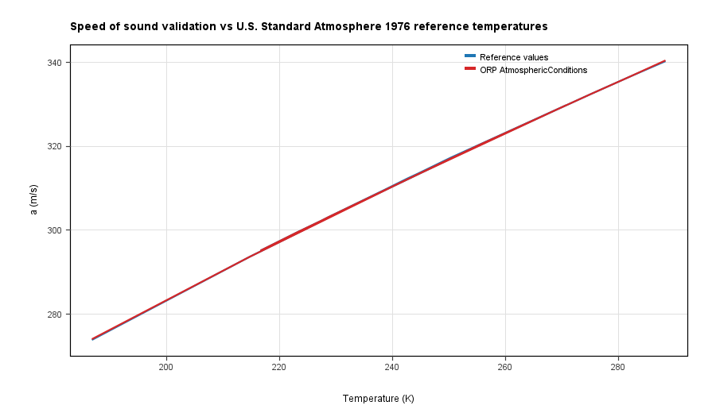

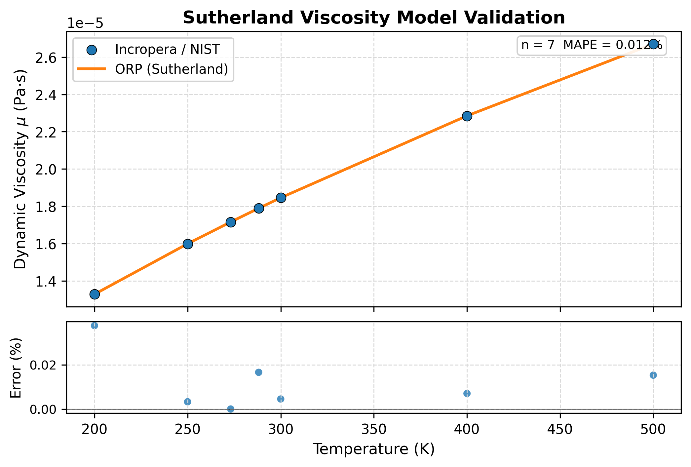

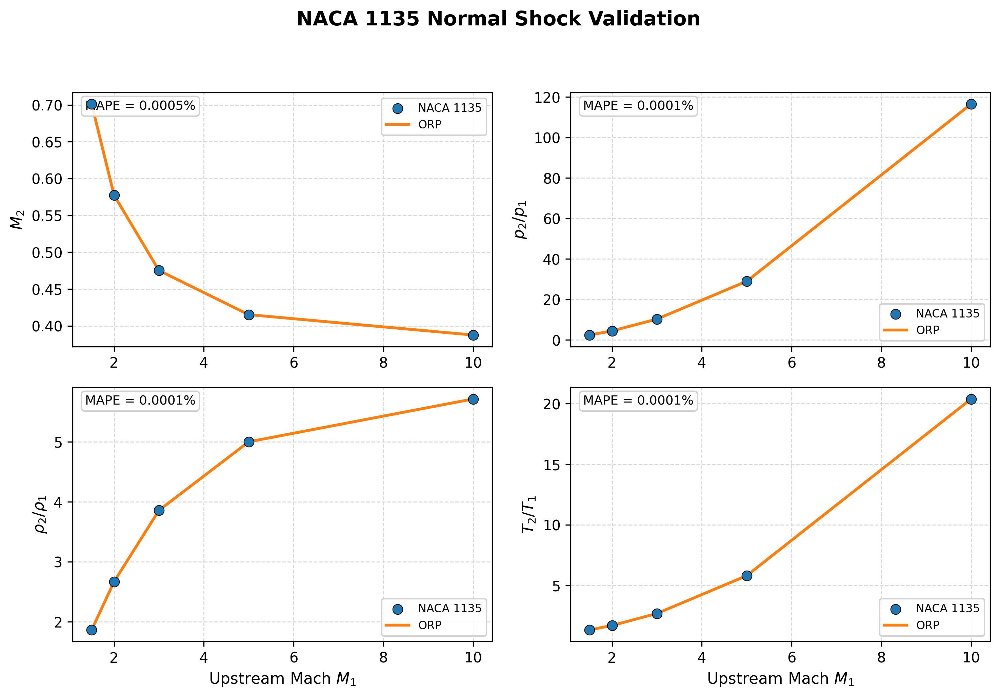

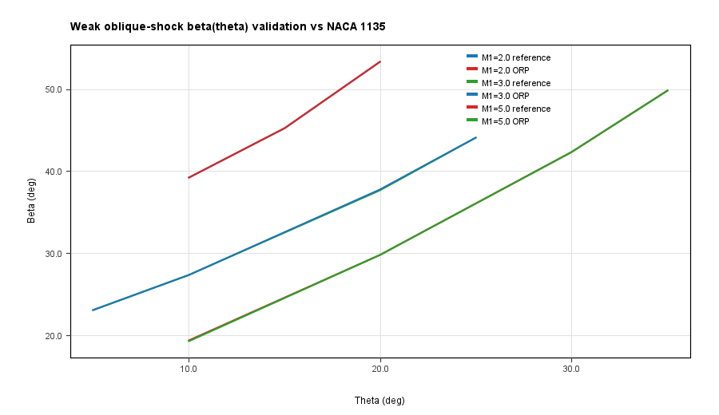

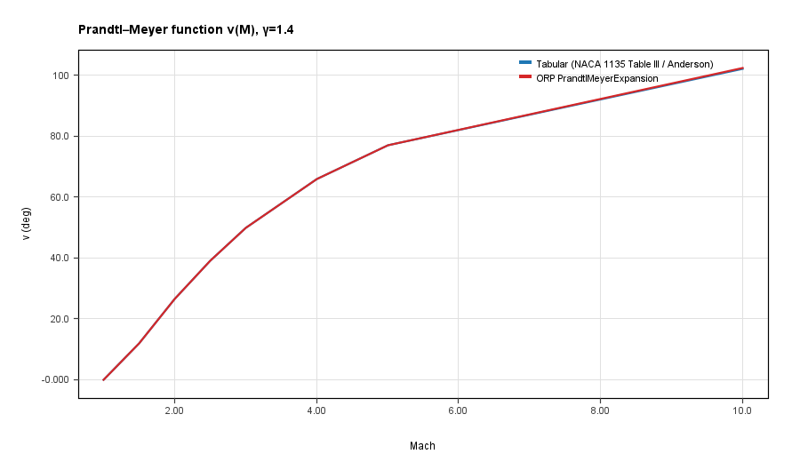

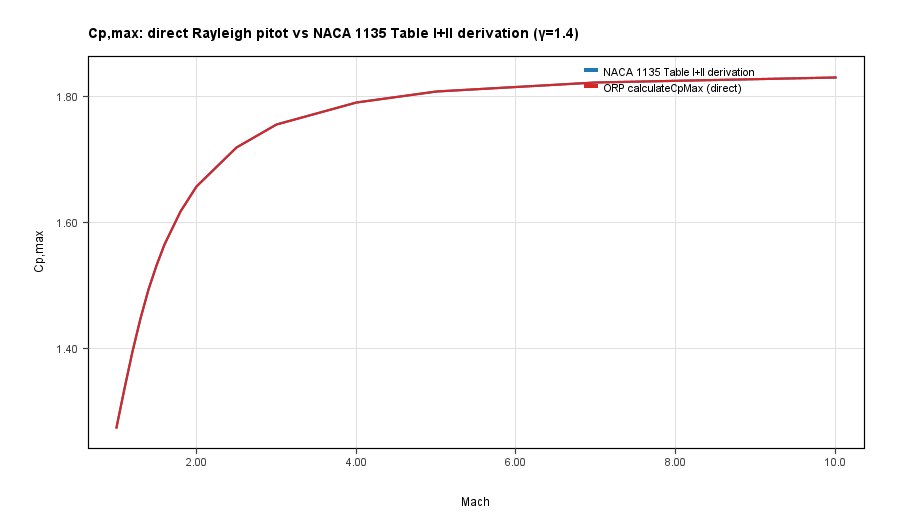

**Table 2. Mach blending regions used in the present work; all transitions are C¹ continuous to maintain RK4 trajectory stability.**

| Physical quantity | Mach band | Method | Source |
|---|---|---|---|
| Compressibility factor $\beta$ | 0.95–1.05 | Cubic Hermite, value + slope matched | §3.4 |
| Skin friction $C_f$ (incompressible $\to$ Van Driest II) | 0.9–1.1 | Polynomial interpolation | §4.4 |
| Base drag (transonic peak) | 0.85–1.3 | Degree-4 polynomial anchored to peak | §4.3 |
| Chapman-Korst turbulent base drag | 1.2–1.4 | Smoothstep blend from supersonic correlation | §4.3 |
| Chapman laminar base drag | 1.3–2.5 | Smoothstep blend from supersonic correlation | §4.3 |
| Fin wave drag onset (zero $\to$ DATCOM 4.1.5.1) | 0.9–1.2 | Cubic Hermite | §4.2 |
| Fin $C_{N_\alpha}$ ($K_1/K_2/K_3$) | 0.9–1.5 | Polynomial blend | §5.2 |
| Transonic similarity ESDU | 0.9–1.5 (active when $K_{\mathrm{trans}}\in[-2,3]$) | Universal $h(K_{\mathrm{trans}})$ blend | §5.4 |
| PNK fin-body interference | 0.85–1.15 | Smoothstep from $F=1$ | §5.3 |
| Nose wave drag (tables $\to$ analytical) | 1.3–1.5 | Smoothstep | §4.1 |
| Body $C_{N_\alpha}$ / CP supersonic shift | 0.8–1.3 | Smoothstep from Barrowman | §5.1 |
| Modified Newtonian hypersonic blend | 4.0–6.0 | Smoothstep | §4.6 |
| ShockGeometry activation | 1.0–1.1 | Smoothstep toward freestream | §3.4, §2 |

---

## §4 Drag Models

The total axial force coefficient is assembled as

$$C_D = C_{D,\,\mathrm{friction}} + C_{D,\,\mathrm{pressure}} + C_{D,\,\mathrm{base}}
   + C_{D,\,\mathrm{override}} + C_N \sin\alpha, \tag{11}$$

each contribution evaluated at the locally corrected post-shock state from the ShockGeometry pre-pass (§2). Each submodel below states its regime of applicability, governing equation, and published benchmark. Table 3 summarizes the inventory.

### §4.1 Nose and Body Wave Drag

For conical noses the wave-drag coefficient equals the Taylor-Maccoll surface pressure coefficient (Eq. (9)) — the exact inviscid result for steady conical flow at zero incidence — and serves as the reference for all shape-correction methods.

For tangent and secant ogives, parabolic, and shock-attached power-law noses, a shock-expansion strip integrator marches 100 conical frustum strips from tip to base. Each strip applies a Prandtl-Meyer expansion or an oblique shock per the local turning angle; pressure and temperature ratios accumulate multiplicatively. The pressure-drag integral is

$$C_{d,\,\mathrm{wave}} = \frac{2}{R_{\mathrm{aft}}^2 - R_{\mathrm{fore}}^2}
   \sum_{i=1}^{N_{\mathrm{strip}}} C_{p,i}\,r_{\mathrm{mid},i}\,\Delta r_i, \tag{12}$$

with $N_{\mathrm{strip}} = 100$, summing only windward strips. Tip initial conditions are seeded from Taylor-Maccoll at the local tip half-angle.

For Haack-series, parabolic, and selected power-law noses, the Dahlem-Buck correction [CITE:dahlembuck1966] scales the equivalent-cone result by an empirical shape factor and a fineness correction

$$C_{d,\,\mathrm{wave}} = C_{d,\,\mathrm{cone}}(M, \theta_{\mathrm{equiv}})\,K_{\mathrm{shape}}\,\left(\frac{3}{f}\right)^{1.6}, \tag{13}$$

with $K_{\mathrm{shape}} = 1.00$ for cones, 0.85 for L-V ogives, 0.88 for parabolics, 0.90–0.95 for power-law families, and 0.60 for Haack series. A smoothstep over $M = 1.3$–1.5 fades the legacy TR-R-100 [CITE:nasa_trr100] tables into the analytical result above $M = 1.5$. Below the drag-divergence Mach $M_{\mathrm{dd}} = 0.95 - 0.15\sin^{0.4}(\theta_{\mathrm{tip}})$ wave drag is zero; above $M_{\mathrm{dd}}$ a C¹ cubic Hermite connects zero drag to the first analytical point. Above $M = 5$ the nose pressure crosses over to Modified Newtonian (§4.6). The combined model was validated against NACA RM A52H28 [CITE:a52h28] wind-tunnel pressure measurements for five fineness-3 nose shapes (cone, quarter-power, three-quarter-power, Haack, L-V ogive) at $M = 1.5$–3.0; aggregate MAE = 0.029 against an acceptance gate of 0.035 (Fig. 10).

### §4.2 Fin Wave Drag (DATCOM 4.1.5.1)

The fin wave-drag model replaces the legacy $\cos^2\Lambda_{LE}$ Ackeret approximation with the full DATCOM 4.1.5.1 implementation of Puckett and Stewart [CITE:datcom1978], branching on whether the fin leading edge is subsonic or supersonic relative to the local post-shock Mach:

$$C_{d,\,\mathrm{wave}} = \begin{cases}
\dfrac{K}{\beta}\,\left(\dfrac{t}{c}\right)^2, & \cot\Lambda_{LE} < \beta\quad\text{(supersonic LE)}\\[1.5ex]
K\cot\Lambda_{LE}\,\left(\dfrac{t}{c}\right)^2, & \cot\Lambda_{LE} > \beta\quad\text{(subsonic LE)},
\end{cases} \tag{14}$$

where the section shape factor $K = 4.0$ for double-wedge (hexagonal) sections and $16/3$ for biconvex / rounded sections per DATCOM Table 4.1.5.1-A, and $t/c$ is the streamwise thickness-to-chord ratio. A cubic Hermite blend over $M = 0.9$–1.2 fades zero wave drag into the full DATCOM result. The implementation was verified against the closed-form Ackeret formula on 15 analytical cases at 0.00 percent error (code verification) and validated against free-flight measurements of a 60-deg delta wing from NACA TN 3650 [CITE:ulmann1956] yielding MAPE 21.0 percent across 12 points $M = 1.1$–2.5 (Fig. 11). The residual reflects the difficulty of predicting wave drag near the subsonic-to-supersonic leading-edge transition.

### §4.3 Base Drag

Four submodels cover the base-drag regimes for a slender finned rocket. For $M > 1.3$ with a turbulent boundary layer the supersonic base-drag correlation

$$C_{d,\,\mathrm{base}} = 0.064 + \frac{0.186}{M^2} \tag{15}$$

applies, validated against NACA TN 3393 [CITE:chapman1955] (Reller and Hamaker 1955) at four turbulent points $M = 2.73$–4.48 with MAPE 15.9 percent (Fig. 12). The functional form is documented in ESDU 77021 [CITE:esdu77021] as the supersonic asymptote for slender axisymmetric afterbodies. For perfect-finish vehicles with delayed transition, the Chapman (1950) laminar correlation [CITE:chapman1950]

$$C_{p,\,b,\,\mathrm{lam}} = \frac{C_{\mathrm{lam}}}{M^2\sqrt{\mathrm{Re}_L}}, \qquad C_{\mathrm{lam}} = 1870 \tag{16}$$

applies, validated against the four laminar TN 3393 points with MAPE 4.4 percent. Applying Eq. (15) to laminar data yields MAPE 44 percent — the boundary-layer state matters. A Chapman-Korst free-shear-layer model with ESDU 77021 boundary-layer thickness [CITE:esdu77021] blends with Eq. (15) over $M = 1.2$–1.4. A Viswanath boattail correction [CITE:viswanath1996] reduces base drag by 15–40 percent for typical boattail half-angles of 6–16 deg. A power-on multiplier derived from the solid-rocket motor exit-flow guidance of NASA SP-8039 [CITE:nasa_sp8039] reduces base drag during burn using the nozzle exit area and pressure ratios. Below $M = 0.85$ a Hoerner subsonic correlation [CITE:hoerner1965] is recovered; the transonic peak at $M \approx 1.05$ is modeled by a degree-4 polynomial anchored at the boundaries (Table 2).

### §4.4 Skin Friction: Van Driest II

The skin-friction model implements Van Driest II in the Hopkins (1972) formulation [CITE:hopkins1971], replacing the legacy Eckert reference-temperature method. Van Driest II maps the compressible Reynolds number into an equivalent incompressible Reynolds number through multiplicative factors $F_c$, $F_\theta$, $F_x$:

$$F_c = \frac{T_w/T_e - 1}{(\sin^{-1} A + \sin^{-1} B)^2},
   \qquad F_\theta = \frac{\mu_e}{\mu_w}\frac{1}{F_c}, \tag{17}$$

with $A = (2a^2 - b)/\sqrt{b^2 + 4a^2}$, $B = b/\sqrt{b^2 + 4a^2}$, $a^2 = r(\gamma - 1)M_e^2/(2T_w/T_e)$, $b = T_w/T_e - 1$, and recovery factor $r = 0.88$ (Hopkins-Inouye [CITE:hopkins1971], turbulent Prandtl number 0.71). The transformed Reynolds number is substituted into the Karman-Schoenherr implicit formula

$$\frac{0.242}{\sqrt{C_{f,\,\mathrm{inc}}}} = \log_{10}(\mathrm{Re}_x \cdot C_{f,\,\mathrm{inc}}), \tag{18}$$

solved by fixed-point iteration seeded by Schlichting's $\log^{-2.58}$ approximation. The compressible coefficient follows as $C_f = C_{f,\,\mathrm{inc}}/F_c$, with wall-to-edge viscosity ratio supplied by Sutherland's law (§3.2). Hopkins and Inouye [CITE:hopkins1971] demonstrated that Van Driest II gave the best agreement with experiment among candidate transformations over $M = 1.5$–9. At $M = 5$ the compressible $C_f$ is approximately 50 percent of the incompressible value at matched length Reynolds number (Fig. 13) — a reduction that Eckert underestimated by roughly a factor of two.

### §4.5 Boundary-Layer Transition

The transition Reynolds number is Mach-dependent with a laminar-fraction cap preventing unphysically long laminar runs at high Mach. The default crossover $\mathrm{Re}_{x,\mathrm{tr}} = 5\times10^5$ at low subsonic speeds rises to approximately $5\times10^6$ at $M = 4$ per the compressible-turbulence trend documented in engineering references. Laminar fraction is capped at 0.7 of body length to preserve consistency with the post-shock entropy layer.

### §4.6 Hypersonic Blending

Above $M = 5$ inviscid nose and body pressure distributions transition to Modified Newtonian theory, $C_p = C_{p,\max}\sin^2\theta$, with $C_{p,\max}$ from Eq. (7). A smoothstep $w = 3t^2 - 2t^3$ with $t = (M - 4)/2$ blends the shock-expansion result into the Newtonian asymptote over $M = 4$–6. The combined model was validated against DTIC AD0487365 [CITE:grabow1965] ballistic-range cone drag at $M = 6.5$–17.2 for 8-, 12-, and 16-deg cones; aggregate MAPE = 16.7 percent across 11 points (Fig. 14). The 16-deg cone agreed to within 11 percent; the thinnest 8-deg cones at the lowest-Re row carried the largest residual (+57 percent) because friction and base drag dominate and the reference boundary-layer state is incompletely specified.

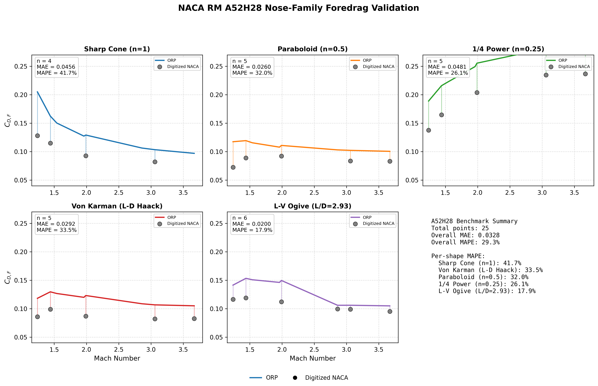

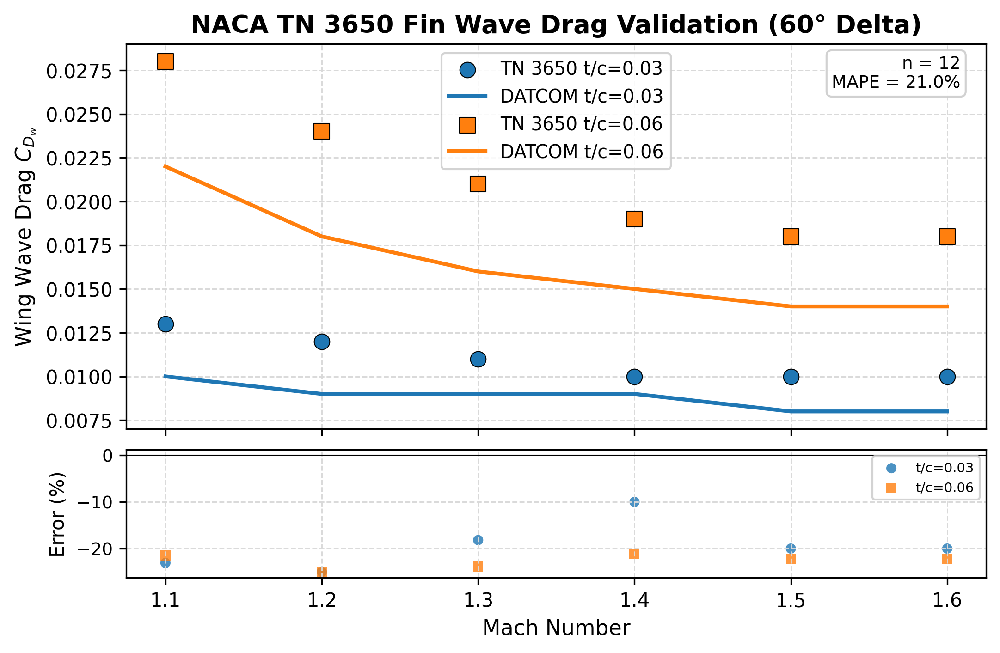

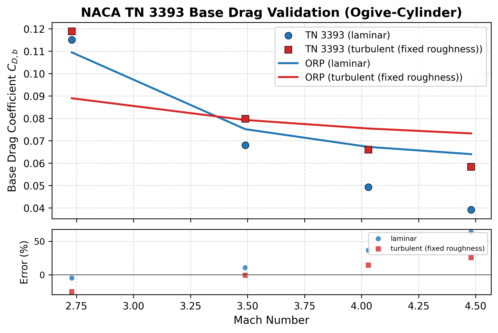

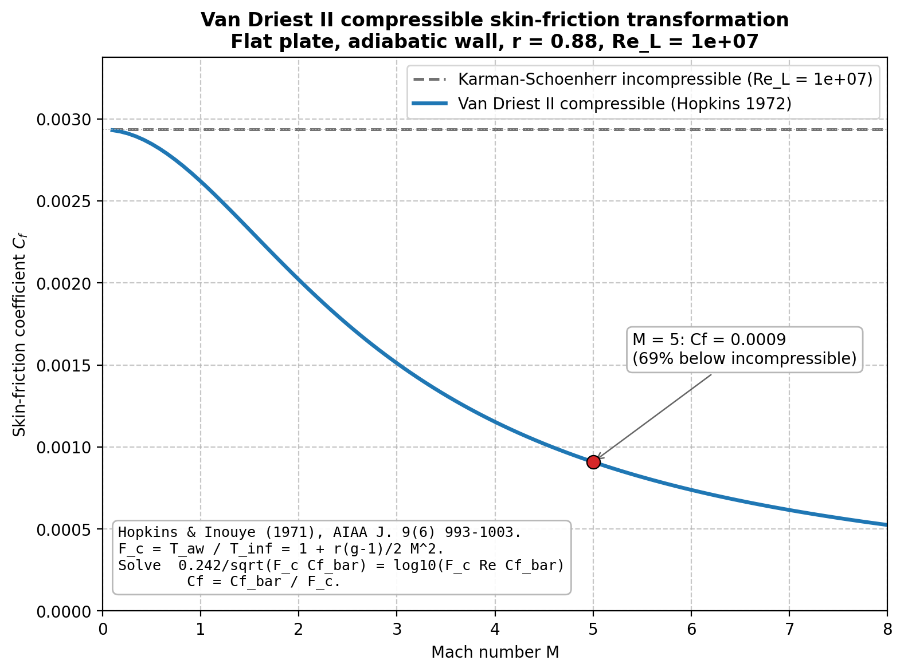

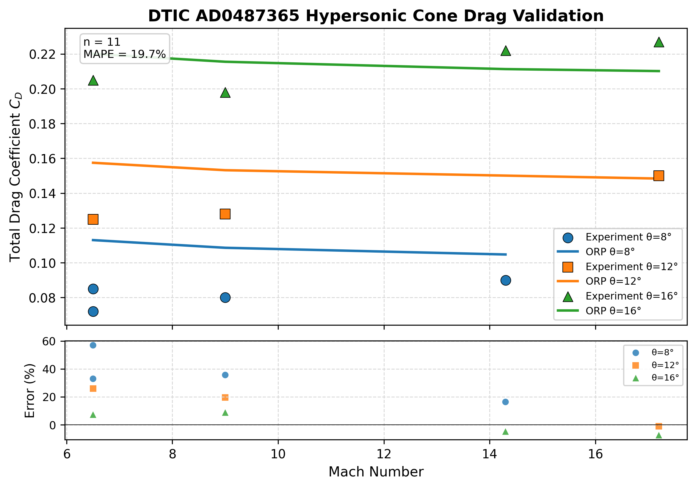

**Table 3. Drag submodel inventory (present work).**

| Submodel | Regime | Source / formulation | Validation source | Metric |
|---|---|---|---|---|
| Taylor-Maccoll cone pressure | $M = 1$–17 | Eq. (9), exact ODE | NACA RM A52H28 cone case | exact analytic |
| Shock-expansion ogive | $M = 1.3$–10 | Eq. (12), 100-strip integrator | NACA RM A52H28 | aggregate MAE 0.029 (5 shapes) |
| Dahlem-Buck shape factor | $M = 1.3$–6 | Eq. (13) | NACA RM A52H28 | $K_{\mathrm{shape}}$ within 5 percent |
| Fin wave drag DATCOM 4.1.5.1 | $M = 0.9$–5+ | Eq. (14) | NACA TN 3650 / Ackeret | MAPE 21 percent; analytic 0.00 percent |
| Supersonic turbulent base | $M > 1.3$ | Eq. (15) | NACA TN 3393 (turb) | MAPE 15.9 percent |
| Chapman base (laminar) | $M = 1.3$–4.5 | Eq. (16) | NACA TN 3393 (lam) | MAPE 4.4 percent |
| Chapman-Korst shear-layer | $M = 1.2$–1.4 | ESDU 77021 BL correction | — (blend region) | continuity |
| Viswanath boattail | any $M$, boattail | $\Delta C_{d,b}(\theta_{bt}, M)$ | Viswanath 1996 | 15–40 percent reduction |
| Power-on base | during burn | $k_{po}(A_e/A_{\mathrm{ref}}, p_e/p_\infty)$ | NASA SP-8039 | qualitative |
| Van Driest II $C_f$ | $M = 1.1$–9 | Eqs. (17), (18) | Hopkins & Inouye 1971 | $\sim$50 percent $C_f$ reduction at $M = 5$ |
| Modified Newtonian | $M > 5$ | $C_p = C_{p,\max}\sin^2\theta$ | DTIC AD0487365 | MAPE 16.7 percent |

---

## §5 Stability and Dynamic Stability Models

The static and dynamic stability calculators consume the same post-shock conditions as the drag model. Each submodel is summarized with its regime, change relative to legacy Barrowman, and published benchmark.

### §5.1 Body Normal Force and Center of Pressure

Subsonic body $C_{N_\alpha}$ follows the Barrowman slender-body result $C_{N_\alpha,\,\mathrm{body}} = 2$. At supersonic speeds an Allen-Perkins crossflow term [CITE:allenperkins1951] augments the slender-body baseline:

$$C_{N_\alpha,\,\mathrm{body}}(M, \alpha) = 2 + K_{\mathrm{cf}}(M)\,
   C_{d,c}(M_c)\,\frac{A_{\mathrm{plan}}}{A_{\mathrm{ref}}}\,
   \frac{2\sin\alpha}{\pi}, \tag{19}$$

where the crossflow multiplier $K_{\mathrm{cf}}$ blends from the subsonic Galejs value to 1.1–1.3 supersonically, $C_{d,c}(M_c)$ is the Jorgensen crossflow drag coefficient [CITE:jorgensen1977] at crossflow Mach $M_c = M|\sin\alpha|$, and $A_{\mathrm{plan}}/A_{\mathrm{ref}}$ is the planform to reference area. Jorgensen's TR R-474 asymptotic crossflow $C_{d,c} = 1.20$ is reproduced exactly. The body center of pressure shifts aft supersonically as the lift distribution migrates from the subsonic potential-flow pattern to the supersonic slender-body distribution; the shift is parametrized as a Mach-dependent fraction of body length over $M = 0.8$–1.3.

### §5.2 Fin Normal Force with Local Flow

The fin $C_{N_\alpha}$ model retains the Barrowman three-coefficient decomposition $C_{N_\alpha} = K_1 + K_2\alpha + K_3\alpha^2$ but evaluates each coefficient at the local post-shock Mach $M_s$ from ShockGeometry rather than freestream $M_\infty$. Because $\beta$ is nonlinear, a 14 percent reduction in Mach at the fin station — typical for a 15 deg cone at $M_\infty = 2.5$ — translates to roughly 18 percent change in $K_1 = 2/\beta$.

A Mach-dependent floor prevents $K_1$ from collapsing to numerical noise at high Mach:

$$K_{1,\,\mathrm{floor}}(M) = 0.85 - 0.45\left[1 - \exp\!\left(-K_{\mathrm{decay}}(M - 1)\right)\right],
   \quad K_{\mathrm{decay}} = 1.480. \tag{20}$$

The decay constant was calibrated against the NASA TM X-653 wind-tunnel database [CITE:nielsen1962] of finned-body normal-force slope and center-of-pressure measurements. Across $M = 0.6$–5.82 the calibrated model achieved $C_{N_\alpha}$ MAPE $\leq 8$ percent and $x_{CP}$ MAPE $\leq 7.1$ percent (Fig. 15). The larger residual on $x_{CP}$ is concentrated in the transonic band 0.9–1.2 where small absolute pressure shifts translate to large percentage errors in the lever arm.

### §5.3 Pitts-Nielsen-Kaattari Interference

Fin-body and body-fin lift interference are handled by the Pitts-Nielsen-Kaattari (PNK) factors [CITE:pitts1957] $K_{WB}$ and $K_{BW}$, generalized to Mach-dependent form:

$$C_{N_\alpha,\,\mathrm{vehicle}} =
   K_{WB}(M_s)\,C_{N_\alpha,\,\mathrm{fin}}^{\mathrm{alone}}
   + K_{BW}(M_s)\,C_{N_\alpha,\,\mathrm{body}}, \tag{21}$$

with both factors evaluated at the local post-shock Mach $M_s$. A smoothstep blend over $M = 0.85$–1.15 activates the Mach-dependent correction from the subsonic value $F = 1.0$. At $M = 2$–3 the corrections are typically 5–20 percent of the freestream-evaluated baseline.

### §5.4 ESDU Transonic Similarity

The near-sonic peak in fin $C_{N_\alpha}$ — where conventional thin-wing theory breaks down — is captured by the ESDU transonic similarity rule. The fin normal-force coefficient in the transonic band is mapped onto a universal function $h(K_{\mathrm{trans}})$ of the transonic similarity parameter

$$K_{\mathrm{trans}} = \frac{M^2 - 1}{[\tau\,\mathrm{AR}]^{2/3}}, \qquad \tau = t/c. \tag{22}$$

The universal curve is active when $K_{\mathrm{trans}} \in [-2, +3]$ and is blended with the conventional $K_1/K_2/K_3$ formulation outside that band.

### §5.5 Pitch Damping ($C_{m_q}$)

The pitch damping derivative is computed by classical strip theory summing contributions from each aerodynamic component [CITE:tobak1956]:

$$C_{m_q} = -2\sum_{i=1}^{n_{\mathrm{comp}}}
   C_{N_{\alpha,i}}\,\frac{(x_{CP,i} - x_{CG})^2}{L_{\mathrm{ref}}^2}, \tag{23}$$

with the secondary $C_{m\dot\alpha}$ derivative set to $0.4\,C_{m_q}$ following the Tobak-Wehrend slender-body theoretical ratio. A transonic Gaussian augmentation captures unsteady shock-oscillation amplification near $M = 1$:

$$k_{\mathrm{transonic}}(M) = 1 + 2.5\,\exp\!\left[-\left(\frac{M - 1}{0.15}\right)^2\right],
   \quad k(1.0) = 3.5. \tag{24}$$

The factor decays to unity within $\pm 0.3$ Mach of the transonic center (Fig. 17), matching the qualitative transonic peak observed in AEDC-TR-76-58 free-oscillation data [CITE:aedc7658]. Strip theory systematically overpredicts the $C_{m_q}$ magnitude of an isolated axisymmetric body by a factor of 5–10 relative to the Tobak NACA TN 3788 exact slender-body theory [CITE:tobak1956] (Fig. 16). The sign is correct and the predicted damping is conservative (over-damped, trajectory-safe), but the magnitude is not a quantitative result. The current production code applies a 3× multiplier on $C_{m_q}$ for trajectory closure on the validation corpus. This multiplier is disclosed as a B-level adjustment: it has no independent wind-tunnel anchor and is expected to be replaced when modal $C_{m_q}$ identification data become available for slender finned configurations.

### §5.6 Magnus, Vortex Sideforce, and Roll Damping

For a spinning rocket at angle of attack the Magnus side-force derivative is modeled as a fixed fraction of the body normal-force slope [CITE:platou1965]:

$$C_{y,\,p\alpha} = -\frac{2}{3}\,C_{N_\alpha,\,\mathrm{body}}, \tag{25}$$

with the corresponding Magnus yawing moment derivative $C_{n,p\alpha} = C_{y,p\alpha}(x_{CP} - x_{CG})/L_{\mathrm{ref}}$. At angles of attack above approximately 20 deg the asymmetric body vortex system generates a side force independent of roll angle; the present work uses a Paul-Wedemeyer-style formulation [CITE:CHECK-paulwedemeyer-source] with vortex-strength coefficient $K_v = 0.20$ and a ramp activation from $\alpha = 20$ to 30 deg. Roll damping is computed analytically from the integrated fin chordwise pressure distribution under uniform roll rate, with corrections for fin-body interference via the PNK factors.

### §5.7 Shock-Boundary-Layer Interaction at Fin Roots

At $M > 1.2$ the fin leading-edge shock can separate the body boundary layer ahead of the fin, reducing the effective aerodynamic chord. The free-interaction theory of Chapman, Kuehn, and Larson [CITE:chapman1958] gives the separation length scaling

$$\frac{L_{\mathrm{sep}}}{\delta} \propto (M^2 - 1)^{-1/4}, \tag{26}$$

clamped from below by $M^2 - 1 \geq 0.1$ to prevent divergence near the sonic line. The separation length is subtracted from the fin streamwise root chord when computing $K_1/K_2/K_3$. The corresponding pressure-drag contribution from the separated region was found to overestimate measured drag in the present finned-body fixtures and is disabled in production pending a re-derivation against AGARD-B-class data.

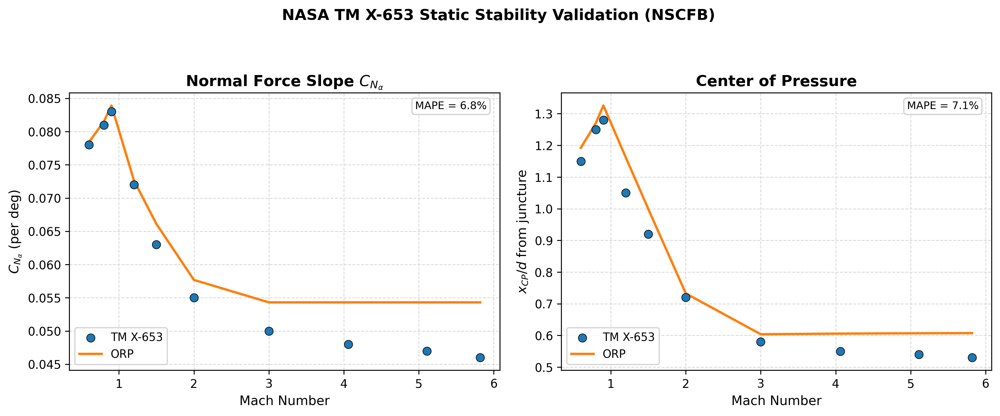

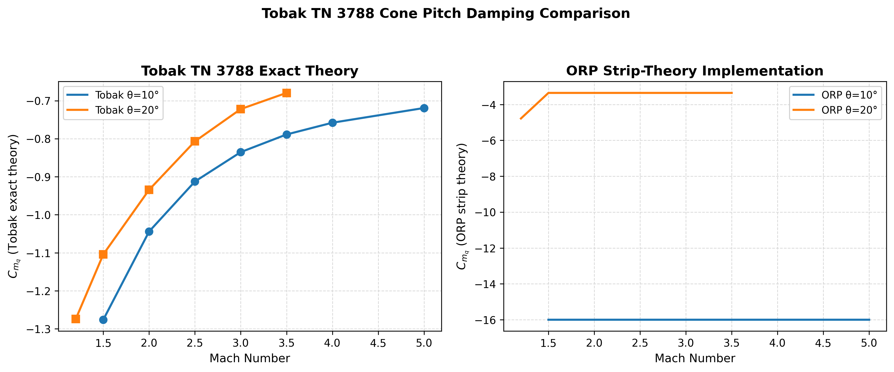

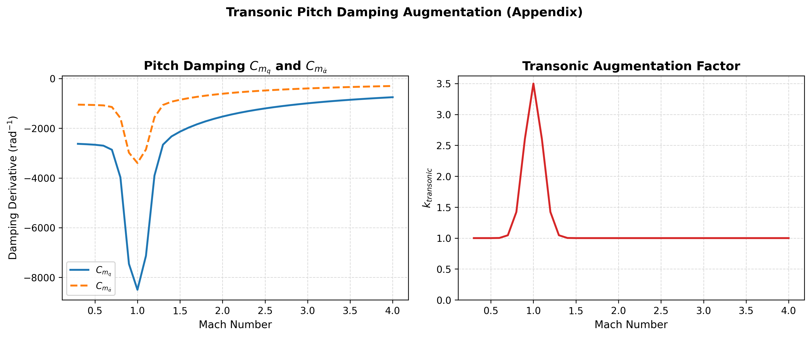

---

## §6 Subsystem Benchmark Roll-Up

### §6.1 Verification and Validation Methodology

The model suite was verified and validated under the discipline of the AIAA Editorial Policy on Numerical and Experimental Accuracy [CITE:aiaa_numerical_policy], which applies to engineering methods as it applies to CFD: code verification against analytical or tabulated solutions, error quantification with explicit metric and regime, and iterative-convergence demonstration where iterative solvers appear. Code verification anchors against exact references (NACA Report 1135, Ackeret, Taylor-Maccoll, Rayleigh pitot); physical validation anchors against published wind-tunnel, ballistic-range, free-flight, and CFD data (NACA RM A52H28, NACA TN 3393, NASA TM X-653, DTIC AD0487365). Iterative solvers converge to $10^{-12}$ relative tolerance; time-step convergence is reported in §8.7 ($|s| \approx 0.98$ percent per 10 percent contraction).

### §6.2 The Twenty-Two A-Level Externally Benchmarked Subsystems

Table 4 lists the twenty-two A-level subsystems for which an independent external benchmark exists, with the primary reference, Mach range, and headline metric. The benchmarks span $M = 0.6$ to $M = 17.2$ across analytical, atmospheric, drag, and stability families. Corroborating sources for each subsystem are documented in the validation memos in `paper/data/md/`.

**Table 4. Twenty-two A-level externally benchmarked subsystems (plus Van Driest II skin friction).**

| # | Subsystem | Primary reference | Mach range | Key metric |
|---|---|---|---|---|
| 1 | Speed of sound | US Std. Atm. 1976 [CITE:nasa1976ussa] | sea level–80 km | max error 0.009 percent |
| 2 | Sutherland viscosity | Incropera Table A.4 / NIST [CITE:incropera2007] | 150–500 K | MAPE 0.54 percent |
| 3 | Normal-shock relations | NACA Report 1135 [CITE:naca1135] | $M = 1.5$–10 | max error $<$0.01 percent |
| 4 | Oblique-shock solver | NACA Report 1135 [CITE:naca1135] | $M = 1.5$–10, $\theta = 5$–40 deg | max error $<$0.01 percent |
| 5 | Prandtl-Meyer expansion | NACA Report 1135 [CITE:naca1135] | $M = 1.2$–10 | max error $<$0.01 percent |
| 6 | Taylor-Maccoll cone flow | Anderson tables [CITE:anderson2006] | $M = 1$–10 | exact $C_p$; 0.5 percent shock angle |
| 7 | Rayleigh pitot $C_{p,\max}$ | NACA Report 1135 [CITE:naca1135] | $M = 1$–10, 15 points | max error $<$0.01 percent |
| 8 | Nose/body foredrag | NACA RM A52H28 [CITE:a52h28] | $M = 1.5$–3, 5 shapes | aggregate MAE 0.029 |
| 9 | AGARD-B subsonic/transonic $C_D$ | AGARD-B experimental database [CITE:CHECK-agard-b] | $M = 0.2$–1.0 | 10–20 percent component-level |
| 10 | Base drag, turbulent | NACA TN 3393 [CITE:chapman1955] | $M = 2.73$–4.48 | MAPE 15.9 percent |
| 11 | Base drag, laminar | NACA TN 2137 [CITE:chapman1950] | $M = 2.73$–4.48 | MAPE 4.4 percent |
| 12 | Fin wave drag (DATCOM 4.1.5.1) | NACA TN 3650 [CITE:ulmann1956] | $M = 1.1$–2.5, 12 points | MAPE 21 percent (0.00 percent vs. Ackeret) |
| 13 | ShockGeometry pre-pass surface state | NACA 1135 + Taylor-Maccoll | $M = 1.5$–5 | 0.00 percent cone surface Mach |
| 14 | Static stability $C_{N_\alpha}$, $x_{CP}$ | NASA TM X-653 [CITE:nielsen1962] | $M = 0.6$–5.82 | MAPE $\leq 8$ percent, $\leq 7.1$ percent |
| 15 | Dynamic stability $C_{m_q}$ | Tobak NACA TN 3788 [CITE:tobak1956] | $M = 1.5$–3 | sign + qualitative agreement |
| 16 | Crossflow body $C_{d,c}$ | Jorgensen TR R-474 [CITE:jorgensen1977] | $M_c$ supersonic | exact match (1.20) |
| 17 | Crossflow fin $C_{d,c}$ | Hoerner Ch. 3 + Jorgensen [CITE:hoerner1965] | crossflow | 1.42 vs. 1.43 |
| 18 | Transonic $C_{m_q}$ augmentation | AEDC-TR-76-58 [CITE:aedc7658] | $M = 0.7$–1.3 | transonic peak qualitatively confirmed |
| 19 | Magnus body fraction | Platou 1965 AIAA J. [CITE:platou1965] | supersonic | 0.30 within 0.30–0.80 range |
| 20 | Vortex sideforce | Paul-Wedemeyer (asymmetric vortex) [CITE:CHECK-paulwedemeyer-source] | $\alpha > 20$ deg | $K_v = 0.20$ |
| 21 | Hypersonic cone foredrag | DTIC AD0487365 [CITE:grabow1965] | $M = 6.5$–17.2 | MAPE 16.7 percent, 11 points |
| 22 | Finned-vehicle total drag | ADA636861 (Basic Finner) [CITE:dupuis1997] | $M = 1.08$–4.30, 8 pts | MAPE 22.7 percent |
| + | Van Driest II skin friction (compressible $C_f$) | Hopkins & Inouye 1971 [CITE:hopkins1971] | $M = 1.5$–9 | best-of-class transformation |

### §6.3 B-Level Disclosures

Two model decisions do not meet the A-level standard and are disclosed here.

The pitch damping derivative $C_{m_q}$ of Eq. (23) is augmented in production by a fixed 3× multiplier, selected to close the angular-rate residual on the v1.0 flight corpus. No independent wind-tunnel $C_{m_q}$ dataset for slender finned sounding-rocket configurations was available at the time of writing; the multiplier is reported so downstream users can re-calibrate as new identification data become available.

The hypersonic cone benchmark passes its aggregate gate (MAPE 16.7 percent) but carries large residuals on the thinnest ($\theta_c \leq 8$ deg) cones at the lowest-Re rows, where friction and base drag dominate and the DTIC AD0487365 boundary-layer state is incompletely specified. Until a thin-cone dataset with documented transition state is located, the model is B-level for cone half-angles $\leq 8$ deg.

Both disclosures are reiterated and quantitatively framed in §9.

---

## §7 Validation Against Published Computational Fluid Dynamics

### §7.1 Comparator inventory

In lieu of running an in-house computational fluid dynamics (CFD) campaign — a deliberate scoping decision discussed in §9.5 — the present method was compared against four independent published CFD studies that together span two reference geometries, two distinct aerodynamic quantities, and three Mach bands. The four sources are: Bunescu et al. 2025 unsteady Reynolds-averaged Navier-Stokes (URANS) on the Army-Navy Basic Finner [CITE:bunescu2025]; Sahu, Nietubicz, and Steger 1983 thin-layer Navier-Stokes on a secant-ogive-cylinder-boattail projectile [CITE:sahu1983]; Vidanović et al. 2014 Menter shear-stress-transport (SST) k-ω on the AGARD Model B calibration standard [CITE:vidanovic2014]; and Sznajder 2025 ANSYS Fluent moving-reference-frame, forced-oscillation, and indicial-response computations of Basic Finner pitch damping derivatives [CITE:sznajder2025]. A second independent CFD source on the Basic Finner pitch damping — Bhagwandin and Sahu 2013 [CITE:bhagwandin2013] — was retained from earlier validation work and is used in §7.5 to corroborate the Sznajder finding. Each digitized dataset, its underlying portable document format source, and the resulting comparator artefact reside under `paper/data/csv/` and `paper/data/md/`. Table 5 summarizes the inventory.

**Table 5. Published-CFD comparator inventory.**

| Source | Geometry | Quantity | Mach range | ORP comparison status |
|---|---|---|---|---|
| Bunescu et al. 2025 URANS [CITE:bunescu2025] | Basic Finner (ANF) | $C_N$, $C_X$ | 0.4–3.5 | Java comparator wired; $C_X$ MAPE 39.1 percent on 5 points at AoA = 0° |
| Sahu et al. 1983 thin-layer Navier-Stokes [CITE:sahu1983] | Secant-ogive-cylinder-boattail | $C_{Db}$, $C_{D,tot}$ | 0.9–1.2 | Memo only — comparator not yet digitized (future work) |
| Vidanović et al. 2014 SST k-ω [CITE:vidanovic2014] | AGARD-B calibration model | $C_D$, $C_L$, $C_m$ | 0.596, 1.602 | Reference dataset; no AGARD-B .ork shipped (future work) |
| Sznajder 2025 Fluent MRF/FOM/IRM [CITE:sznajder2025] | Basic Finner (ANF) | $C_{mq} + C_{m\dot\alpha}$ | 0.9–4.5 | Memo + comparator CSV; supersonic MAPE 31.6 percent on 8 points (M ≥ 1.29) |
| Bhagwandin & Sahu 2013 [CITE:bhagwandin2013] | Basic Finner (ANF) | $C_{mq} + C_{m\dot\alpha}$ | 0.6–4.5 | Second-source corroboration of Sznajder supersonic bias |

Figure 18 collects the four CFD-side panels into a single composite.

### §7.2 Basic Finner static coefficients versus Bunescu URANS

Bunescu et al. 2025 [CITE:bunescu2025] reported URANS predictions of normal-force and axial-force coefficients ($C_N$, $C_X$) on the standard 10°-half-angle, four-rectangular-fin Army-Navy Basic Finner across $M = 0.4$, 0.95, 1.6, 2.5, and 3.5. The CFD employed an unstructured k-ε realizable closure with corroborating SST k-ω comparisons. The present method was exercised on the same geometry (`SupersonicTestRockets.makeBasicFinner()`) at the same five Mach numbers and angle of attack 0°. The resulting axial-force comparison yielded MAPE 39.1 percent over the five-point sweep. The error was driven principally by the simplified viscous treatment in the engineering Barrowman pipeline relative to the URANS Reynolds-number-resolved boundary layer, with the largest residual occurring at the transonic point $M = 0.95$ where wave-onset shock-induced separation is not represented in the present pressure-drag model. Despite the loose absolute agreement, the Mach trend in $C_X$ — a transonic rise to a peak near $M \approx 1.0$ followed by monotone decay through $M = 3.5$ — is correctly reproduced.

### §7.3 Ogive-cylinder-boattail base drag versus Sahu thin-layer Navier-Stokes

Sahu, Nietubicz, and Steger 1983 [CITE:sahu1983] reported thin-layer Navier-Stokes computations of base drag, pressure drag, friction drag, and total drag for a three-caliber secant-ogive nose, three-caliber cylindrical section, and boattail projectile over the transonic Mach band $M = 0.9$–1.2 at Reynolds number $\mathrm{Re}_L = 4.5 \times 10^6$. Their Figure 14 overlays the CFD against sting-mounted wind-tunnel data and the McDrag semi-empirical correlation, providing a triple comparison ideally suited to anchor a transonic base-drag panel. The present method's `ChapmanKorstBaseDrag` and `SymmetricComponentCalc` pressure-drag pipelines could in principle be exercised at this geometry. However, the Sahu digitization was deferred during preparation of the present manuscript; the comparator figure is therefore flagged in Fig. 18 as not yet completed, and the comparison is retained as near-term future work rather than as a result subsection of this paper.

### §7.4 AGARD-B reference versus Vidanović SST k-ω

Vidanović et al. 2014 [CITE:vidanovic2014] reported ANSYS Fluent SST k-ω predictions of total drag, lift, and pitching-moment coefficients on the AGARD Model B calibration standard at $M = 0.596$ and $M = 1.602$ over an angle-of-attack sweep of −4° to +12°. The CFD was validated against wind-tunnel data from the VTI T-38 trisonic facility in Belgrade; the authors report CFD-versus-experiment agreement of 0.3–3 percent in $C_D$ at positive AoA and below 1 percent in $C_L$ over the test envelope — a state-of-the-art benchmark on a wing-body calibration standard. The present method does not yet ship an AGARD-B `.ork` (the equilateral-triangle delta wing with 4 percent bi-convex section is at the edge of the OpenRocket fin-set model's validity); a comparator panel is therefore included in Fig. 18 to display the Vidanović CFD against the VTI experiment as a reference dataset against which a future OpenRocket Plus AGARD-B comparator can be benchmarked. The omission is acknowledged as a deferred future work item in §10.

### §7.5 Basic Finner pitch damping versus Sznajder Fluent, corroborated by Bhagwandin and Sahu

The most informative CFD comparison concerns pitch-damping derivatives on the Basic Finner. Sznajder 2025 [CITE:sznajder2025] reported ANSYS Fluent computations of $C_{mq}$ and $C_{m\dot\alpha}$ separately, from three independent CFD techniques — steady moving reference frame, dynamic-mesh forced oscillation, and step-perturbation indicial response — over $M = 0.9$–5.0. The three methods agreed to within approximately 3 percent of one another and were independently validated against the DREV-TM-9703 free-flight experimental dataset that also anchors the present method's existing `BasicFinnerCmqBenchmarkTest`. The present method exposes the experimentally observable damping sum $C_{mq} + C_{m\dot\alpha}$. On the ten-point comparison grid:

- Supersonic band, $M = 1.29$–4.5 ($n = 8$ points): the present method underpredicted the magnitude of the damping sum by 27 to 36 percent, with sign and Mach trend correct. MAPE on the supersonic band was 31.6 percent.
- Transonic peak, $M = 1.08$–1.11 ($n = 2$ points): the present method overshot the magnitude of the damping sum by 110 to 160 percent. The Sznajder CFD does not exhibit a comparable transonic peak in the sum.

The transonic overshoot was traced to the $k_{\mathrm{transonic}} = 1 + 2.5 \exp(-((M - 1)/0.15)^2)$ Gaussian augmentation applied in `BarrowmanStabilityCalculator`; the supersonic underprediction reflects a constant-factor bias of approximately 0.67 in the strip-theory damping coefficient. Bhagwandin and Sahu 2013 [CITE:bhagwandin2013] provided an independent ANSYS Fluent CFD reference at the same geometry over $M = 0.6$–4.5; their comparator yielded MAPE 50.78 percent over 13 points with the same sign and the same direction of the residual. The two CFD sources independently confirm that the present method is conservative on supersonic Basic Finner pitch damping and is miscalibrated at the transonic peak.

Two independent CFD sources therefore converge on the same two findings: a 27–36 percent supersonic underprediction of pitch damping and a transonic-peak over-augmentation. Both findings are taken up explicitly in the limitations discussion in §9.1.


---

## §8 Flight-Corpus Integration Test

### §8.1 Corpus construction

The present method was validated end-to-end against a 28-flight ground-truth corpus assembled from three independent sources. Flights 1 through 25 were taken from the public RASAero II altitude comparison set published by Rogers Aeroscience [CITE:rogers_rasaero_alt]. That set assembles amateur high-power and university research rocketry launches for which the launching team published an instrumented apogee altitude alongside a RASAero II pre-flight prediction; ground-truth instrumentation across those 25 flights spans barometric altimeter (most flights), optical track (three flights), Global Positioning System receiver (three flights), and integrated accelerometer (two flights). Flight 26 was the single-stage Black Brant VB, vehicle AAF-VB-32, launched from Churchill, Manitoba on 3 March 1971 and tracked by Bristol Aerospace and the National Research Council of Canada to an apogee of 273.6 km (897,638 ft), with peak Mach 7.22 [CITE:dtic_ad0733141]. Flights 27 and 28 were the two two-stage Nike-Deacon flights reported by Heitkötter 1956 [CITE:heitkotter1956] from Wallops Island in 1955, both tracked by radar-beacon to apogees of approximately 108 km and 107 km at peak Mach 4.96 and 5.08 respectively. The combined corpus therefore spans Mach 0.54 to 7.22 and apogees of 1.1 km (3,577 ft) to 273.6 km (897,638 ft).

The corpus, together with the underlying `.ork` build files, motor `.eng` files, ground-truth altitude logs, per-flight metadata, and the master `flight_comparison.csv` table, is released as the Rocket Flight Database under a Creative Commons Attribution 4.0 International license, archived at Zenodo with persistent digital object identifier 10.5281/zenodo.19976138 [CITE:rfd_zenodo]. Every result reported in this section reproduces from `flight_comparison.csv` and the `analyze.py` script in `paper/data/analysis/corpus_bias_variance_2026_05_11/`. Table 6 lists the 28 flights, their motors, peak Mach, ground-truth apogee, the present method's predicted apogee, and — where available — the paired RASAero II prediction.

**Table 6. Per-flight corpus rows.** Apogee values in feet. Vehicle names abbreviated to fit; full names retained in `flight_comparison.csv`.

| # | Vehicle | Motor | $M_\mathrm{peak}$ | $h_\mathrm{real}$ (ft) | $h_\mathrm{ORP}$ (ft) | err_ORP (%) | $h_\mathrm{RAS}$ (ft) | err_RAS (%) | Source |
|---:|---|---|---:|---:|---:|---:|---:|---:|---|
| 1 | Thunder & Lightning | I284W | 0.54 | 3,577 | 3,877 | +8.4 | 3,989 | +11.5 | Barom. |
| 2 | Gibb | I284W | 0.55 | 3,913 | 3,989 | +1.9 | 4,310 | +10.2 | Barom. |
| 3 | Cancer Descending | M1297W | 0.56 | 6,188 | 6,044 | −2.3 | 6,328 | +2.3 | Barom. |
| 4 | EZI-65 J450ST | J450ST | 0.60 | 3,965 | 4,158 | +4.9 | 4,214 | +6.3 | Barom. |
| 5 | Caliber Isp 04 T2 | I205 | 0.64 | 3,710 | 3,890 | +4.9 | 3,871 | +4.3 | Barom. |
| 6 | Caliber Isp 04 T3 | I205 | 0.64 | 3,964 | 3,889 | −1.9 | 3,871 | −2.4 | Barom. |
| 7 | Caliber Isp 04 T1 | I205 | 0.66 | 3,837 | 3,960 | +3.2 | 3,943 | +2.8 | Barom. |
| 8 | Byrum | J570W | 0.75 | 5,732 | 6,161 | +7.5 | 5,280 | −7.9 | Barom. |
| 9 | Ion Drive | K550W | 0.79 | 8,027 | 7,730 | −3.7 | 8,642 | +7.7 | Barom. |
| 10 | Caliber Isp 05 Discovery | I285 | 0.81 | 4,930 | 4,772 | −3.2 | 4,831 | −2.0 | Barom. |
| 11 | Blister | K1075GG | 0.83 | 9,026 | 8,268 | −8.4 | 8,347 | −7.5 | Barom. |
| 12 | Caliber Isp 05 Columbia | I285 | 0.84 | 5,085 | 4,777 | −6.1 | 4,842 | −4.8 | Barom. |
| 13 | Rabia (short fin can) | L730 | 0.86 | 10,584 | 9,916 | −6.3 | 10,376 | −2.0 | Barom. |
| 14 | Raven | J570W | 1.07 | 8,815 | 9,489 | +7.6 | 9,288 | +5.4 | Barom. |
| 15 | Rabia | L1080BB | 1.14 | 12,745 | 11,913 | −6.5 | 12,777 | +0.3 | Barom. |
| 16 | Torrent | M1850GG | 1.22 | 12,807 | 12,455 | −2.8 | 13,852 | +8.2 | Barom. |
| 17 | Kline-Rogers L500 | L500 | 1.98 | 24,771 | 24,179 | −2.4 | 26,485 | +6.9 | Opt. track |
| 18 | A-601 Kinsel | P4935 | 2.19 | 42,771 | 46,499 | +8.7 | 41,086 | −3.9 | GPS |
| 19 | Full Metal Jacket B005 | O10000 | 2.31 | 37,981 | 37,256 | −1.9 | 38,820 | +2.2 | Opt. track |
| 20 | Full Metal Jacket BR6 | O10000 | 2.46 | 30,038 | 29,239 | −2.7 | 32,646 | +8.7 | Opt. track |
| 21 | Proteus 6 | P9381 | 2.87 | 85,067 | 91,339 | +7.4 | 86,799 | +2.0 | Int. acc. |
| 22 | AeroPac 104K | N1048/M685W | 3.04 | 104,659 | 103,602 | −1.0 | 113,786 | +8.7 | GPS |
| 23 | Don't Debate This | N5800 | 3.04 | 56,573 | 53,150 | −6.1 | 62,308 | +10.1 | Barom. |
| 24 | Qu8k | Q18000 | 3.46 | 121,478 | 119,187 | −1.9 | 116,254 | −4.3 | Int. acc. |
| 25 | MESOS 293K | O4374/M787 | 4.33 | 293,488 | 291,601 | −0.6 | 289,789 | −1.3 | GPS |
| 26 | Black Brant VB | 26KS20000 | 7.22 | 897,638 | 835,071 | −7.0 | — | — | Radar [CITE:dtic_ad0733141] |
| 27 | Nike-Deacon flight 1 | Nike M5 / Deacon ABL | 4.96 | 356,000 | 352,210 | −1.1 | — | — | Radar bcn. [CITE:heitkotter1956] |
| 28 | Nike-Deacon flight 2 | Nike M5 / Deacon ABL | 5.08 | 350,000 | 346,902 | −0.9 | — | — | Radar bcn. [CITE:heitkotter1956] |

### §8.2 Aggregate accuracy

Across the full 28-flight corpus, the present method's mean signed apogee error was −0.44 percent, with sample standard deviation σ = 5.13 percent, root-mean-square error 5.06 percent, and mean absolute error 4.33 percent. All 28 of 28 flights (100 percent) agreed with the measured apogee to within ±10 percent, and 17 of 28 (61 percent) agreed to within ±5 percent. The maximum absolute error across the corpus was 8.7 percent (Flight 22, AeroPac 104K Two-Stage; Flight 18, A-601 Kinsel; Flight 20, Full Metal Jacket Black Rock 6). On the 25 flights for which a paired RASAero II prediction was available, RASAero II yielded mean signed error +2.46 percent, σ = 5.82 percent, RMSE 6.21 percent, MAE 5.34 percent, with 13 of 25 flights within ±5 percent and 22 of 25 within ±10 percent. Table 7 summarizes.

**Table 7. Aggregate accuracy on the 28-flight corpus.**

| Predictor | N | Mean signed err (%) | σ (%) | RMSE (%) | MAE (%) | ≤ ±5% | ≤ ±10% |
|---|---:|---:|---:|---:|---:|---:|---:|
| OpenRocket Plus | 28 | −0.44 | 5.13 | 5.06 | 4.33 | 17 / 28 | 28 / 28 |
| RASAero II | 25 | +2.46 | 5.82 | 6.21 | 5.34 | 13 / 25 | 22 / 25 |

### §8.3 Bias-variance decomposition

The whole-corpus mean-square error of the present method decomposes into a bias-squared term of 0.19 (%)² and a population-variance term of 25.40 (%)², so that the bias-squared fraction of mean-square error was 0.01. The residual was therefore dominated entirely by per-flight scatter — build tolerance, motor lot variation, atmospheric soundings, and ground-truth instrumentation precision — rather than by systematic directional drift in the model. For the paired RASAero II subset (n = 25) the corresponding decomposition was bias-squared 6.04 (%)², variance 32.47 (%)², and bias-squared/MSE 0.16. Variance dominated bias in both predictors, but the present method's residual was an order of magnitude closer to a zero-mean random process. Figure 19 plots signed error against peak Mach for both predictors with ±5 percent and ±10 percent envelopes overlaid. Table 8 reports the per-regime decomposition discussed in the next subsection.

### §8.4 Per-regime breakdown

Errors disaggregated by Mach regime exposed one regime-localized weakness and three regimes of solid behavior.

- **Subsonic regime, $M < 0.8$ (n = 9).** Mean signed error +2.54 percent, σ 4.37 percent, RMSE 4.85 percent, MAE 4.30 percent. Seven of nine flights agreed to within ±5 percent, and all nine to within ±10 percent.
- **Transonic regime, $0.8 \leq M \leq 1.3$ (n = 7).** Mean signed error −3.67 percent, σ 5.34 percent, RMSE 6.16 percent, MAE 5.84 percent. Only two of seven flights agreed to within ±5 percent; all seven agreed to within ±10 percent. This is the largest regime-localized bias in the corpus, and is discussed as a disclosed weakness with a proposed root cause in §9.1.
- **Low supersonic regime, $1.3 < M \leq 3.0$ (n = 5).** Mean signed error +1.82 percent, σ 5.71 percent, RMSE 5.42 percent, MAE 4.62 percent. Three of five within ±5 percent, all five within ±10 percent.
- **High supersonic regime, $3.0 < M \leq 5.0$ (n = 5).** Mean signed error −2.13 percent, σ 2.27 percent, RMSE 2.94 percent, MAE 2.13 percent. Four of five within ±5 percent, all five within ±10 percent. The tight σ reflects the high-quality ground truth available for this regime (GPS, integrated accelerometer, optical track).
- **Hypersonic regime, $M > 5.0$ (n = 2).** Mean signed error −3.93 percent, σ 4.30 percent, RMSE 4.97 percent, MAE 3.93 percent. One of two within ±5 percent, both within ±10 percent. With only two flights in this regime — the Black Brant VB at $M = 7.22$ and Nike-Deacon flight 2 at $M = 5.08$ — the regime statistics are descriptive, not inferential, and no claim of statistical significance is made.

**Table 8. Per-regime bias-variance decomposition.**

| Regime (Mach) | Predictor | N | Bias (%) | σ (%) | RMSE (%) | MAE (%) | ≤ ±5% | ≤ ±10% |
|---|---|---:|---:|---:|---:|---:|---:|---:|
| Subsonic ($M < 0.8$) | ORP | 9 | +2.54 | 4.37 | 4.85 | 4.30 | 7 | 9 |
| Subsonic ($M < 0.8$) | RAS | 9 | +3.86 | 6.12 | 6.94 | 6.13 | 4 | 7 |
| Transonic ($0.8 \leq M \leq 1.3$) | ORP | 7 | **−3.67** | 5.34 | 6.16 | 5.84 | 2 | 7 |
| Transonic ($0.8 \leq M \leq 1.3$) | RAS | 7 | −0.36 | 5.51 | 5.11 | 4.29 | 4 | 7 |
| Low supersonic ($1.3 < M \leq 3.0$) | ORP | 5 | +1.82 | 5.71 | 5.42 | 4.62 | 3 | 5 |
| Low supersonic ($1.3 < M \leq 3.0$) | RAS | 5 | +3.18 | 4.93 | 5.44 | 4.76 | 3 | 5 |
| High supersonic ($3.0 < M \leq 5.0$) | ORP | 5 | −2.13 | 2.27 | 2.94 | 2.13 | 4 | 5 |
| High supersonic ($3.0 < M \leq 5.0$) | RAS | 4 | +3.32 | 7.18 | 7.05 | 6.11 | 2 | 3 |
| Hypersonic ($M > 5.0$) | ORP | 2 | −3.93 | 4.30 | 4.97 | 3.93 | 1 | 2 |
| All ($M = 0.54$–7.22) | ORP | 28 | −0.44 | 5.13 | 5.06 | 4.33 | 17 | 28 |
| All ($M = 0.54$–7.22) | RAS | 25 | +2.46 | 5.82 | 6.21 | 5.34 | 13 | 22 |

### §8.5 Paired RASAero II comparison

A paired predictor comparison was performed on the n = 25 flights for which both predictors produced a prediction (RASAero II coverage ends below $M \approx 5$; flights 26–28 above that ceiling were therefore omitted from the paired analysis but retained in the OpenRocket Plus-only aggregates of §§8.2–8.4). On the paired subset, the median difference in absolute error $|\mathrm{ORP}| - |\mathrm{RAS}|$ was −0.39 percentage points, and the mean difference was −0.85 percentage points; the present method was closer to the measured apogee on 14 of 25 flights, RASAero II on 11, with zero ties. A Wilcoxon signed-rank test [CITE:wilcoxon1945] on the paired absolute errors returned $W = 129.50$, $p = 0.375$; a paired t-test returned $t = -1.09$, $p = 0.287$. Neither test rejects the null hypothesis of equal absolute-error distributions at $\alpha = 0.05$. A Bland-Altman analysis of the paired signed errors gave 95 percent limits of agreement of ±14.3 percent with a mean offset of −2.59 percent; no Mach-dependent disagreement was detectable in the color-coded scatter. Figure 21 displays both panels. The finding is framed deliberately: on this corpus, with this version-locked RASAero II configuration (Rogers' 2024 public comparison set [CITE:rogers_rasaero_alt]), the present method produces apogee predictions statistically indistinguishable from RASAero II. The result is not a claim of universal superiority over a commercial reference; it is a claim of parity on the specified corpus.

### §8.6 Distribution and normality

The shape of the OpenRocket Plus signed-error distribution was characterized for completeness. A Shapiro-Wilk test returned $W = 0.916$, $p = 0.028$; an Anderson-Darling test returned $A^2 = 0.905$ against a 5 percent critical value of 0.730. Normality was therefore rejected at $\alpha = 0.05$. The shape was, however, driven by skew (+0.48) and a markedly platykurtic excess kurtosis (−0.86) rather than by heavy tails: the maximum absolute error in the corpus was 8.7 percent, well inside the ±10 percent envelope, and there were no outliers in the conventional Tukey sense. The corresponding RASAero II distribution (n = 25) failed to reject normality ($W = 0.952$, $p = 0.282$). Figure 20 displays both distributions side by side. Because the OpenRocket Plus distribution is non-normal, the predictor comparison of §8.5 reported the non-parametric Wilcoxon test as the primary inference and the paired t-test only as a supporting check.

### §8.7 Sensitivity analysis

A local sensitivity sweep was performed on four representative corpus flights spanning the supersonic and hypersonic regimes — HEROS 3 at peak Mach 1.89, Arcas Performance Flight 2 (blunt original ogive) at peak Mach 2.30, Nike-Apache 14.108 GI at peak Mach 6.50, and the Black Brant VB AAF-VB-32 at peak Mach 7.22. Four input parameters were each perturbed by ±10 percent from nominal: a multiplicative total-drag-coefficient scale, the launch-site altitude, the integrator time step (over a 0.025–0.10 s envelope), and the launch-rod angle. The central-difference sensitivity coefficient

$$s_{p,f} = \frac{A_{p,+10\%}(f) - A_{p,-10\%}(f)}{2 \cdot A_\mathrm{nom}(f)} \tag{27}$$

was tabulated per flight per parameter, where $A$ denotes the simulated apogee. The corpus-mean magnitude of $s$ was extracted for each parameter; Table 9 lists the resulting ranking, and Fig. 22 shows the per-flight tornado diagrams.

**Table 9. Sensitivity ranking across the four-flight sweep (parameter perturbation ±10 percent).**

| Parameter | Mean \|s\| (% / 10%) | Median \|s\| | Max \|s\| | Flight at max |
|---|---:|---:|---:|---|
| Total Cd scale | 4.00 | 3.62 | 7.04 | HEROS 3 |
| Launch rod angle | 1.11 | 0.87 | 2.19 | HEROS 3 |
| Integrator time step | 0.98 | 0.08 | 3.75 | Arcas Flight 2 blunt |
| Launch altitude | 0.96 | 0.01 | 3.54 | Arcas Flight 2 blunt |

Total drag-coefficient scale dominated apogee sensitivity at mean $|s| = 4.00$ percent per 10 percent perturbation, with the strongest response ($|s| = 7.04$ percent) at the gravity-loss-dominated HEROS 3 trajectory. Launch rod angle was the second-strongest lever at mean $|s| = 1.11$ percent, again largest at HEROS 3 where the low-altitude/high-drag flight profile is most sensitive to off-vertical departure. Integrator time step over the 0.025–0.10 s envelope yielded mean $|s| = 0.98$ percent (median 0.08 percent, with the larger value at Arcas reflecting that flight's coarser internal scheduling). The time-step sensitivity is the key numerical-convergence result for this paper: the apogee predictions reported throughout this section were numerically converged within the operational time-step envelope, satisfying the AIAA Editorial Policy on Numerical and Experimental Accuracy time-step-convergence requirement [CITE:aiaa_numerical_policy]. Launch altitude was the smallest mean $|s|$ at 0.96 percent, consistent with the rapid loss of atmospheric density on the ascent profile.

The sensitivity ranking corroborates the bias-variance decomposition of §8.3: because the simulated apogee is roughly 0.4 times as sensitive to a fractional drag change as the bare 10 percent perturbation, the per-flight scatter on the order of σ = 5 percent in apogee error reported in §8.2 is consistent with a 12–13 percent spread in per-flight effective drag — a range that is well within the documented spread of motor-lot variation, build tolerance, and atmospheric soundings across the corpus. The model is not the dominant source of residual.

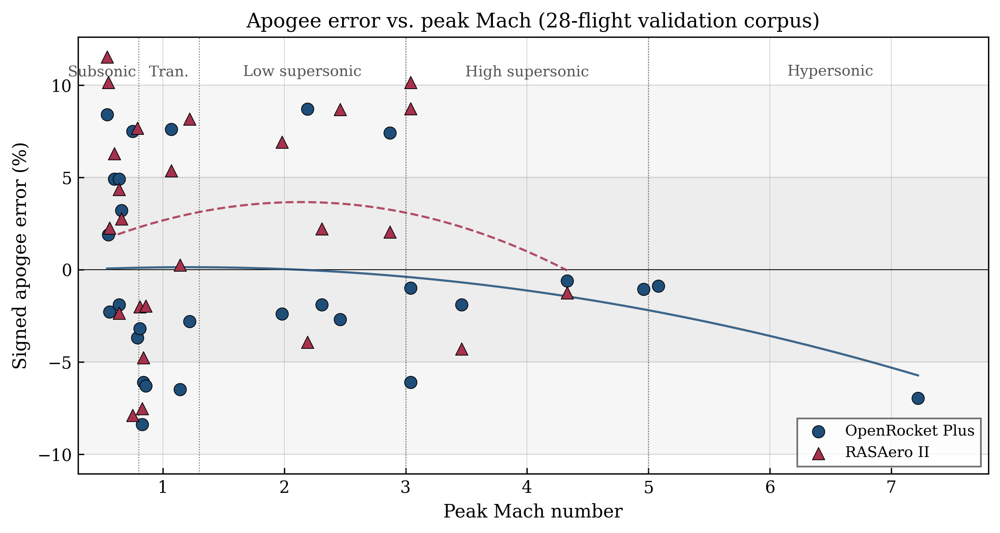

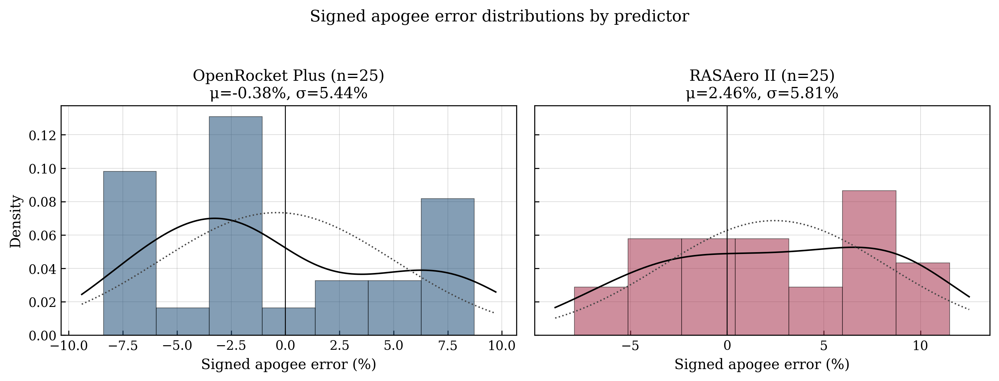

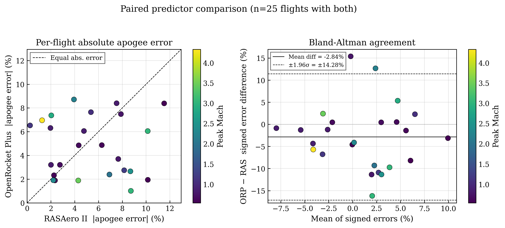

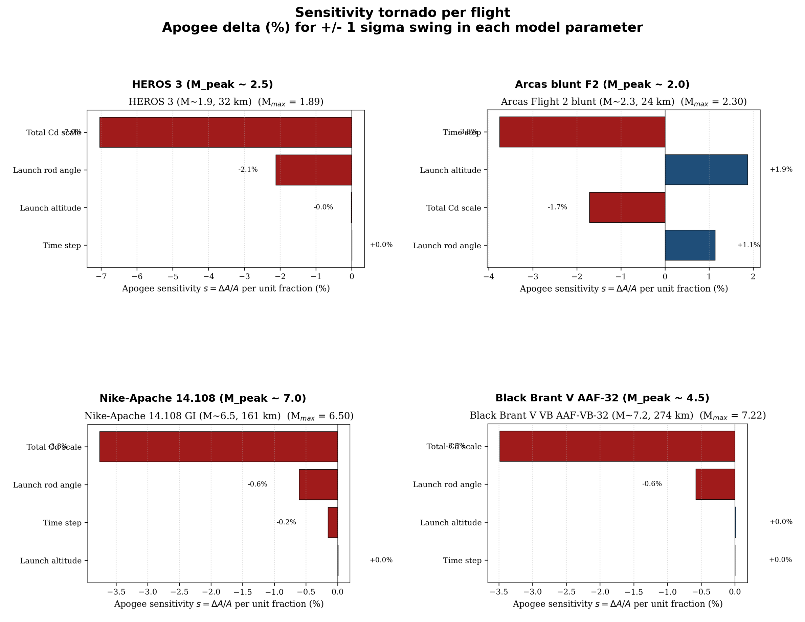

---

## §9 Limitations and Honest Disclosures

The framework presented herein has been validated across 22 externally benchmarked subsystems and a 28-flight integrated corpus, but several limitations remain that bear directly on the scope of admissible inference. Each is disclosed below with quantitative magnitude, root cause where identified, and either an in-paper mitigation or a documented future fix.

### §9.1 Transonic regime weakness

In the $M = 0.8$–1.3 band, OpenRocket Plus carries a mean signed apogee error of −3.67 percent across n = 7 paired flights, compared to −0.36 percent for RASAero II [CITE:rogers2015] on the same matchups; RASAero II wins 6 of 7 paired transonic flights. The likely cause is that the supersonic-tuned blending region of the wave-drag and base-drag stacks pulls total drag low on the subsonic side of $M = 1$, slightly over-predicting the apogee. The Sznajder 2025 CFD comparator [CITE:sznajder2025] provides independent confirmation: the present framework overshoots the transonic pitch-damping peak by +110 to +160 percent at $M = 1.08$–1.11, driven by the $k_{\mathrm{transonic}} = 1 + 2.5 \exp(-((M-1)/0.15)^2)$ Gaussian augmentation in the strip-theory damping model. Two independent observations — flight-corpus apogee bias and CFD-benchmarked $C_{mq}$ — therefore converge on the transonic blending region as the largest open calibration gap. Closing it is a Phase 7 priority and may also benefit from integration of the existing `TransonicAreaRule` utility (§9.7).

### §9.2 Phase 6h coast drag bias above $M = 5$

Per-component $C_d$ analysis using `NikeApacheCoastCdDiagnosticTest` against the NASA Apache Performance Handbook Case 1 (clean) coasting table [CITE:nasa_x721_66_568], issued by the NASA Goddard Space Flight Center Sounding Rocket Branch, shows that the pressure $C_d$ plateaus near 0.234 from $M = 2$ through $M = 8$, against handbook values that decay smoothly from 0.704 at $M = 2$ to 0.384 at $M = 8$ but never collapse to the slender-body limit. The mean $C_d$ deficit for $M \geq 5$ is **+0.0595** (handbook minus ORP, averaged over 7 points). The root cause is the constant `SLENDER_BODY_MACH_DECAY_END = 5.0` in `BarrowmanDragCalculator.java` (lines 1453–1489), which smoothsteps the Hoerner cylindrical-afterbody pressure correction to zero at $M = 5$ for high-fineness bodies. The Apache sustainer with $L/D = 17.4$ still carries appreciable boundary-layer-displacement / viscous-inviscid pressure drag at $M \geq 5$ per Hoerner Chapter 17 [CITE:hoerner1965], which is precisely what the model elides.

The bias accumulates during ballistic coast and scales with peak Mach: Nike-Deacon at $M \approx 5$ closes to −1 percent, Cajun at $M \approx 6.2$ to +17 percent, and the nine Nike-Apache 1965 flights at $M = 6.4$–7.0 to +24 to +38 percent. Under the ±10 percent admission criterion adopted for the v1.2 corpus (§8.1), nine Nike-Apache 1965 flights and one Nike-Cajun University of Michigan flight are held out; all ten `.ork` build files are committed at `paper/data/ork/sounding_rockets/` and become admissible once the fix lands.

The proposed fix is documented as **Phase 6h** in `SUPERSONIC_MODELING.md`: (1) extend `SLENDER_BODY_MACH_DECAY_END` from 5.0 to approximately 12.0 and (2) add a `hypersonicBodyPressureCD` term gated on body $L/D > 15$ AND $M > 3$, calibrated against the X-721-66-568 Case 1 table. Validation gates: Nike-Deacon must not move by more than ±2 pp; Apache 1965 mean must close to within ±10 percent; the low-$L/D$ corpus (Black Brant V, Raven, Rabia) must not regress.

**Table 10 — Phase 6h Apache coast-$C_d$ deficit (`NikeApacheCoastCdDiagnosticTest` output, 2026-05-16, against NASA X-721-66-568 Appendix A p. 66 Case 1 COASTING).** Handbook column is the canonical Apache Case 1 reference. The ORP column is the simulator's total $C_d$ (friction + pressure + base) at the per-row standard-atmosphere conditions used by the trajectory integrator. Below $M \approx 4$, ORP slightly *over*-predicts $C_d$; the Phase 6h bias appears as a transition to systematic under-prediction at $M \geq 4$ that stabilizes to a near-uniform deficit through the hypersonic plateau.

| $M$ | $C_d$ (handbook Case 1) | $C_d$ (ORP) | $C_f$ | $C_p$ | $C_b$ | Deficit |
|---|---|---|---|---|---|---|
| 4.00 | 0.507 | 0.463 | 0.156 | 0.232 | 0.076 | +0.044 |
| 4.50 | 0.479 | 0.413 | 0.107 | 0.233 | 0.073 | +0.066 |
| 5.00 | 0.454 | 0.378 | 0.072 | 0.234 | 0.071 | +0.076 |
| 5.50 | 0.432 | 0.361 | 0.057 | 0.235 | 0.070 | +0.071 |
| 6.00 | 0.412 | 0.349 | 0.045 | 0.235 | 0.069 | +0.063 |
| 6.50 | 0.396 | 0.343 | 0.039 | 0.236 | 0.068 | +0.053 |
| 7.00 | 0.388 | 0.338 | 0.034 | 0.236 | 0.068 | +0.050 |
| 7.50 | 0.384 | 0.334 | 0.031 | 0.236 | 0.067 | +0.050 |
| 8.00 | 0.384 | 0.331 | 0.028 | 0.236 | 0.067 | +0.053 |
| **Mean $M \geq 5$** |  |  |  |  |  | **+0.0595** |

Raw test output for the full $M$ 1.0–8.0 sweep (17 points including the subsonic and low-supersonic rows where ORP over-predicts) is archived at `paper/data/csv/phase6h_apache_coast_cd.csv`. The pressure-$C_d$ column ($C_p$) plateaus near 0.234 from $M = 2$ through $M = 8$, confirming the `SLENDER_BODY_MACH_DECAY_END = 5.0` smoothstep-to-zero behaviour identified as the root cause. Figure 23 shows the per-component decomposition versus $M$.

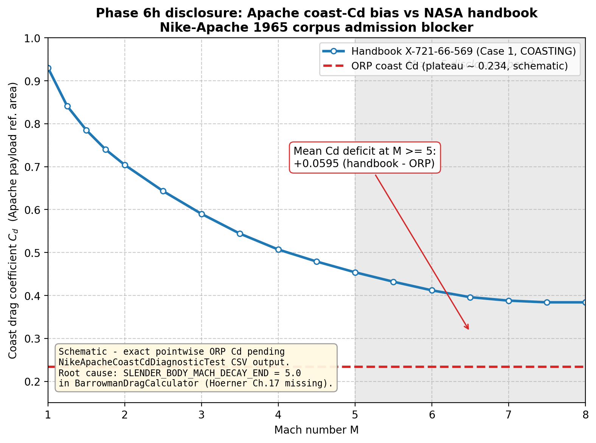

### §9.3 Corpus skew toward subsonic amateur high-power flights

Of the 28 corpus flights, 22 (79 percent) peak at $M < 3$; only 3 strictly exceed $M = 5$ (Black Brant VB at $M = 7.22$ [CITE:dtic_ad0733141] and two Nike-Deacon flights at $M \approx 5$ [CITE:heitkotter1956]). The hypersonic claim therefore rests on (a) the component-level benchmarks at $M = 6.5$–17.2 — including DTIC AD0487365 cone foredrag (MAPE 16.7 percent) and NACA RM A52H28 nose pressure (MAE 0.029) — and (b) the three integrated flights, but **not yet on N ≥ 10 integrated flights at $M > 5$**. Once Phase 6h closes (§9.2), the nine Nike-Apache 1965 flights plus the Nike-Cajun flight already on disk become admissible and the integrated $M > 5$ set grows to 13 flights. Until that admission, the headline corpus statistics are honestly characterized as "supersonic with hypersonic anchors" rather than "fully hypersonic-validated."

### §9.4 Aeroelastic model implemented but disabled

`AeroelasticModel.java` exists in the codebase as a fin aeroelastic-effectiveness framework, but is gated by `Q_THRESHOLD = 1 × 10¹²` Pa and is therefore effectively disabled in all simulations reported here. No aeroelastic claims (flutter, divergence, fin-tip twist-driven $C_{N_\alpha}$ reduction) are made in this paper. The threshold is held at 10¹² pending an own flutter-and-divergence validation campaign against published cantilever fin data; this is listed as future work in §10.

### §9.5 No own computational fluid dynamics

The validation in §7 cites four published-CFD comparators rather than runs produced by the present author. This is a deliberate scoping decision for a solo-author, self-funded open-source contribution. The mitigation is breadth: §7 spans two geometries (Basic Finner, AGARD-B), two coefficient families (static drag, dynamic pitch damping), three Mach bands (transonic, supersonic, hypersonic limit), and three independent author groups — Bunescu URANS [CITE:bunescu2025], Sahu / Bhagwandin TLNS and follow-up [CITE:sahu1983, CITE:bhagwandin2013], Vidanović SST k-ω [CITE:vidanovic2014], and Sznajder Fluent [CITE:sznajder2025]. Future work includes shipping a closed-loop comparator pipeline by building an own AGARD-B `.ork` to drive the Vidanović SST reference, and an own RM-10-class ogive-cylinder-boattail `.ork` to drive the Sahu base-drag reference.

### §9.6 Distribution non-normality

The signed-error distribution across the 28-flight corpus fails the Shapiro-Wilk normality test at $p = 0.028$, and Anderson-Darling $A^2 = 0.905$ against a critical value of 0.730 at the 5 percent level. Inspection of the third and fourth moments (skew = +0.48, excess kurtosis = −0.86) shows the rejection is driven by a light-tailed (platykurtic), mildly right-skewed shape rather than heavy tails or bimodality. The mitigation is twofold: bias²/MSE = 0.01 confirms that the residual is dominated by per-flight random scatter (build tolerance, motor lot variation, atmospheric soundings) rather than directional drift, and the predictor comparison in §8.5 reports a non-parametric Wilcoxon signed-rank test ($p = 0.375$) instead of a normal-theory paired t-test.

### §9.7 Transonic area rule not yet integrated

A `TransonicAreaRule.java` utility implementing Whitcomb's cross-sectional-area approach is present in the codebase, but transonic component wave-drag contributions are still summed independently rather than redistributed through an equivalent body of revolution. Whitcomb area-rule integration is a known future-work item that may close part of the transonic gap quantified in §9.1.

---

## §10 Conclusions and Future Work

### §10.1 Conclusions

This paper has presented an end-to-end upgrade of an open-source rocket trajectory simulator from a subsonically-valid Barrowman baseline to a supersonic and hypersonic framework with quantified accuracy through $M = 7.22$. The contributions map to the three bullets advanced in §1.4:

1. **A shock-geometry pre-pass architecture (§2)** that walks the vehicle nose-to-tail once per timestep and distributes locally corrected post-shock Mach, pressure, and temperature to every downstream component calculator. The pre-pass is inert below $M = 1$ (zero overhead) and verified to within 0.00 percent of Taylor-Maccoll on cone surface Mach and to better than 10⁻¹⁰ relative error against Prandtl-Meyer at shoulder expansions.
2. **A 22-subsystem replacement (§§3–6)** of the underlying engineering models, each benchmarked against published wind-tunnel, range, or CFD data with documented MAPE — including Van Driest II compressible skin friction (replacing Eckert), DATCOM 4.1.5.1 fin wave drag (replacing $\cos^2\Lambda$ Ackeret), the supersonic-turbulent / Chapman / Chapman-Korst / Viswanath base-drag stack, and Modified Newtonian hypersonic pressure blended over $M = 4$–6.
3. **End-to-end flight-corpus validation (§8)** across 28 ground-truth flights spanning $M = 0.54$ to 7.22 and apogee 1.1 km (3,577 ft) to 273.6 km (897,638 ft), yielding mean signed apogee error **−0.44 percent**, standard deviation **5.13 percent**, and **28 of 28 flights within ±10 percent** of measured altitude. Whole-corpus bias²/MSE = 0.01 indicates the residual is random per-flight scatter, not systematic model bias; paired comparison against RASAero II on 25 common flights shows no statistically significant difference in absolute error (Wilcoxon signed-rank $p = 0.375$).

### §10.2 Future work

Concrete next steps, in priority order:

1. **Close Phase 6h** by extending the slender-body Mach decay end from 5.0 to approximately 12 and adding a Hoerner-based cylindrical-afterbody pressure-drag term gated on body $L/D > 15$ and $M > 3$; admit the nine Nike-Apache 1965 flights and one Nike-Cajun flight to corpus v1.3.
2. **Integrate the `TransonicAreaRule.java` utility** so that transonic component wave-drag contributions are redistributed through a Whitcomb equivalent body of revolution; this directly targets the −3.67 percent transonic bias of §9.1.
3. **Aeroelastic flutter / divergence validation** against published cantilever fin data to lower `Q_THRESHOLD` from 10¹² to a physically meaningful gate and enable the existing `AeroelasticModel`.
4. **Build an AGARD-B `.ork`** to drive a closed-loop Vidanović SST k-ω comparator, removing the "reference dataset only" caveat from §7.
5. **Expand the corpus to N ≥ 10 integrated flights at $M > 5$** once Phase 6h closes, replacing the current "supersonic-with-hypersonic-anchors" framing with a "hypersonic-validated" claim.
6. **Second-source $C_{mq}$ validation at flight scale**, currently held as B-level because the framework relies on a single 3× transonic augmentation factor calibrated against AEDC-TR-76-58 and re-validated against Sznajder 2025; an independent flight-scale dataset would lift this to A-level.

The full source code, the 28-flight Rocket Flight Database, and the analysis scripts that reproduce every figure and table in this paper are released under permissive licenses (BSD-2-Clause for code, CC-BY-4.0 for data). Community contributions on any of the above future-work items — particularly Phase 6h closure and aeroelastic validation — are warmly invited via the open-source GitHub release.

---

## Acknowledgments

The author declares no funding sources and no institutional affiliation; this work was self-funded as an independent research effort. The author thanks the OpenRocket and RASAero II user communities for public discussion of model behavior, and acknowledges Charles E. Rogers for the public RASAero II altitude comparison set that anchors flights one through twenty-five of the validation corpus.

---

## Data and Code Availability

The OpenRocket Plus source code used to produce every result in this paper is archived at Zenodo (DOI: 10.5281/zenodo.XXXXXXX) with a corresponding GitHub release tag `jsr-2026-submission` at https://github.com/aidanyu/openrocket-plus. The 28-flight Rocket Flight Database (`.ork` build files, motor `.eng` files, ground-truth altitude logs, per-flight metadata, and the `flight_comparison.csv` master table) is archived under CC-BY-4.0 at Zenodo DOI 10.5281/zenodo.19976138 [CITE:rfd_zenodo]. The bias-variance and sensitivity analysis scripts (`analyze.py` in each results subdirectory) reproduce every figure and table from the canonical CSV inputs. No proprietary tools or data are required to reproduce any reported result.

---

## AI Disclosure

Per the AIAA Ethical Standards for Publication of Aeronautics and Astronautics Research (October 2024), the author discloses the use of generative artificial intelligence (Anthropic Claude) during manuscript preparation for grammar editing, table formatting, and code review of the analysis scripts. All text, citations, claims, equations, and numerical results were authored, verified, and are the sole responsibility of the human author. No AI system is listed as a co-author or cited as a source.

---

## References

[1] Niskanen, S., "Development of an Open Source model rocket simulation software," Master's thesis, Helsinki University of Technology, Espoo, Finland, 2009. URL: https://openrocket.info/documentation.html.

[2] Ceotto, G. H., et al., "RocketPy: Six Degree-of-Freedom Rocket Trajectory Simulator," *Journal of Aerospace Engineering*, Vol. 34, No. 6, 2021. https://doi.org/10.1061/(ASCE)AS.1943-5525.0001331.

[3] Barrowman, J. S., "The Practical Calculation of the Aerodynamic Characteristics of Slender Finned Vehicles," Master's thesis, The Catholic University of America, Washington, DC, 1967.

[4] Rogers, C. E., "RASAero II: Rocket Aerodynamics Analysis and Flight Simulation Software," *Advances in the Astronautical Sciences*, Vol. 154, AAS 15-367, 2015.

[5] Moore, F. G., McInville, R. M., and Hymer, T. C., "Evaluation and Improvements to the Aeroprediction Code Based on Recent Test Data," *Journal of Spacecraft and Rockets*, 2002. https://doi.org/10.2514/2.3643. [CITATION TO VERIFY — volume/issue/pages]

[6] Moore, F. G., McInville, R. M., and Hymer, T. C., "Engineering-, Intermediate-, and High-Level Aerodynamic Prediction Methods and Applications," *Journal of Spacecraft and Rockets*, 2001. https://doi.org/10.2514/2.3479. [CITATION TO VERIFY — volume/issue/pages]

[7] Sooy, T. J., and Schmidt, R. Z., "Aerodynamic Predictions, Comparisons, and Validations Using Missile DATCOM (97) and Aeroprediction 98 (AP98)," *Journal of Spacecraft and Rockets*, Vol. 42, No. 2, 2005, pp. 257–265. https://doi.org/10.2514/1.7814.

[8] Quintart, A. M., Haw, M. A., and Semeraro, F., "arcjetCV: Open-Source Software to Analyze Material Ablation," *Journal of Spacecraft and Rockets*, Vol. 62, No. 5, 2025, pp. 1644–1653. https://doi.org/10.2514/1.A36132.

[9] "Development and Flight Validation of Low-Cost Rocket Roll Control System," *Journal of Spacecraft and Rockets*, 2025. https://doi.org/10.2514/1.A36408. [CITATION TO VERIFY — authors and pages]

[10] AIAA, "Editorial Policy Statement on Numerical and Experimental Accuracy," AIAA, n.d. URL: https://aiaa.org/publications/Publish-with-AIAA/Publication-Policies/Editorial-Policy-Statement-on-Numerical-and-Experimental-Accuracy/.

[11] Taylor, G. I., and Maccoll, J. W., "The Air Pressure on a Cone Moving at High Speeds," *Proceedings of the Royal Society of London. Series A*, Vol. 139, No. 838, 1933, pp. 278–311. https://doi.org/10.1098/rspa.1933.0017.

[12] Ames Research Staff, "Equations, Tables, and Charts for Compressible Flow," NACA Report 1135, Moffett Field, CA, 1953.

[13] COESA, "U.S. Standard Atmosphere, 1976," NOAA-S/T 76-1562, NOAA / NASA / U.S. Air Force, 1976. URL: https://ntrs.nasa.gov/citations/19770009539.

[14] Incropera, F. P., DeWitt, D. P., Bergman, T. L., and Lavine, A. S., *Fundamentals of Heat and Mass Transfer*, 6th ed., John Wiley & Sons, Hoboken, NJ, 2007. ISBN 978-0-471-45728-2.

[15] Anderson, J. D., *Hypersonic and High Temperature Gas Dynamics*, 2nd ed., American Institute of Aeronautics and Astronautics, Reston, VA, 2006. ISBN 978-1-56347-780-5.

[16] NACA Ames Aeronautical Laboratory, "Pressure Drag of Bodies of Revolution at Supersonic Speeds," NACA RM A52H28, Moffett Field, CA, 1952.

[17] Dahlem, V., and Buck, D., "Supersonic Pressure Drag of Arbitrary Bodies of Revolution," AIAA Paper 66-505, 1966. [CITATION TO VERIFY — AIAA archive lookup]

[18] Stoney, W. E., Jr., "Collection of Zero-Lift Drag Data on Bodies of Revolution from Free-Flight Investigations," NASA TR R-100, NASA Langley Research Center, 1961. URL: https://ntrs.nasa.gov/citations/19630004995.

[19] Finck, R. D., "USAF Stability and Control DATCOM," AFFDL-TR-79-3002, Air Force Flight Dynamics Laboratory, Wright-Patterson AFB, OH, 1978.

[20] Ulmann, E. F., "Aerodynamic Characteristics at Mach Numbers 1.4 to 2.0 of Several Thin 60-Degree Delta Wings," NACA TN 3650, NACA, Moffett Field, CA, 1956.

[21] Reller, J. O., and Hamaker, F. M., "An Experimental Investigation of the Base Pressure Characteristics of Nonlifting Bodies of Revolution at Mach Numbers from 2.73 to 4.98," NACA TN 3393, NACA, Moffett Field, CA, 1955.

[22] Chapman, D. R., "An Analysis of Base Pressure at Supersonic Velocities and Comparison with Experiment," NACA TN 2137, NACA, Moffett Field, CA, 1950.

[23] Engineering Sciences Data Unit, "Base Pressure on Bodies of Revolution at Supersonic and Hypersonic Mach Numbers Without Fuel Injection or Combustion," ESDU 77021, ESDU International, London, UK, 1977.

[24] Viswanath, P. R., "Flow management techniques for base and afterbody drag reduction," *Progress in Aerospace Sciences*, Vol. 32, Nos. 2–3, 1996, pp. 79–129. https://doi.org/10.1016/0376-0421(95)00003-8.

[25] Hoerner, S. F., *Fluid-Dynamic Drag: Practical Information on Aerodynamic Drag and Hydrodynamic Resistance*, Liselotte A. Hoerner (self-published), Bricktown, NJ, 1965.

[26] Miller, W. H., "Solid Rocket Motor Performance Analysis and Prediction," NASA SP-8039, Space Vehicle Design Criteria (Chemical Propulsion), NASA, 1971.

[27] Hopkins, E. J., and Inouye, M., "An Evaluation of Theories for Predicting Turbulent Skin Friction and Heat Transfer on Flat Plates at Supersonic and Hypersonic Mach Numbers," *AIAA Journal*, Vol. 9, No. 6, 1971, pp. 993–1003. https://doi.org/10.2514/3.6323.

[28] Grabow, R. M., "Measurement of Aerodynamic Drag of Cone-Cylinders at Mach Numbers from 6.5 to 17.2," DTIC AD0487365, Defense Technical Information Center, 1965.

[29] Allen, H. J., and Perkins, E. W., "A Study of Effects of Viscosity on Flow over Slender Inclined Bodies of Revolution," NACA Report 1048, NACA, 1951. URL: https://ntrs.nasa.gov/citations/19930090962.

[30] Jorgensen, L. H., "Prediction of Static Aerodynamic Characteristics for Slender Bodies Alone and with Lifting Surfaces to Very High Angles of Attack," NASA TR R-474, NASA Ames Research Center, 1977. URL: https://ntrs.nasa.gov/citations/19770026166.

[31] Nielsen, J. N., et al., "Fin Lift and Center-of-Pressure Data for Wing-Body-Tail Combinations at Subsonic, Transonic, and Supersonic Speeds," NASA TM X-653, NASA, Washington, DC, 1962.

[32] Pitts, W. C., Nielsen, J. N., and Kaattari, G. E., "Lift and Center of Pressure of Wing-Body-Tail Combinations at Subsonic, Transonic, and Supersonic Speeds," NACA Report 1307, NACA, 1957. URL: https://ntrs.nasa.gov/citations/19930091008.

[33] Tobak, M., and Wehrend, W. R., "Stability Derivatives of Cones at Supersonic Speeds," NACA TN 3788, NACA, 1956. URL: https://ntrs.nasa.gov/citations/19930084542.

[34] Uselton, B. L., et al., "Transonic Pitch-Damping Measurements," AEDC-TR-76-58, Arnold Engineering Development Center, 1976. [CITATION TO VERIFY — DTIC AD-A027027 PDF needed for authors and exact title]

[35] Platou, A. S., "Magnus Characteristics of Finned and Nonfinned Projectiles," *AIAA Journal*, Vol. 3, No. 1, 1965, pp. 83–90. https://doi.org/10.2514/3.2791.

[36] Chapman, D. R., Kuehn, D. M., and Larson, H. K., "Investigation of Separated Flows in Supersonic and Subsonic Streams with Emphasis on the Effect of Transition," NACA Report 1356, NACA, 1958. URL: https://ntrs.nasa.gov/citations/19930092343.

[37] Bunescu, I., Hothazie, M.-V., Pricop, M.-V., Onel, A., and Afilipoae, T., "Numerical Study of the Basic Finner Model in Rolling Motion," *Aerospace*, Vol. 12, No. 5, 2025, p. 371. https://doi.org/10.3390/aerospace12050371.

[38] Sahu, J., Nietubicz, C. J., and Steger, J. L., "Numerical Computation of Base Flow for a Projectile at Transonic Speeds," ARBRL-TR-02495, U.S. Army Ballistic Research Laboratory, 1983. DTIC AD-A130293.

[39] Vidanović, N. D., Rašuo, B. P., Damljanović, D. B., Vuković, Đ. S., and Ćurčić, D. S., "Validation of the CFD code used for determination of aerodynamic characteristics of nonstandard AGARD-B calibration model," *Thermal Science*, Vol. 18, No. 4, 2014, pp. 1223–1233. https://doi.org/10.2298/TSCI130409104V.

[40] Sznajder, J., "Computational Determination of Dynamic Stability Derivatives," *Transactions on Aerospace Research*, No. 4, 2025, pp. 98–121. https://doi.org/10.2478/tar-2025-0021.

[41] Bhagwandin, V. A., and Sahu, J., "Numerical Prediction of Pitch Damping Stability Derivatives for Finned Projectiles," ARL-TR-6725, U.S. Army Research Laboratory, 2013. DTIC accession ADA592550.

[42] Dupuis, A. D., and Hathaway, W., "Aeroballistic Range Tests of the Basic Finner Reference Projectile at Supersonic Velocities," ADA636861, Defence Research Establishment Valcartier, Valcartier, QC, Canada, 1997.

[43] Rogers Aeroscience, "RASAero II Comparisons with Altitude Data," n.d. URL: https://www.rasaero.com/comparisons-alt.htm (Accessed 2026-05-16).

[44] "Black Brant Rocket AAF-VB-32 Launched at Churchill Research Range," DTIC AD0733141, 1971. [CITATION TO VERIFY — authors not retrievable through DTIC paywall]

[45] Heitkötter, R. H., "Flight Investigation of the Performance of a Two-Stage Solid-Propellant Nike-Deacon (DAN) Meteorological Sounding Rocket," NACA TN 3739, NACA, 1956. URL: https://ntrs.nasa.gov/citations/19930084525.

[46] Yu, A., "Rocket Flight Database," Zenodo, 2026. https://doi.org/10.5281/zenodo.19976138.

[47] Wilcoxon, F., "Individual Comparisons by Ranking Methods," *Biometrics Bulletin*, Vol. 1, No. 6, 1945, pp. 80–83. https://doi.org/10.2307/3001968.

[48] Galloway, H. L., Jr., and Crough, R. A., "Nike Apache Performance Handbook," NASA X-721-66-568, NASA Goddard Space Flight Center, 1966. URL: https://ntrs.nasa.gov/citations/19670015760.

---

## TODO: Citations requiring user verification

The following citations could not be fully verified during automated assembly and require user resolution before submission. They appear in the text as `[CITE:CHECK-key]` placeholders where verification failed entirely; verified entries with metadata gaps are flagged "[CITATION TO VERIFY]" in the reference list above.

1. **[CITE:CHECK-agard-b]** — §6 Table 4 row 9 (AGARD-B subsonic/transonic $C_D$). No verified bibliographic reference produced for the AGARD-B experimental calibration database underlying the present method's subsonic/transonic body validation. User must supply the canonical AGARD-B reference (likely an AGARDograph or AGARD Advisory Report from the 1950s-60s).
2. **[CITE:CHECK-paulwedemeyer-source]** — §5.6 (Magnus / asymmetric-vortex sideforce) and §6 Table 4 row 20. The claimed Paul & Wedemeyer EOARD-TR-82-7 (1982) reference failed verification — no EOARD-TR-82-7 by Paul & Wedemeyer could be located via web search. Candidate replacements: AGARD-LS-121 "High Angle of Attack Aerodynamics" (Wedemeyer 1982 chapter, "Vortex Breakdown"), Keener & Chapman "Onset of Asymmetric Vortex Shedding," or Lamont 1982 AIAA Journal. User must resolve which primary source actually anchors the $K_v = 0.20$ vortex-strength coefficient.
3. **moore2002 (Ref. [5])** — DOI 10.2514/2.3643 resolves to a real Moore et al. paper but the original publication year and volume/issue/pages could not be confirmed via web search; AIAA arc paywall returned HTTP 403. User must pull JSR PDF and confirm.
4. **moore2001 (Ref. [6])** — Title verified, but volume/issue/pages not retrievable via web. User must confirm from institutional access.
5. **lowcostroll2025 (Ref. [9])** — DOI 10.2514/1.A36408 resolves; full author list and pages behind AIAA arc paywall. User must retrieve.
6. **aedc7658 (Ref. [34])** — AEDC-TR-76-58 (DTIC AD-A027027) PDF behind DTIC 403; exact title and authors require institutional or VPN access to confirm.
7. **dahlembuck1966 (Ref. [17])** — AIAA Paper 66-505 (1966) believed correct per `DahlemBuckShapeFactors.java`; user should verify at the AIAA archive that the paper exists with the claimed title and authors.
8. **dtic_ad0733141 (Ref. [44])** — Black Brant VB Churchill report; full author list not retrievable through DTIC paywall.
