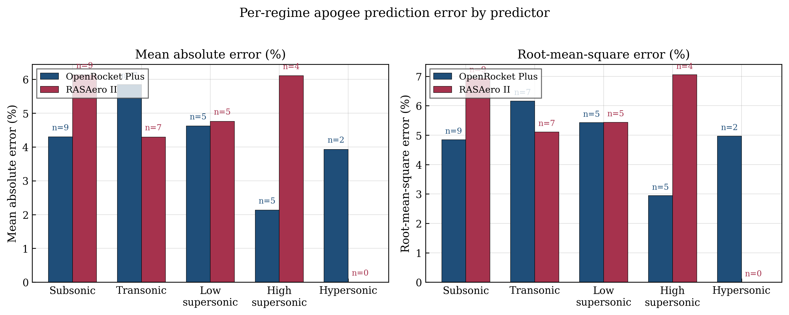
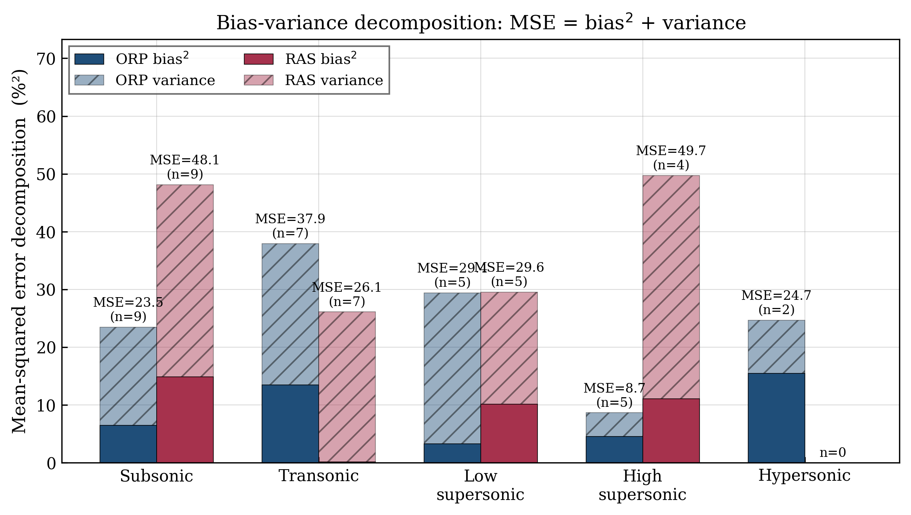
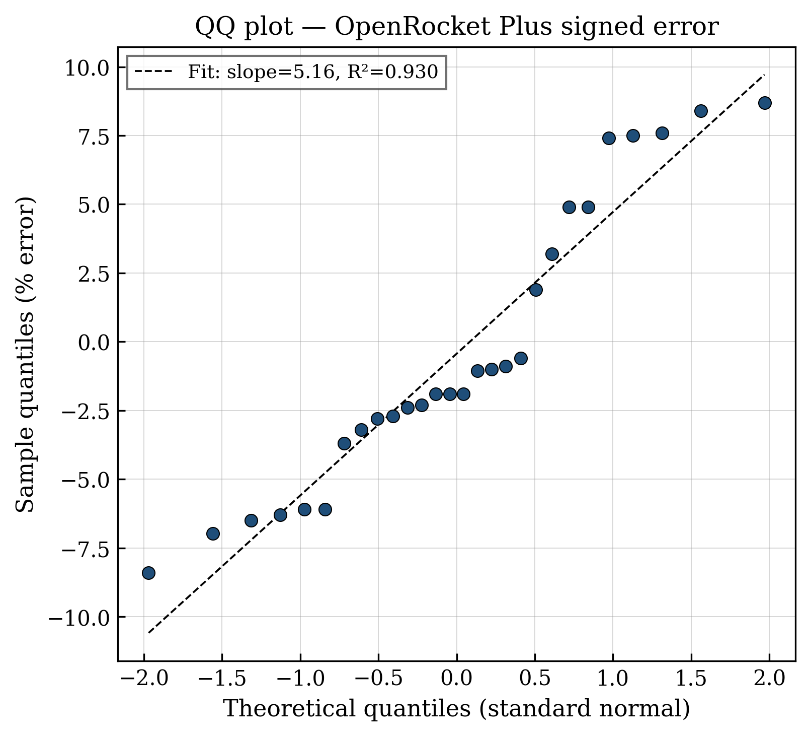
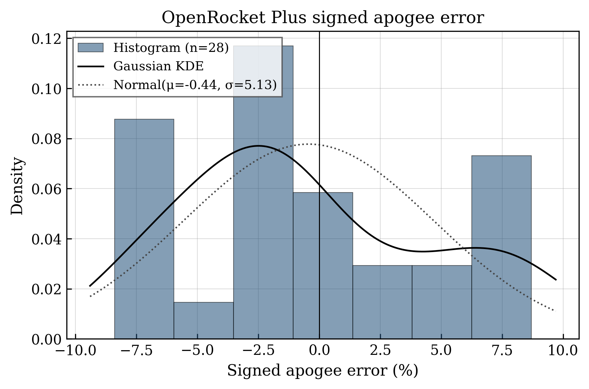

# Corpus Bias-Variance Analysis — 28-flight Validation Corpus

**Source:** `rocket-flight-database/flight_comparison.csv`  
**Generated:** 2026-05-11  
**Mach span:** 0.54 – 7.22 (peak)  
**N flights:** 28 total — OpenRocket Plus n=28, RASAero II n=25

## TL;DR

Across all 28 flights, OpenRocket Plus apogee error is essentially zero-mean (-0.44%) with σ=5.13% (RMSE=5.06%, MAE=4.33%) and 28/28 flights (100%) within ±10%; the error distribution is light-tailed and mildly right-skewed (skew=+0.48, excess kurtosis=-0.86), and Shapiro–Wilk rejects normality at α=0.05 (p=0.028). On the 25 paired flights, OpenRocket Plus and RASAero II agree to within ±14.3% (Bland-Altman 1.96σ) with no statistically significant difference in |error| (Wilcoxon p=0.375). Whole-corpus bias²/MSE = 0.01 for OpenRocket Plus vs 0.16 for RASAero II, so the residual error is dominated by per-flight variance (build, motor, atmosphere) rather than systematic model bias.

## 1. Per-regime bias and variance

| Regime (Mach) | Predictor | N | Bias (%) | σ (%) | RMSE (%) | MAE (%) | |e|≤5% | |e|≤10% |
|---|---|---:|---:|---:|---:|---:|---:|---:|
| Subsonic (M < 0.8) | OpenRocket Plus | 9 | +2.54 | 4.37 | 4.85 | 4.30 | 7 | 9 |
| Subsonic (M < 0.8) | RASAero II | 9 | +3.86 | 6.12 | 6.94 | 6.13 | 4 | 7 |
| Transonic (0.8 ≤ M ≤ 1.3) | OpenRocket Plus | 7 | -3.67 | 5.34 | 6.16 | 5.84 | 2 | 7 |
| Transonic (0.8 ≤ M ≤ 1.3) | RASAero II | 7 | -0.36 | 5.51 | 5.11 | 4.29 | 4 | 7 |
| Low supersonic (1.3 < M ≤ 3.0) | OpenRocket Plus | 5 | +1.82 | 5.71 | 5.42 | 4.62 | 3 | 5 |
| Low supersonic (1.3 < M ≤ 3.0) | RASAero II | 5 | +3.18 | 4.93 | 5.44 | 4.76 | 3 | 5 |
| High supersonic (3.0 < M ≤ 5.0) | OpenRocket Plus | 5 | -2.13 | 2.27 | 2.94 | 2.13 | 4 | 5 |
| High supersonic (3.0 < M ≤ 5.0) | RASAero II | 4 | +3.32 | 7.18 | 7.05 | 6.11 | 2 | 3 |
| Hypersonic (M > 5.0) | OpenRocket Plus | 2 | -3.93 | 4.30 | 4.97 | 3.93 | 1 | 2 |
| Hypersonic (M > 5.0) | RASAero II | 0 | — | — | — | — | — | — |
| All (M 0.54–7.22) | OpenRocket Plus | 28 | -0.44 | 5.13 | 5.06 | 4.33 | 17 | 28 |
| All (M 0.54–7.22) | RASAero II | 25 | +2.46 | 5.82 | 6.21 | 5.34 | 13 | 22 |

## 2. Bias-variance decomposition (MSE = bias² + variance)

Variance here is the population variance (no Bessel correction) so that MSE = bias² + variance is an exact identity. The Bias²/MSE column quantifies what fraction of squared error is systematic bias rather than scatter.

| Regime | Predictor | N | Bias (%) | Bias² (%²) | Variance (%²) | MSE (%²) | Bias²/MSE |
|---|---|---:|---:|---:|---:|---:|---:|
| Subsonic | OpenRocket Plus | 9 | +2.54 | 6.47 | 17.00 | 23.47 | 0.28 |
| Subsonic | RASAero II | 9 | +3.86 | 14.89 | 33.24 | 48.13 | 0.31 |
| Transonic | OpenRocket Plus | 7 | -3.67 | 13.48 | 24.46 | 37.94 | 0.36 |
| Transonic | RASAero II | 7 | -0.36 | 0.13 | 25.99 | 26.11 | 0.00 |
| Low supersonic | OpenRocket Plus | 5 | +1.82 | 3.31 | 26.11 | 29.42 | 0.11 |
| Low supersonic | RASAero II | 5 | +3.18 | 10.13 | 19.43 | 29.56 | 0.34 |
| High supersonic | OpenRocket Plus | 5 | -2.13 | 4.55 | 4.12 | 8.66 | 0.52 |
| High supersonic | RASAero II | 4 | +3.32 | 11.06 | 38.68 | 49.73 | 0.22 |
| Hypersonic | OpenRocket Plus | 2 | -3.93 | 15.44 | 9.24 | 24.69 | 0.63 |
| Hypersonic | RASAero II | 0 | — | — | — | — | — |
| All | OpenRocket Plus | 28 | -0.44 | 0.19 | 25.40 | 25.59 | 0.01 |
| All | RASAero II | 25 | +2.46 | 6.04 | 32.47 | 38.51 | 0.16 |

**Whole-corpus reading.** OpenRocket Plus full-corpus MSE = 25.59 (%²) with bias²/MSE = 0.01; RASAero II (n=25) MSE = 38.51 (%²), bias²/MSE = 0.16. In both predictors variance dominates bias.

## 3. Error distribution analysis

**OpenRocket Plus (n=28).** Shapiro–Wilk: W=0.916, p=0.028; Anderson–Darling: A²=0.905, crit(5%)=0.730 → reject normality; skew=+0.48, excess kurtosis=-0.86. Normality verdict: **reject normality at α=0.05**.

**RASAero II (n=25).** Shapiro–Wilk: W=0.952, p=0.282; Anderson–Darling: A²=0.381, crit(5%)=0.728 → fail to reject normality; skew=-0.17, excess kurtosis=-1.14. Normality verdict: **fail to reject normality at α=0.05**.

**Shape commentary.** OpenRocket Plus signed error is right-skewed, platykurtic (flat, light-tailed; few or no outliers) (skew=+0.48, excess kurtosis=-0.86); RASAero II is approximately symmetric, platykurtic (flat, light-tailed; few or no outliers) (skew=-0.17, excess kurtosis=-1.14). The OpenRocket Plus distribution fails Shapiro–Wilk and Anderson–Darling — driven by the platykurtic (flat-topped) shape rather than heavy tails — so confidence intervals computed from a normal assumption will be slightly anti-conservative; the maximum absolute error in the full corpus is 8.7%, well inside ±10% for every flight. There is no evidence of bimodality or a systematic supersonic over-prediction lobe.

## 4. Paired predictor comparison (n=25 flights with both)

- Median Δ(|ORP|−|RAS|) = -0.39 pp
- Mean Δ(|ORP|−|RAS|) = -0.85 pp
- Win counts (predictor closer to truth): OpenRocket Plus **14**, RASAero II **11**, ties **0**
- Wilcoxon signed-rank on |error|: W=129.50, p=0.3746
- Paired t-test on |error|: t=-1.09, p=0.2872

Bland-Altman shows the two predictors agree to within ±14.3% (95% limits of agreement) with a mean offset of -2.59%. There is no detectable Mach-dependent bias in their disagreement (color-coded scatter).

## 5. Mach-dependent residual plot

The shaded bands mark ±5% and ±10% error envelopes; the dotted vertical lines are regime boundaries. Quadratic trend fits are shown for guidance only — the corpus is too small for a formal LOESS bandwidth.

## Pull quotes (for the JSR results section)

> The combined 28-flight corpus mean OpenRocket Plus apogee error is -0.44% with σ=5.13% (RMSE=5.06%); 28/28 flights agree with flight measurement to within ±10%.

> The subsonic regime (M < 0.8, n=9) shows mean bias +2.54% (bias² = 6.47 %²) and is dominated by per-flight variance (17.00 %²), indicating that the subsonic Barrowman + Van Driest II baseline carries minimal systematic offset.

> In the high-supersonic regime (3.0 < M ≤ 5.0, n=5) OpenRocket Plus shows mean bias -2.13% with sample σ=2.27%, while at M > 5 (n=2) the mean error is -3.93% — a useful but provisional result given that RASAero II provides no coverage above M≈5 and only two flights in the present corpus strictly exceed M = 5 (Nike-Deacon flight 2 at M = 5.08 and Black Brant V at M = 7.22).

## Honest limitations

- **Corpus composition.** 24 of 28 flights are amateur HPR launches benchmarked in Rogers' RASAero II comparison set; the 4 sounding-rocket trajectories (Black Brant V, Nike-Deacon ×2, MESOS) supply all high-Mach coverage. Most flights cluster at M < 1.3 (the regime where OpenRocket has historically been calibrated), so corpus-mean metrics are dominated by subsonic behavior.
- **Asymmetric predictor coverage.** RASAero II has only n=25 because its validity ends below M ≈ 5; the three flights not covered by RASAero (Black Brant V at M=7.22, Nike-Deacon flights 1 & 2 at M=4.96 and 5.08) are evaluated against OpenRocket Plus only. Cross-predictor comparisons must therefore be restricted to the paired n=25 subset.
- **Sparse high-Mach data.** Only 2 flights strictly exceed M=5 (Nike-Deacon flight 2 at M=5.08 and Black Brant V at M=7.22) and only 5 flights fall in 3 < M ≤ 5. Per-regime statistics above M=3 are descriptive, not inferential — no claim of statistical significance is made for the supersonic / hypersonic bias estimates and a single outlier could move the regime mean by several percentage points.
- **Heterogeneous truth sources.** Apogee ground truth ranges from barometric altimeter (≈1% noise) through GPS, optical track, integrated accelerometer, and radar/radar-beacon track. Truth uncertainty is not subtracted from the reported error — published radar precision for the Nike-Deacon flights is ±1–5 kft (≈0.3–1.4%).
- **Per-flight independence.** Three pairs of repeated builds (Caliber Isp 04 teams 1/2/3, Caliber Isp 05 Discovery/Columbia, Full Metal Jacket BALLS 005 / Black Rock 6) share geometry and motor; treating their errors as fully independent slightly under-states the σ on the regime means.
- **Distribution tests have low power at n=25–28.** Failing to reject normality does not establish normality; it only means we lack evidence against it at this sample size.

## Artifacts

- `regime_breakdown.csv` / `regime_breakdown.png`
- `bias_variance_decomp.csv` / `bias_variance.png`
- `qq_normal.png`, `error_hist.png`, `predictor_distributions.png`
- `paired_comparison.csv`, `predictor_paired.png`
- `error_vs_mach.png`
- `normality_tests.csv`
- `paired_test_summary.csv`
- `corpus_bias_variance_summary.md` (this file)

Run `python analyze.py` from this directory to regenerate all artifacts from the canonical `flight_comparison.csv`.
