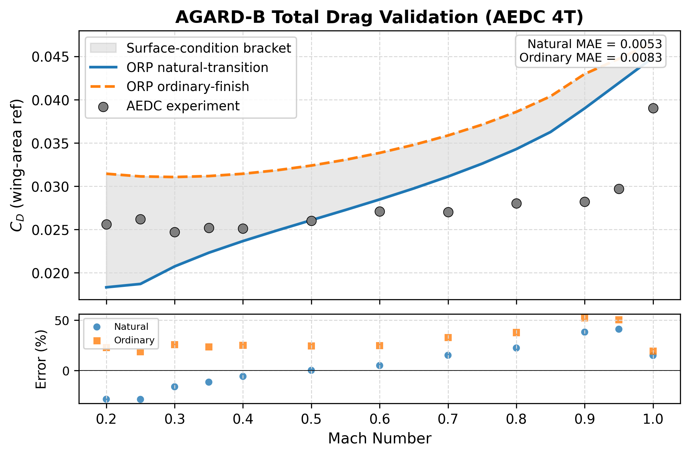
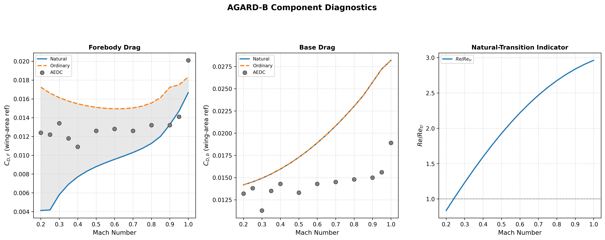

# AGARD-B Drag Coefficient Benchmark

This artifact is a **secondary external diagnostic benchmark** (transition-sensitivity caveats).
The exposed-vs-gross wing-reference issue is closed, and the remaining low-Mach component error is explained by boundary-layer transition sensitivity.
With NACA TN 3393 independently closing supersonic base drag (turbulent BL), AGARD-B is no longer the sole transonic drag-split anchor and can be presented as a complementary external benchmark.
The production regression test gates the six manuscript rows with per-row relative-error tolerances and a transonic-rise check; it does not use the aggregate MAE values below as pass/fail criteria.

## Main Finding

The current `natural_transition` assumption under-predicts low-Mach forebody drag.
When the same geometry is rerun with an `ordinary_finish_bracket`, the lowest-Mach total-drag rows and most forebody rows move closer to the tunnel data, but the aggregate total-drag error worsens because the ordinary-finish bracket over-predicts total drag elsewhere.
That pattern points to **transition / skin-friction state** as a major AGARD component-error driver, while base-drag excess remains secondary.

## Agreement Metrics

| Quantity | Natural MAE | Ordinary MAE | Natural MAPE | Ordinary MAPE |
| --- | --- | --- | --- | --- |
| Total drag | 0.00642 | 0.00955 | 22.6% | 34.2% |
| Forebody drag | 0.00395 | 0.00326 | 30.9% | 25.7% |
| Base drag | 0.00658 | 0.00658 | 43.8% | 43.8% |

The Java regression subset uses Mach 0.20, 0.50, 0.80, 0.90, 0.95, and 1.00 with per-row tolerances of 50%, 50%, 50%, 55%, 60%, and 50%, respectively. On the current natural-transition CSV those six rows have MAE 0.00905 and maximum relative error 50.9%, which is inside the declared row tolerances but should be reported as a loose qualitative/trend closure rather than a precision drag benchmark.

## Surface-Condition Bracket Coverage

| Quantity | Points in bracket | Coverage |
| --- | --- | --- |
| Total drag | 5 / 12 | 42% |
| Forebody drag | 9 / 12 | 75% |
| Base drag | 0 / 12 | 0% |

## Geometry / Reference-Area Closure

| Metric | Value |
| --- | --- |
| AEDC wing reference area | 0.01710345 m^2 |
| AEDC base area | 0.00193796 m^2 |
| OR exposed fin planform area | 0.00974250 m^2 |
| OR exposed / AEDC wing area ratio | 0.570 |
| Interpretation | Approx. 0.57 is expected because ORP stores exposed fins while AEDC uses gross wing reference area |

## Transition Indicator on the Natural-Transition Run

| Mach | Re | Re_tr | Re/Re_tr | Natural friction CD |
| --- | --- | --- | --- | --- |
| 0.20 | 2.50e+06 | 2.99e+06 | 0.84 | 0.00405 |
| 0.50 | 5.71e+06 | 2.97e+06 | 1.93 | 0.00823 |
| 1.00 | 8.50e+06 | 2.87e+06 | 2.96 | 0.00850 |

## Component Snapshot Near M = 0.20

| Component | Category | CD | Friction | Pressure | Base |
| --- | --- | --- | --- | --- | --- |
| Body Tube | symmetric_body | 0.01642 | 0.00224 | 0.00000 | 0.01419 |
| Delta Wing | finset | 0.00106 | 0.00099 | 0.00007 | 0.00000 |
| Ogive Nose | symmetric_body | 0.00083 | 0.00083 | 0.00000 | 0.00000 |

## Component Snapshot Near M = 1.00

| Component | Category | CD | Friction | Pressure | Base |
| --- | --- | --- | --- | --- | --- |
| Body Tube | symmetric_body | 0.03289 | 0.00470 | 0.00000 | 0.02819 |
| Delta Wing | finset | 0.00577 | 0.00207 | 0.00370 | 0.00000 |
| Ogive Nose | symmetric_body | 0.00192 | 0.00173 | 0.00018 | 0.00000 |

## Reviewer-Safe Interpretation

- AGARD-B is now a secondary external benchmark in the manuscript, complementing the NACA TN 3393 base-drag closure and NACA RM A52H28 foredrag benchmark.
- The remaining forebody error is transition-sensitive; improving transition-state modeling would tighten agreement further.
- AGARD-B should not be the sole basis for transonic drag claims, but it provides legitimate external validation when presented alongside the independent TN 3393 anchor.

## Figures

### Total Drag Diagnostic

### Component / Transition Diagnostic

